# AutoGen — arquitectura real derivada del código (HEAD `027ecf0`)

## Resumen

Este documento reconstruye la arquitectura de AutoGen a partir de imports, clases, factories, subscriptions y entry points del commit `027ecf0a379bcc1d09956d46d12d44a3ad9cee14`. No es un diagrama de marketing: cada caja corresponde a código existente y cada arista se justifica con un import, una llamada, un registro o una herencia verificable. El hallazgo central es que AutoGen no es simplemente “AgentChat sobre gRPC”: el núcleo define un actor runtime abstracto; AgentChat usa por defecto un `SingleThreadedAgentRuntime` embebido; GroupChat adapta `ChatAgent`/`Team` a actores mediante `ChatAgentContainer`; y gRPC vive como implementación opcional en `autogen-ext`.

La arquitectura también delimita ausencias. En este commit no se encontraron clases `McpAgent` ni `AgentContainer`, ni una implementación del protocolo A2A. MCP se implementa con `McpWorkbench`, `McpSessionActor` y `McpSessionHost`. A2A aparece en el README como capacidad del sucesor Microsoft Agent Framework, no como componente de AutoGen. Estas ausencias se muestran explícitamente en vez de rellenar huecos.

Para el inventario detallado, divergencias y lista de correcciones al overview anterior, véase [`autogen-code-audit.md`](./autogen-code-audit.md). Ambos documentos usan el mismo commit y se revisaron juntos.

## Objetivo

1. Dibujar el monorepo real y sus fronteras de dependencia.
2. Explicar la arquitectura del actor model desde dirección y topics hasta entrega.
3. Mostrar cómo GroupChat mapea la API alta a la API core.
4. Separar el plano de control del plano de datos de un team.
5. Derivar la selección de speaker de cada manager concreto.
6. Integrar memoria, models, tools, MCP y code execution sin inventar acoplamientos.
7. Comparar la arquitectura reconstruida con [`autogen.md`](./autogen.md).
8. Cumplir los seis criterios de CONSTITUTION §8 con trazabilidad `path:line`.

## Estado

🟢 **Verificado** sobre clon local `--depth 1` de `microsoft/autogen`.

- Commit: `027ecf0a379bcc1d09956d46d12d44a3ad9cee14`.
- Fecha de commit: 2026-04-06.
- Fecha de auditoría: 2026-07-13.
- Inventario: 1.837 archivos fuera de `.git`; 546 Python, 497 C#, 125 TS/TSX, 162 Markdown y 49 notebooks.
- Parse/bytecode check: `compileall` de `autogen-core`, `autogen-agentchat` y `autogen-ext` completó con `COMPILEALL_OK`.
- No se ejecutaron integraciones remotas: la arquitectura se valida por código estático, tests existentes y manifiestos. Docker, Redis, Chroma, MCP, gRPC y proveedores requieren servicios/extras.

El README de este commit declara maintenance mode y recomienda MAF para proyectos nuevos (`README.md:14-25`). Esta arquitectura representa la línea 0.7.5 mantenida, no un roadmap futuro.

## Versiones compatibles

| Capa | Package / target | Versión o restricción |
|---|---|---|
| Core Python | `autogen-core` | 0.7.5, Python `>=3.10` |
| Alto nivel | `autogen-agentchat` | 0.7.5, pin `autogen-core==0.7.5` |
| Integraciones | `autogen-ext` | 0.7.5, pin `autogen-core==0.7.5` |
| Studio | `autogenstudio` | Python `>=3.9`, AutoGen `<0.7` según manifest |
| Core .NET nuevo | `Microsoft.AutoGen.*` | `net8.0` |

La evidencia para AgentChat está en `python/packages/autogen-agentchat/pyproject.toml:5-19`; la de Ext en `python/packages/autogen-ext/pyproject.toml:5-19`; Studio muestra sus pins divergentes en `python/packages/autogen-studio/pyproject.toml:20-38`. Por eso los diagramas no presentan Studio como una UI perfectamente sincronizada con la capa 0.7.5.

## Proyectos compatibles

La arquitectura ofrece interfaces para aplicaciones Python, servicios web, notebooks y workers distribuidos. El sample FastAPI o Studio no son prerequisitos del runtime. .NET comparte los protos gRPC, lo que habilita cross-language cuando mensajes usan schemas compartidos (`python/packages/autogen-ext/src/autogen_ext/runtimes/grpc/_worker_runtime.py:215-225`; `dotnet/src/Microsoft.AutoGen/Core.Grpc/Microsoft.AutoGen.Core.Grpc.csproj:16-24`).

No hay integración Aithera en el repo. Aithera puede reutilizar patrones, pero no debe representar esa compatibilidad como upstream.

## Dependencias

### Dependencia ascendente principal

`autogen-agentchat` depende de `autogen-core`; `autogen-ext` depende de core y añade opcionalmente AgentChat para features como Magentic-One. El manifiesto Ext mantiene Docker, OpenAI, Anthropic, MCP, ChromaDB, Mem0, RedisVL, Jupyter y gRPC como extras (`python/packages/autogen-ext/pyproject.toml:21-46`, `:75-104`, `:151-158`).

### Dependencias de diseño

- `BaseGroupChat` importa `AgentRuntime`, `SingleThreadedAgentRuntime` y `TypeSubscription` del core y `ChatAgentContainer` de su paquete (`python/packages/autogen-agentchat/src/autogen_agentchat/teams/_group_chat/_base_group_chat.py:6-37`).
- `BaseGroupChatManager` importa `event`, `rpc`, `MessageContext` y `DefaultTopicId` del core (`python/packages/autogen-agentchat/src/autogen_agentchat/teams/_group_chat/_base_group_chat_manager.py:1-22`).
- `AssistantAgent` consume `Memory`, `Workbench` y `ChatCompletionClient`, pero no SDKs concretos en su loop (`python/packages/autogen-agentchat/src/autogen_agentchat/agents/_assistant_agent.py:1027-1115`).
- `McpWorkbench` implementa `Workbench` y traduce schemas MCP a `ToolSchema` core (`python/packages/autogen-ext/src/autogen_ext/tools/mcp/_workbench.py:6-35`, `:274-312`).

## Arquitectura

## 1. Mapa físico del monorepo

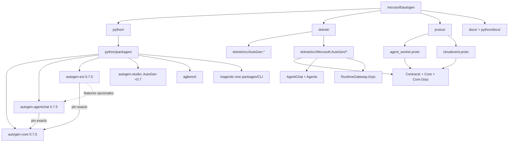

Este mapa evita dos simplificaciones del overview previo. Primero, `autogen-ext` no está debajo del runtime como si fuera un driver obligatorio: es un paquete hermano que implementa interfaces de Core. Segundo, .NET no son “cuatro archivos generados”; hay una familia histórica y diez proyectos bajo `Microsoft.AutoGen`, entre contratos, core, AgentChat, host, extensions y gateway. El número de artefactos NuGet publicados queda fuera del diagrama porque no se verificó desde el código local.

### Frontera Core / AgentChat / Ext

- **Core**: identidad, topics, subscriptions, serialización, components, model interfaces, tools, memoria, telemetría y runtime local.
- **AgentChat**: agentes conversacionales, mensajes, teams, termination y UI de streaming.
- **Ext**: SDK clients, stores, MCP, executors, agentes especializados y runtime gRPC.
- **Studio**: producto de prototipado con frontend y backend propios; su manifest no sigue 0.7.5.

El diseño permite usar Core sin AgentChat. El ejemplo del runtime crea un `RoutedAgent` y envía mensajes sin `AssistantAgent` (`python/packages/autogen-core/src/autogen_core/_single_threaded_agent_runtime.py:168-245`). También permite usar AgentChat con runtime embebido sin gRPC (`python/packages/autogen-agentchat/src/autogen_agentchat/teams/_group_chat/_base_group_chat.py:134-142`).

## 2. Modelo de actores: contratos y direcciones

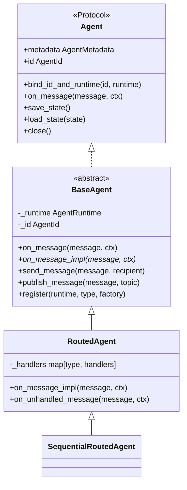

`Agent` es estructural: un runtime puede alojar cualquier objeto que cumpla el protocolo. `BaseAgent` añade lifecycle y helpers. `RoutedAgent` descubre métodos decorados y despacha por tipo concreto. `SequentialRoutedAgent`, usado por GroupChat, serializa ciertos tipos de mensajes para impedir carreras internas; no sustituye al runtime global.

### Dirección de actor

```python
# verified path:line: python/packages/autogen-core/src/autogen_core/_agent_id.py:12-33
class AgentId:
    """
    Agent ID uniquely identifies an agent instance within an agent runtime - including distributed runtime. It is the 'address' of the agent instance for receiving messages.

    See here for more information: :ref:`agentid_and_lifecycle`
    """

    def __init__(self, type: str | AgentType, key: str) -> None:
        if isinstance(type, AgentType):
            type = type.type

        if not is_valid_agent_type(type):
            raise ValueError(rf"Invalid agent type: {type}. Allowed values MUST match the regex: `^[\w\-\.]+\Z`")

        self._type = type
        self._key = key

    def __hash__(self) -> int:
        return hash((self._type, self._key))

    def __str__(self) -> str:
        return f"{self._type}/{self._key}"
```

`type` identifica factory; `key` identifica instancia. La factory se registra una vez y el runtime instancia por ID de forma lazy o explícita. El diseño separa clase Python de addressable agent type: dos factories podrían producir la misma clase con types distintos.

### Mensajería directa y broadcast

```mermaid
%% verified path:line: python/packages/autogen-core/src/autogen_core/_agent_runtime.py:20-73
%% verified path:line: python/packages/autogen-core/src/autogen_core/_type_subscription.py:10-60
flowchart LR
  Sender[Actor / caller]
  Sender -->|send_message(message, AgentId)| Runtime[AgentRuntime]
  Runtime -->|MessageContext is_rpc=True| One[un destinatario]
  One -->|response future| Sender

  Sender -->|publish_message(message, TopicId)| Runtime
  Runtime --> Subs[SubscriptionManager]
  Subs -->|TypeSubscription maps topic.source to key| A1[0..N actors]
  A1 -. no response expected .-> Runtime
```

`send_message()` es RPC semántico: crea un future y espera respuesta. `publish_message()` es evento: no espera respuestas. En `RoutedAgent`, `@rpc` registra router que exige `ctx.is_rpc`; `@event` exige lo contrario (`python/packages/autogen-core/src/autogen_core/_routed_agent.py:278-285`, `:399-405`).

`TopicId` consta de type y source, inspirado en CloudEvents; `TypeSubscription` hace match por type y convierte source en agent key (`python/packages/autogen-core/src/autogen_core/_topic.py:11-38`; `python/packages/autogen-core/src/autogen_core/_type_subscription.py:10-60`). Este detalle explica cómo un mismo subscription pattern crea instancias separadas por conversación/source.

## 3. Runtime local: queue, envelopes y tasks

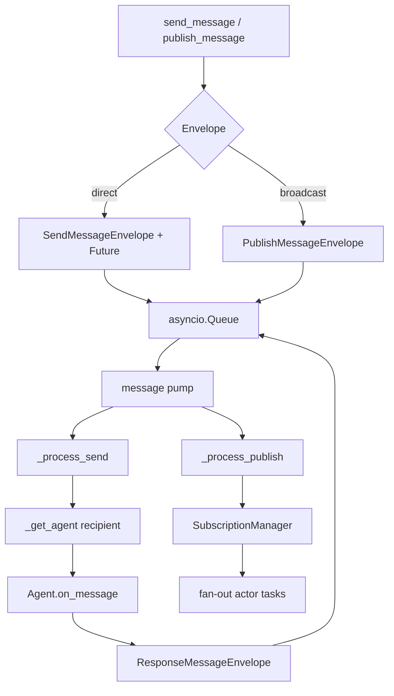

El nombre `SingleThreadedAgentRuntime` puede inducir a error. El docstring dice que usa una sola queue, pero procesa mensajes en tareas asyncio separadas concurrentemente (`python/packages/autogen-core/src/autogen_core/_single_threaded_agent_runtime.py:149-164`). “Single-threaded” no significa “un mensaje termina antes de iniciar el siguiente”; significa un event loop/queue, sin distribución externa. Por eso los agentes que requieren orden interno usan `SequentialRoutedAgent`.

El runtime mantiene factories, instantiated agents, intervention handlers, background tasks, subscription manager y serialization registry (`:249-270`). En direct RPC, el future se liga a un cancellation token y solo se resuelve tras procesar una `ResponseMessageEnvelope` (`:331-385`, `:466-555`). En publish, obtiene recipients por subscription y evita reentregar al sender (`:557-565`).

### Estado local

El runtime local serializa cada agente instanciado bajo su `AgentId`. No serializa subscriptions (`python/packages/autogen-core/src/autogen_core/_single_threaded_agent_runtime.py:431-458`). Por eso un restore completo exige volver a registrar factories/subscriptions antes de `load_state()`. El estado no es un scheduler durable ni una event log.

## 4. Runtime gRPC: extensión y límite de simetría

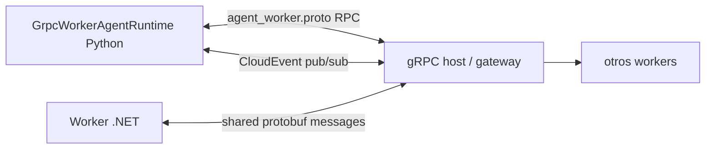

`GrpcWorkerAgentRuntime` conecta a un host, recibe `RpcRequest`, `RpcResponse` y `CloudEvent`, y crea tasks para procesarlos (`python/packages/autogen-ext/src/autogen_ext/runtimes/grpc/_worker_runtime.py:261-306`). Mensajes RPC se serializan con `SerializationRegistry`; los eventos pueden usar JSON o Protobuf (`:366-490`). Cross-language requiere schemas protobuf comunes; Python objects arbitrarios serializados como JSON no crean automáticamente un contrato .NET.

La arquitectura previa dibujaba `GrpcWorkerAgentRuntime` como equivalente distribuido total. El código muestra una asimetría crítica:

```python
# verified path:line: python/packages/autogen-ext/src/autogen_ext/runtimes/grpc/_worker_runtime.py:492-505
async def save_state(self) -> Mapping[str, Any]:
    raise NotImplementedError("Saving state is not yet implemented.")

async def load_state(self, state: Mapping[str, Any]) -> None:
    raise NotImplementedError("Loading state is not yet implemented.")

async def agent_metadata(self, agent: AgentId) -> AgentMetadata:
    raise NotImplementedError("Agent metadata is not yet implemented.")
```

Por tanto, reemplazar runtime local por gRPC no conserva todos los métodos operativos del protocolo en 0.7.5.

## 5. Puente AgentChat ↔ Core

`BaseGroupChat` declara que proporciona el mapping entre AgentChat API y Core API (`python/packages/autogen-agentchat/src/autogen_agentchat/teams/_group_chat/_base_group_chat.py:40-62`). Ese mapping es el centro de la arquitectura.

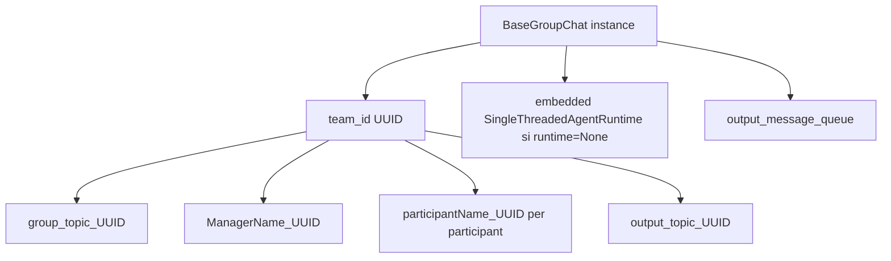

Cada team instance recibe UUID, de modo que nombres de participantes pueden repetirse entre teams sin colisionar. Se generan cuatro clases de topic: group broadcast, manager direct, participant direct y output. El runtime embebido se configura con `ignore_unhandled_exceptions=False` para que excepciones de background emerjan (`:134-142`).

### Registro y subscriptions

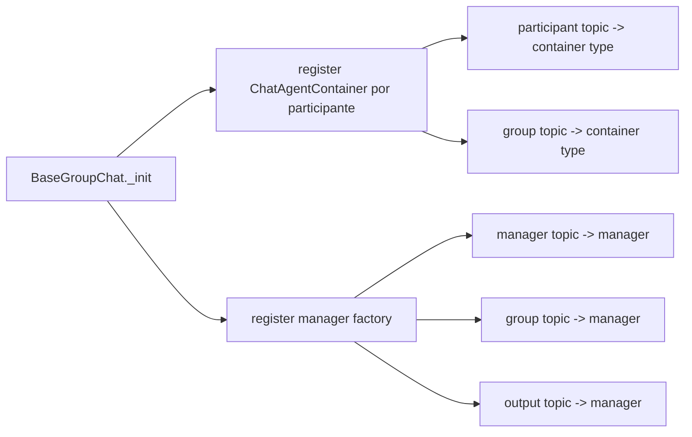

El manager y todos los contenedores oyen el group topic. Cada contenedor oye además su topic individual. El manager oye su topic y output. Esto implementa broadcast de contexto y activación selectiva sin llamar directamente objetos Python desde el manager.

### Por qué existe `ChatAgentContainer`

`ChatAgent` tiene API `on_messages_stream(messages, cancellation_token)` y no el `on_message(message, MessageContext)` del actor core. El container adapta ambos mundos, mantiene buffer y traduce eventos runtime a llamadas AgentChat.

```python
# verified path:line: python/packages/autogen-agentchat/src/autogen_agentchat/teams/_group_chat/_chat_agent_container.py:85-112
@event
async def handle_request(self, message: GroupChatRequestPublish, ctx: MessageContext) -> None:
    """Handle a content request event by passing the messages in the buffer
    to the delegate agent and publish the response."""
    if isinstance(self._agent, Team):
        try:
            stream = self._agent.run_stream(
                task=self._message_buffer,
                cancellation_token=ctx.cancellation_token,
                output_task_messages=False,
            )
            result: TaskResult | None = None
            async for team_event in stream:
                if isinstance(team_event, TaskResult):
                    result = team_event
                else:
                    await self._log_message(team_event)
            if result is None:
                raise RuntimeError(
                    "The team did not produce a final TaskResult. Check the team's run_stream method."
                )
            self._message_buffer.clear()
            # Publish the team response to the group chat.
            await self.publish_message(
                GroupChatTeamResponse(result=result, name=self._agent.name),
                topic_id=DefaultTopicId(type=self._parent_topic_type),
                cancellation_token=ctx.cancellation_token,
            )
```

Para un `ChatAgent`, llama `on_messages_stream()` y exige una `Response` final (`_chat_agent_container.py:123-149`). El buffer se borra al publicar respuesta. Para un team anidado, consume eventos hasta `TaskResult` y publica `GroupChatTeamResponse` (`:89-112`). RoundRobin y Selector permiten ese nesting; Swarm y MagenticOne lo restringen en sus constructors/docs.

## 6. Protocolo de GroupChat: plano de datos y control

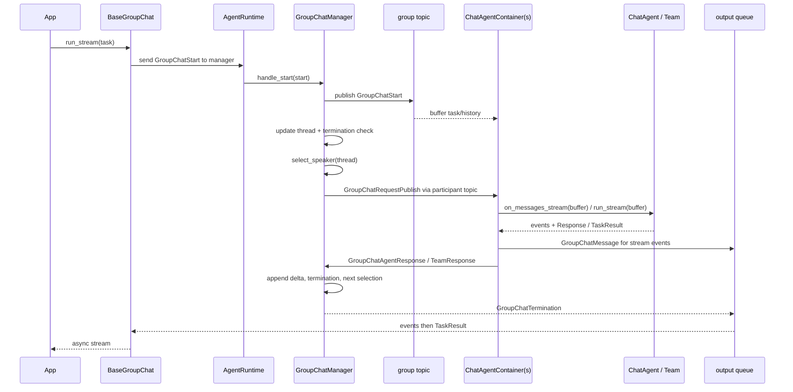

### Plano de datos

Los `BaseChatMessage` producidos por agentes se publican al topic grupal y se copian en buffers. Eventos internos (`BaseAgentEvent`) se emiten a aplicaciones, pero la documentación de `messages.py` distingue chat messages para comunicación agente-agente de agent events para señalización a usuario/aplicación (`python/packages/autogen-agentchat/src/autogen_agentchat/messages.py:1-4`, `:149-152`).

### Plano de control

`GroupChatStart`, `GroupChatRequestPublish`, `GroupChatAgentResponse`, reset/pause/resume y termination controlan ejecución. El manager mantiene `_active_speakers`, lo que permite GraphFlow seleccionar varios nodos en paralelo y esperar que todos respondan antes de la siguiente transición (`python/packages/autogen-agentchat/src/autogen_agentchat/teams/_group_chat/_base_group_chat_manager.py:134-164`).

### Termination

El manager evalúa primero condición custom sobre el delta y luego `max_turns`. Cuando termina, resetea condición y turn counter y emite `GroupChatTermination` (`_base_group_chat_manager.py:195-260`). La condición es stateful y se compone con AND/OR (`python/packages/autogen-agentchat/src/autogen_agentchat/base/_termination.py:15-85`). No existe default universal.

## 7. Arquitecturas de selección por Team

### 7.1 RoundRobinGroupChat

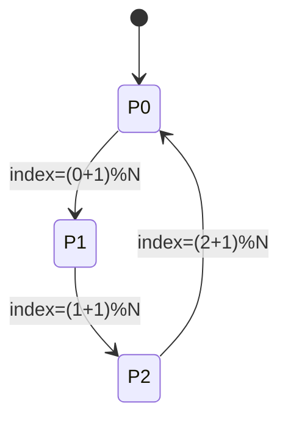

La máquina real es un índice, no un scheduler separado. `save_state()` conserva ese índice, por lo que resume el próximo speaker correctamente (`_round_robin_group_chat.py:58-70`). El thread no decide selección. Con un participante, siempre retorna el mismo.

### 7.2 SelectorGroupChat

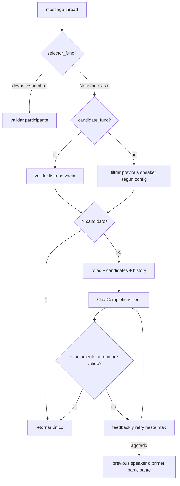

Este orden reduce calls al modelo si una función custom resuelve selección. La validación de menciones usa regex sensible a nombres y variantes con underscores (`_selector_group_chat.py:310-341`). El prompt se envía como `SystemMessage` para familia OpenAI y `UserMessage` para otras (`:232-245`), una adaptación provider-aware que el overview previo no mostraba.

### 7.3 Swarm

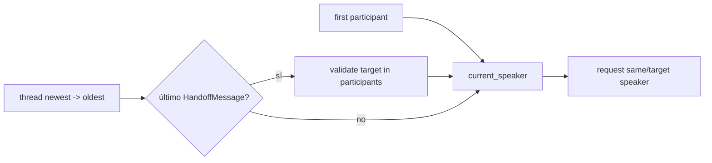

El nombre “Swarm” no implica elección emergente de múltiples agentes. Solo uno habla; un `HandoffMessage` cambia el pointer. Si no hay handoff, continúa el mismo speaker (`_swarm_group_chat.py:126-132`). El target se valida al iniciar/reanudar y al seleccionar.

### 7.4 GraphFlow

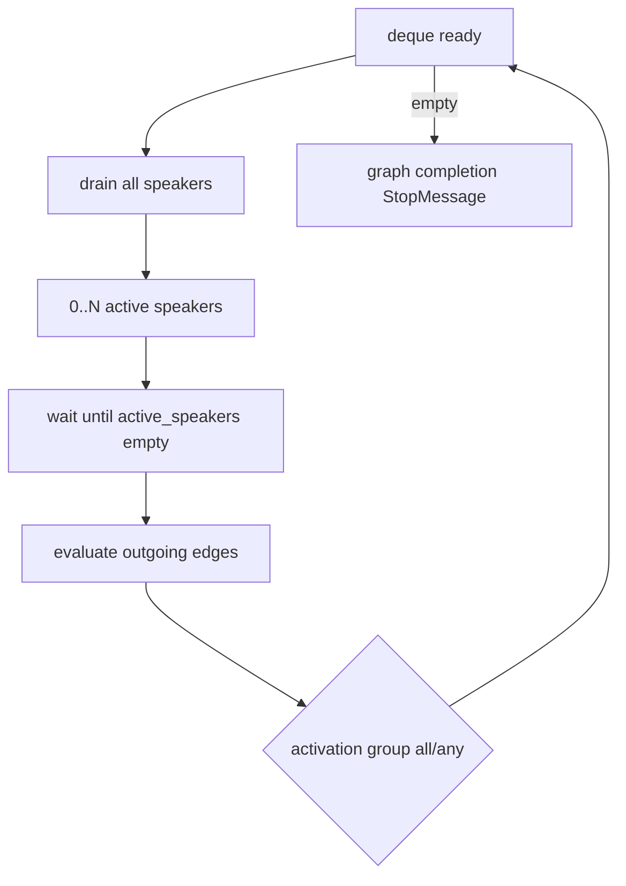

`select_speaker()` drena toda la cola ready y puede activar varios participantes (`_digraph_group_chat.py:458-468`). GraphFlow sobreescribe termination para parar cuando no quedan nodos listos antes de consultar condiciones standard (`:473-504`). El builder registra nodes por agent name y edges opcionales con condición string/callable y activation group (`python/packages/autogen-agentchat/src/autogen_agentchat/teams/_group_chat/_graph/_graph_builder.py:96-120`).

Callables no se serializan al `dump_component`, una pérdida arquitectónica explícita (`_digraph_group_chat.py:580-583`). Para workflows durables, condiciones declarativas son más seguras que closures.

### 7.5 MagenticOneGroupChat

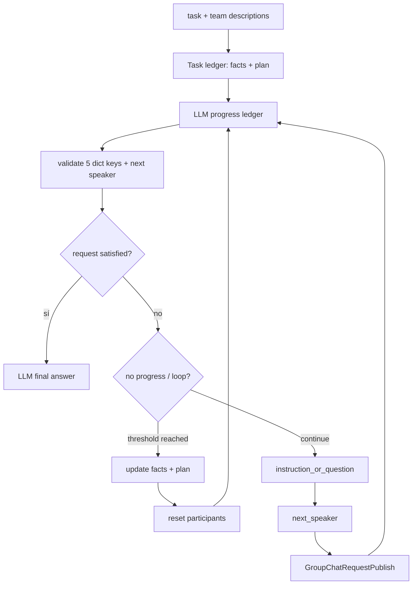

Magentic-One no usa el `select_speaker()` base; ese método retorna dummy y `_orchestrate_step()` elige speaker (`python/packages/autogen-agentchat/src/autogen_agentchat/teams/_group_chat/_magentic_one/_magentic_one_orchestrator.py:247-249`, `:300-440`). El progress ledger exige `is_request_satisfied`, `is_progress_being_made`, `is_in_loop`, `instruction_or_question` y `next_speaker`, cada uno con answer/reason (`:348-377`). Tras demasiados stalls, actualiza facts/plan y reentra al outer loop (`:393-406`, `:451-476`).

El helper empaqueta agentes especializados:

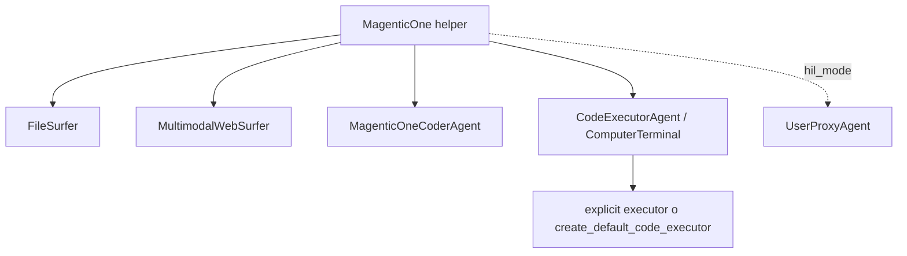

El helper no “incluye Docker” directamente. Si no se pasa executor, llama factory; esta prefiere Docker y cae a local (`python/packages/autogen-ext/src/autogen_ext/code_executors/__init__.py:41-80`).

## 8. Arquitectura de `AssistantAgent`

```mermaid
%% verified path:line: python/packages/autogen-agentchat/src/autogen_agentchat/agents/_assistant_agent.py:1027-1115
%% verified path:line: python/packages/autogen-agentchat/src/autogen_agentchat/agents/_assistant_agent.py:1144-1242
flowchart TD
  Input[BaseChatMessage delta] --> Context[ChatCompletionContext]
  Context --> Memories[for each Memory.update_context]
  Memories --> MQ[MemoryQueryEvent(s)]
  Memories --> Gather[get_messages]
  Gather --> Tools[Workbench.list_tools + handoff tools]
  Tools --> Client[ChatCompletionClient.create/create_stream]
  Client --> Result{texto o FunctionCall list}
  Result -->|texto| Response[Text/Structured Message]
  Result -->|tools| Parallel[asyncio.gather tool calls]
  Parallel --> ToolEvents[request + execution events]
  ToolEvents --> Handoff{handoff call?}
  Handoff -->|sí| HM[HandoffMessage]
  Handoff -->|no y quedan iteraciones| Client
  Handoff -->|no/final| Summary[summary/reflection/response]
```

El loop no acopla a un proveedor. Construye `llm_messages`, lista tools de todos los workbenches, elige streaming o no y delega al client (`_assistant_agent.py:1055-1115`). Function calls se ejecutan concurrentemente con `asyncio.gather` y producen eventos antes de añadir `FunctionExecutionResultMessage` al context (`:1192-1242`).

La memoria se ejecuta antes de la llamada al modelo. Cada store controla cómo consulta y cómo muta context; AgentChat solo emite eventos con resultados (`:1027-1053`). Esto permite combinar ListMemory, vector store y Mem0, pero también significa que varias stores pueden agregar múltiples system messages y consumir presupuesto sin un router global.

## 9. Arquitectura de memoria

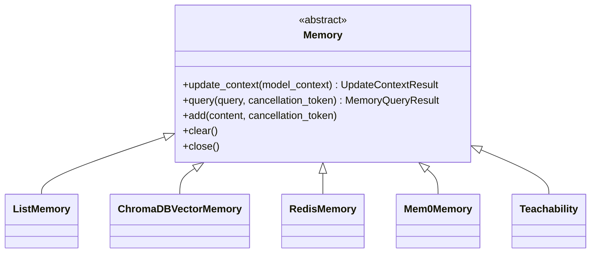

### Stores concretos

- `ListMemory`: lista cronológica; `query()` ignora query y devuelve todo (`python/packages/autogen-core/src/autogen_core/memory/_list_memory.py:104-165`).
- `ChromaDBVectorMemory`: local persistent o HTTP, top-k/threshold y varias embedding functions (`python/packages/autogen-ext/src/autogen_ext/memory/chromadb/_chromadb.py:35-59`, `:189-279`).
- `RedisMemory`: `MessageHistory` secuencial o `SemanticMessageHistory` vectorial (`python/packages/autogen-ext/src/autogen_ext/memory/redis/_redis_memory.py:175-192`).
- `Mem0Memory`: cloud/local con user id y retrieval de Mem0 (`python/packages/autogen-ext/src/autogen_ext/memory/mem0/_mem0.py:166-191`).
- `Teachability`: experimental task-centric memory que implementa el mismo contrato (`python/packages/autogen-ext/src/autogen_ext/experimental/task_centric_memory/utils/teachability.py:12-25`).

### Flujo de retrieval

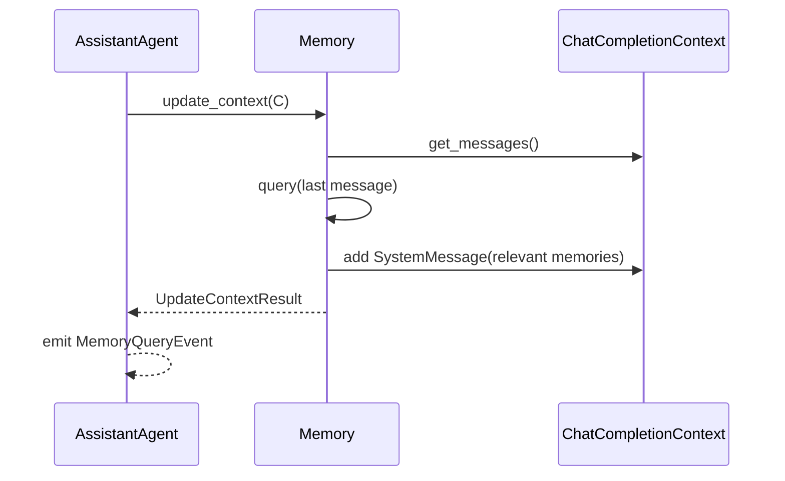

Memoria de retrieval no es team checkpoint. `save_state()` del team conserva managers/containers/agents; `Memory` decide su propio storage. El artículo previo mezclaba ambos al comparar con LangGraph checkpointers.

## 10. Arquitectura de model clients

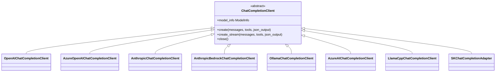

`ModelInfo` anuncia vision, function calling, JSON, family y structured output (`python/packages/autogen-core/src/autogen_core/models/_model_client.py:164-200`). Orchestrators y selectors usan esos flags para adaptar prompt/parse. Magentic-One comprueba function calling y JSON y avisa si el client no es OpenAI-compatible (`python/packages/autogen-ext/src/autogen_ext/teams/magentic_one.py:223-237`).

### OpenAI/Azure/Anthropic

OpenAI y Azure comparten base; Azure añade deployment/endpoint/api_version (`python/packages/autogen-ext/src/autogen_ext/models/openai/_openai_client.py:1520-1539`). Anthropic tiene base propia y clase nativa (`python/packages/autogen-ext/src/autogen_ext/models/anthropic/_anthropic_client.py:1177-1258`). Esto confirma provider injection real, no solo cambio de base URL.

### Gemini

No se encontró una clase `GeminiChatCompletionClient`. El adapter Semantic Kernel documenta Google Gemini (`python/packages/autogen-ext/src/autogen_ext/models/semantic_kernel/_sk_chat_completion_adapter.py:55-75`, `:157-190`), y el manifiesto tiene extras Google. Por eso el diagrama no inventa una caja de cliente Gemini nativo.

## 11. Arquitectura MCP

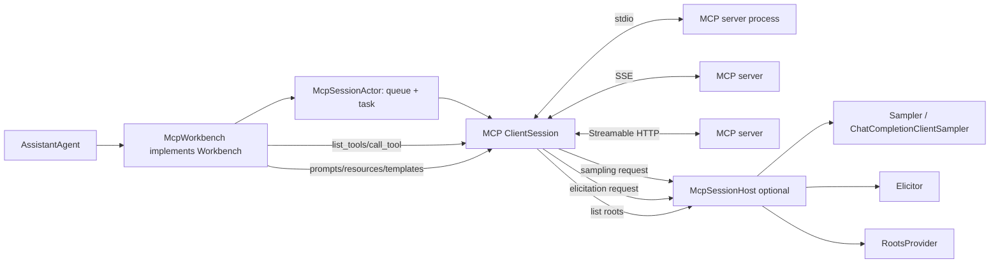

`McpWorkbench.list_tools()` traduce `inputSchema` MCP a `ParametersSchema/ToolSchema` core (`python/packages/autogen-ext/src/autogen_ext/tools/mcp/_workbench.py:274-312`). `call_tool()` mapea overrides, abre span, liga cancellation future y convierte texto/imágenes/resources a `ToolResult` (`:314-363`).

El actor de sesión serializa comandos por queue y mantiene una conexión MCP en una task (`python/packages/autogen-ext/src/autogen_ext/tools/mcp/_actor.py:93-138`, `:185-243`). Sampling, elicitation y roots fallan con `ErrorData` si no hay host (`:140-183`). El workbench soporta tres transports al iniciar (`_workbench.py:460-474`).

### Ausencias MCP verificadas

- `McpAgent`: **no encontrado en el código**.
- `AgentContainer`: **no encontrado en el código**.
- `ChatAgentContainer`: existe, pero pertenece a GroupChat, no MCP.
- `McpSessionActor`: no hereda `RoutedAgent`; “actor” aquí significa loop queue-based interno.

## 12. A2A: frontera negativa

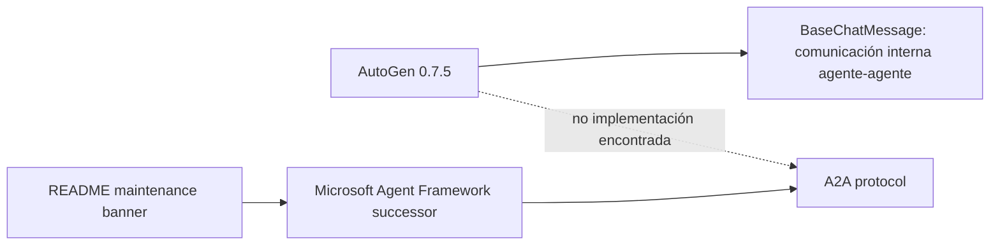

La frase “agent-to-agent communication” de `messages.py` describe el propósito interno de `BaseChatMessage`, no protocolo A2A (`python/packages/autogen-agentchat/src/autogen_agentchat/messages.py:1-4`, `:71-75`). La única mención literal A2A atribuye interoperabilidad a MAF (`README.md:25`). Esta distinción evita convertir nomenclatura genérica en soporte protocolario.

## 13. Arquitectura de ejecución de código

```mermaid
%% verified path:line: python/packages/autogen-ext/src/autogen_ext/code_executors/__init__.py:41-80
flowchart TD
  Agent[CodeExecutorAgent / PythonCodeExecutionTool]
  Agent --> CE[CodeExecutor interface]
  CE --> Factory{create_default_code_executor}
  Factory -->|Docker ping OK| Docker[DockerCommandLineCodeExecutor]
  Factory -->|no Docker / init failure| Local[LocalCommandLineCodeExecutor + warning]
  CE --> Explicit{executor explícito}
  Explicit --> Jupyter[JupyterCodeExecutor]
  Explicit --> Azure[Azure Container executor]
  Docker --> Container[container.exec_run timeout command]
  Local --> Host[asyncio.create_subprocess_exec on host]
  Jupyter --> Kernel[nbclient kernel on host]
```

### Local

Guarda código a archivo dentro del workdir, hereda `os.environ` y ejecuta intérprete con `asyncio.create_subprocess_exec` (`python/packages/autogen-ext/src/autogen_ext/code_executors/local/__init__.py:390-435`). Timeout termina el proceso (`:438-456`). La sanitización mencionada en docstring no convierte el host en sandbox; un Python program puede leer credenciales accesibles al proceso.

### Docker

Monta workdir y ejecuta dentro del container. El comando lleva utilidad `timeout` y se lanza con `container.exec_run` (`python/packages/autogen-ext/src/autogen_ext/code_executors/docker/_docker_code_executor.py:292-306`, `:327-376`). El constructor acepta extra volumes, hosts y devices (`:158-235`), de modo que la configuración puede debilitar aislamiento.

### Jupyter

Mantiene kernel stateful y produce archivos de outputs. El propio código advierte ejecución local (`python/packages/autogen-ext/src/autogen_ext/code_executors/jupyter/_jupyter_code_executor.py:48-54`). Es útil para cálculos iterativos, no para código hostil.

### Approval y Magentic-One

`MagenticOne` pasa `approval_func` al `CodeExecutorAgent`; si no se proporciona, la documentación dice que ejecutará sin aprobación (`python/packages/autogen-ext/src/autogen_ext/teams/magentic_one.py:35-40`, `:203-221`). Una arquitectura segura debe hacer approval mandatory o usar políticas externas, no confiar en que “human in loop” sea default.

## 14. Observabilidad transversal

```mermaid
%% verified path:line: python/packages/autogen-core/src/autogen_core/_telemetry/_genai.py:103-214
flowchart LR
  Construct[BaseChatAgent.__init__] --> CA[create_agent span]
  Run[agent.run / run_stream] --> IA[invoke_agent span]
  MCP[McpWorkbench.call_tool] --> Tool[execute_tool span]
  Runtime[send/publish/process] --> Msg[message runtime spans]
  CA --> OTel[OpenTelemetry provider]
  IA --> OTel
  Tool --> OTel
  Msg --> OTel
```

`trace_create_agent_span` y `trace_invoke_agent_span` siguen semconv GenAI incubating y añaden atributos de system/name/id/description (`python/packages/autogen-core/src/autogen_core/_telemetry/_genai.py:103-214`). `McpWorkbench.call_tool()` usa `trace_tool_span` (`_workbench.py:335-363`). El runtime crea spans alrededor de create/send/publish/process (`python/packages/autogen-core/src/autogen_core/_single_threaded_agent_runtime.py:357-400`, `:466-507`).

No se encontró instrumentación de request SDK dentro de los clientes OpenAI/Anthropic auditados. Un collector puede ver la invocación del agente y tool, pero no debe asumirse automáticamente un span por HTTP model call.

## Descripción técnica

## 15. Invariantes arquitectónicos

### Invariante A — types y topics son parte del routing

GroupChat genera types únicos por team y registra subscriptions antes de ejecutar. Si un participant topic no coincide con su agent type, el manager no puede activarlo. `BaseGroupChatManager` lista estas responsabilidades en su docstring (`python/packages/autogen-agentchat/src/autogen_agentchat/teams/_group_chat/_base_group_chat_manager.py:25-35`).

### Invariante B — el manager no debe invocar participantes directamente

Excepto en lifecycle/state coordinado, el control normal usa topics. `_transition_to_next_speakers()` publica `GroupChatRequestPublish` (`:172-193`). Esto mantiene la posibilidad de runtime externo y fan-out.

### Invariante C — un speaker response debe producir un final marker

Para un agente, el container exige `Response`; para team, exige `TaskResult`. Si no aparecen, levanta `RuntimeError` (`_chat_agent_container.py:96-105`, `:130-142`). Así se delimita streaming intermedio de finalización.

### Invariante D — el manager espera todos los speakers activos

GraphFlow puede seleccionar N speakers. Cada respuesta elimina un nombre de `_active_speakers`; mientras queden, no corre termination ni siguiente selección (`_base_group_chat_manager.py:149-164`). Esto implementa barrera de join simple.

### Invariante E — termination consume deltas

La condición recibe mensajes desde la última llamada, no todo el thread (`python/packages/autogen-agentchat/src/autogen_agentchat/base/_termination.py:15-21`). Implementaciones custom no deben recontar el historial completo.

### Invariante F — AgentChat conserva estado entre runs

`TaskRunner` declara continuidad por llamadas (`python/packages/autogen-agentchat/src/autogen_agentchat/base/_task.py:19-58`). Para una conversación nueva, usar `reset()` o instancia nueva.

## 16. Topología de estado

```mermaid
%% verified path:line: python/packages/autogen-agentchat/src/autogen_agentchat/teams/_group_chat/_chat_agent_container.py:197-213
%% verified path:line: python/packages/autogen-agentchat/src/autogen_agentchat/teams/_group_chat/_round_robin_group_chat.py:58-70
flowchart TB
  TeamState[TeamState]
  TeamState --> ManagerState[manager state]
  TeamState --> ContainerState[participant container states]
  ManagerState --> Thread[message_thread]
  ManagerState --> Turn[current_turn]
  ManagerState --> Strategy[RR index / selector previous / swarm current / graph ready / M1 ledgers]
  ContainerState --> Buffer[message_buffer]
  ContainerState --> AgentState[delegated ChatAgent/Team state]
  AgentState --> Context[model context + implementation-specific]
  Memory[external Memory store] -. separate lifecycle .-> AgentState
  RuntimeState[SingleThreaded runtime state] --> Instantiated[agent states only]
  RuntimeState -. subscriptions omitted .-> Gap[re-register topology]
```

RoundRobin guarda index; Selector previous speaker y model context; Swarm current speaker; GraphFlow ready/remaining/enqueued; Magentic-One task/facts/plan/rounds/stalls (`_magentic_one_orchestrator.py:230-245`). El state shape es strategy-specific. No debe tratarse como schema estable entre team types.

## 17. Failure domains

### Runtime local

- Un handler RPC exception completa el future con excepción.
- Event handler background exceptions pueden emerger al stop según configuración.
- Cancellation inmediata puede dejar team inconsistente; `run_stream` recomienda `ExternalTermination` para graceful stop (`python/packages/autogen-agentchat/src/autogen_agentchat/teams/_group_chat/_base_group_chat.py:368-374`).

### gRPC

- El read loop tiene TODO de reconexión y solo loggea exceptions (`python/packages/autogen-ext/src/autogen_ext/runtimes/grpc/_worker_runtime.py:279-306`).
- State/metadata no implementado.
- Mensajes cross-language requieren schemas compartidos.

### Selector

- Output LLM sin nombre, múltiple o repetido activa retries.
- Tras max attempts, fallback puede repetir speaker anterior o elegir primero; no aborta (`_selector_group_chat.py:302-308`).

### MCP

- Un server stdio puede ejecutar comandos locales; el workbench advierte conectar solo servidores trusted (`python/packages/autogen-ext/src/autogen_ext/tools/mcp/_workbench.py:47-58`).
- Sin host, sampling/elicitation/roots devuelven errores protocolarios.
- `save_state()` del workbench es vacío y `load_state()` no hace nada (`_workbench.py:484-491`); la sesión debe recrearse.

### Code execution

- Factory cae a local, ampliando blast radius.
- Approval es opcional.
- Docker isolation puede romperse con mounts/host daemon/network.
- Jupyter mantiene state entre cells.

## Flujo interno

## 18. Flujo completo: user task → model → tool MCP → response

```mermaid
%% verified path:line: python/packages/autogen-agentchat/src/autogen_agentchat/agents/_assistant_agent.py:1027-1115
%% verified path:line: python/packages/autogen-ext/src/autogen_ext/tools/mcp/_workbench.py:274-363
sequenceDiagram
  participant U as User/App
  participant T as Team
  participant M as Manager
  participant C as ChatAgentContainer
  participant A as AssistantAgent
  participant Mem as Memory store(s)
  participant MC as Model Client
  participant WB as McpWorkbench
  participant MCP as MCP server

  U->>T: run_stream(task)
  T->>M: GroupChatStart
  M->>C: GroupChatRequestPublish
  C->>A: on_messages_stream(buffer)
  A->>Mem: update_context(model_context)
  Mem-->>A: relevant memories
  A->>WB: list_tools()
  WB->>MCP: list_tools
  MCP-->>WB: schemas
  A->>MC: create(messages, tools)
  MC-->>A: FunctionCall
  A->>WB: call_tool(name,args)
  WB->>MCP: tools/call
  MCP-->>WB: CallToolResult
  WB-->>A: ToolResult
  A->>MC: create(messages + tool result)
  MC-->>A: text response
  A-->>C: Response
  C-->>M: GroupChatAgentResponse
  M-->>T: stream + termination/next turn
  T-->>U: events + TaskResult
```

Cada arista tiene un sitio de traducción: task a `TextMessage`, model tool schema a MCP `inputSchema`, MCP result a `ToolResult`, final model text a `TextMessage`, AgentChat response a group event. La arquitectura no pasa objetos MCP directamente al model client.

## 19. Flujo completo: ejecución de código en Magentic-One

```mermaid
%% verified path:line: python/packages/autogen-ext/src/autogen_ext/teams/magentic_one.py:203-221
%% verified path:line: python/packages/autogen-agentchat/src/autogen_agentchat/agents/_code_executor_agent.py:717-721
sequenceDiagram
  participant O as MagenticOneOrchestrator
  participant C as Coder
  participant CT as CodeExecutorAgent
  participant AP as approval_func optional
  participant E as CodeExecutor
  participant OS as Docker container or host

  O->>C: instruction to write/analyze code
  C-->>O: message containing code blocks
  O->>CT: select ComputerTerminal
  CT->>CT: extract code blocks
  opt approval configured
    CT->>AP: ApprovalRequest
    AP-->>CT: approved/rejected
  end
  CT->>E: execute_code_blocks
  E->>OS: container.exec_run or create_subprocess_exec
  OS-->>E: exit code + stdout/stderr
  E-->>CT: CodeResult
  CT-->>O: execution message
```

El código del executor no es generado por el manager; llega por contexto/chat y `CodeExecutorAgent` lo extrae. El orquestador decide speaker, no llama al OS.

## Call Stack / API

### Call stack de team embebido

```text
# verified path:line: python/packages/autogen-agentchat/src/autogen_agentchat/teams/_group_chat/_base_group_chat.py:351-493
Team.run_stream(task)
  BaseGroupChat.run_stream
    normalize task -> TextMessage
    embedded SingleThreadedAgentRuntime.start
    BaseGroupChat._init
      ChatAgentContainer.register x N
      manager.register
      runtime.add_subscription x topology
    send GroupChatStart
      manager.handle_start
        publish GroupChatStart to group/output
        update_message_thread
        apply termination
        select_speaker / strategy-specific orchestration
        publish GroupChatRequestPublish
          container.handle_request
            ChatAgent.on_messages_stream OR Team.run_stream
            publish GroupChatAgentResponse/TeamResponse
              manager.handle_agent_response
                update thread / barrier / termination / next
    drain output queue
    yield TaskResult last
```

### API core estable relevante

- `AgentRuntime.send_message`, `publish_message`, registration, subscriptions, state.
- `BaseAgent.register`, `send_message`, `publish_message`.
- `RoutedAgent` con `@event`, `@rpc`, `@message_handler`.
- `AgentId`, `TopicId`, `TypeSubscription`.
- `ChatCompletionClient`, `Workbench`, `Memory`, `CodeExecutor`.

### API AgentChat relevante

- `ChatAgent`/`BaseChatAgent`, `AssistantAgent`, `CodeExecutorAgent`, `UserProxyAgent`.
- `Team`, `TaskResult`, `TerminationCondition`.
- `RoundRobinGroupChat`, `SelectorGroupChat`, `Swarm`, `MagenticOneGroupChat`, `GraphFlow`.

### API Ext relevante

- OpenAI/Azure/Anthropic/Ollama/AzureAI/LlamaCpp/SK clients.
- ChromaDB/Redis/Mem0 stores.
- Docker/local/Jupyter executors.
- `McpWorkbench`, transports y host.
- `GrpcWorkerAgentRuntime`.

## Diagramas

## 20. Diagrama de capas consolidado

```mermaid
%% verified path:line: python/packages/autogen-agentchat/src/autogen_agentchat/teams/_group_chat/_base_group_chat.py:40-62
%% verified path:line: python/packages/autogen-ext/src/autogen_ext/teams/magentic_one.py:203-221
flowchart TB
  subgraph App[Aplicación]
    User[HTTP/CLI/Notebook/UI]
  end

  subgraph AgentChat[autogen-agentchat]
    Agents[AssistantAgent / UserProxy / CodeExecutorAgent]
    Teams[RR / Selector / Swarm / MagenticOne / GraphFlow]
    Terms[Termination conditions]
    Messages[Chat messages + events + TaskResult]
    Containers[ChatAgentContainer]
    Managers[GroupChat managers]
  end

  subgraph Core[autogen-core]
    Actor[Agent / BaseAgent / RoutedAgent]
    Runtime[AgentRuntime + SingleThreadedAgentRuntime]
    Address[AgentId / TopicId / subscriptions]
    Contracts[Models / Tools / Memory / CodeExecutor]
    Telemetry[OTel helpers]
  end

  subgraph Ext[autogen-ext]
    Models[OpenAI / Azure / Anthropic / Ollama / adapters]
    MCP[MCP Workbench / session actor / host]
    Memory[ChromaDB / Redis / Mem0]
    Exec[Docker / Local / Jupyter / Azure]
    GRPC[GrpcWorkerAgentRuntime]
    Specialized[Web/File/Coder + MagenticOne helper]
  end

  User --> Teams
  Teams --> Containers
  Teams --> Managers
  Containers --> Agents
  Containers --> Runtime
  Managers --> Runtime
  Runtime --> Actor
  Runtime --> Address
  Agents --> Contracts
  Agents --> Models
  Agents --> MCP
  Agents --> Memory
  Agents --> Exec
  GRPC -. implements .-> Runtime
  Models -. implements .-> Contracts
  MCP -. implements Workbench .-> Contracts
  Memory -. implements Memory .-> Contracts
  Exec -. implements CodeExecutor .-> Contracts
  Specialized --> Agents
  Terms --> Managers
```

## 21. Diagrama de despliegue local frente a distribuido

```mermaid
%% verified path:line: python/packages/autogen-agentchat/src/autogen_agentchat/teams/_group_chat/_base_group_chat.py:134-142
%% verified path:line: python/packages/autogen-ext/src/autogen_ext/runtimes/grpc/_worker_runtime.py:261-306
flowchart LR
  subgraph Local[Modo default embebido]
    Proc[Proceso Python]
    TeamL[Team]
    RTL[SingleThreadedAgentRuntime]
    ActorsL[manager + containers]
    Proc --> TeamL --> RTL --> ActorsL
  end

  subgraph Distributed[Modo explícito distribuido]
    App[App]
    Host[gRPC host]
    WP[Python worker]
    WD[.NET worker]
    App --> Host
    Host <--> WP
    Host <--> WD
  end

  TeamL -. caller puede inyectar AgentRuntime .-> Host
```

La flecha punteada no implica que cualquier `BaseGroupChat` automáticamente se distribuya sin configuración. El constructor acepta `runtime: AgentRuntime | None`; la inicialización registrará sus actors/subscriptions en el runtime pasado (`_base_group_chat.py:66-78`, `:191-243`). El runtime gRPC requiere host en ejecución, serializers y schemas adecuados.

## Código relacionado

| Subsistema | Paths fuente |
|---|---|
| Actor protocol | `autogen_core/_agent.py`, `_base_agent.py`, `_routed_agent.py` |
| Addressing/pub-sub | `_agent_id.py`, `_topic.py`, `_type_subscription.py`, `_runtime_impl_helpers.py` |
| Local runtime | `_single_threaded_agent_runtime.py` |
| gRPC runtime | `autogen_ext/runtimes/grpc/_worker_runtime.py` |
| GroupChat bridge | `_group_chat/_base_group_chat.py`, `_chat_agent_container.py` |
| Managers | `_base_group_chat_manager.py`, concrete team modules |
| Graph | `_graph/_digraph_group_chat.py`, `_graph/_graph_builder.py` |
| Magentic-One | `_magentic_one_group_chat.py`, `_magentic_one_orchestrator.py`, `autogen_ext/teams/magentic_one.py` |
| Memory | `autogen_core/memory/`, `autogen_ext/memory/` |
| MCP | `autogen_ext/tools/mcp/` |
| Execution | `autogen_ext/code_executors/` |
| Models | `autogen_core/models/`, `autogen_ext/models/` |
| .NET shared runtime | `dotnet/src/Microsoft.AutoGen/` + `protos/` |

Las rutas del overview previo que colocaban modules de Teams directamente bajo `teams/` son obsoletas para este commit; viven en `teams/_group_chat/`.

## Ejemplos

## 22. Ejemplo arquitectónico: team con runtime inyectado

```python
# verified path:line: python/packages/autogen-agentchat/tests/test_society_of_mind_agent.py:27-37
model_client = ReplayChatCompletionClient(["1", "2", "3"])
agent1 = AssistantAgent("assistant1", model_client=model_client, system_message="You are a helpful assistant.")
agent2 = AssistantAgent("assistant2", model_client=model_client, system_message="You are a helpful assistant.")
inner_termination = MaxMessageTermination(3)
inner_team = RoundRobinGroupChat(
    [agent1, agent2], termination_condition=inner_termination, runtime=runtime
)
society_of_mind_agent = SocietyOfMindAgent(
    "society_of_mind", team=inner_team, model_client=model_client
)
response = await society_of_mind_agent.run(task="Count to 10.")
```

La API concreta de `RoundRobinGroupChat` acepta runtime mediante su base/factory; la condición explícita evita el default infinito. Si una aplicación comparte runtime entre teams, los UUID topics previenen colisión. Debe gestionar lifecycle del runtime externo; `BaseGroupChat` solo arranca/para automáticamente el embedded runtime.

## 23. Ejemplo arquitectónico: selector determinista antes del LLM

```python
# verified path:line: python/packages/autogen-agentchat/tests/test_group_chat.py:1180-1188
termination = MaxMessageTermination(6)
team = SelectorGroupChat(
    participants=[agent1, agent2, agent3, agent4],
    model_client=model_client,
    selector_func=_select_agent,
    termination_condition=termination,
    runtime=runtime,
)
result = await team.run(task="task")
```

La arquitectura aplica la función antes de candidatos/model. Si devuelve un nombre inválido, levanta `ValueError`; si devuelve `None`, continúa. Esta es la forma correcta de combinar reglas fuertes con flexibilidad LLM.

## 24. Ejemplo arquitectónico: MCP con lifecycle explícito

```python
# verified path:line: python/packages/autogen-ext/src/autogen_ext/tools/mcp/_workbench.py:97-121
params = StdioServerParams(
    command="uvx",
    args=["mcp-server-fetch"],
    read_timeout_seconds=60,
)
async with McpWorkbench(server_params=params) as workbench:
    tools = await workbench.list_tools()
    result = await workbench.call_tool(tools[0]["name"], {"url": "https://github.com/"})
```

El context manager importa porque hay una task actor y una sesión que cerrar. El ejemplo no conecta un server arbitrario en producción: el código advierte trust boundary para stdio.

## 25. Ejemplo arquitectónico: memoria inyectada

```python
# verified path:line: python/packages/autogen-agentchat/src/autogen_agentchat/agents/_assistant_agent.py:596-609
memory = ListMemory()
await memory.add(MemoryContent(content="User likes pizza.", mime_type="text/plain"))
await memory.add(MemoryContent(content="User dislikes cheese.", mime_type="text/plain"))
agent = AssistantAgent(
    name="assistant",
    model_client=model_client,
    memory=[memory],
    system_message="You are a helpful assistant.",
)
result = await agent.run(task="What is a good dinner idea?")
```

El constructor acepta una lista de stores y el loop las consulta secuencialmente; cada una puede mutar context. El snippet oficial muestra una store, no ranking global entre stores. Para Aithera conviene envolver múltiples backends en un `MemoryRouter` que dedupe, ordene y limite tokens antes de una sola inserción.

## Buenas prácticas

1. **Mantener los planos separados**: actor routing, conversational API y adaptadores externos deben tener interfaces propias.
2. **Nombrar runtime por implementación**: “AgentRuntime” como contrato, “SingleThreaded” como default, “gRPC worker” como extensión.
3. **Usar topics únicos por workflow**: el UUID team pattern evita colisiones al compartir runtime.
4. **Adaptar agentes de dominio con contenedor**: no forzar a toda clase de negocio a heredar del actor core.
5. **Seleccionar con jerarquía**: reglas deterministas → candidatos → LLM → validación/retry → fallback.
6. **Modelar joins explícitos**: `_active_speakers` es una barrera para fan-out; no avanzar al primer resultado.
7. **Persistir topology fuera del state**: subscriptions no están en runtime state.
8. **Definir termination explícita**: usar condition y max_turns para defensa en profundidad.
9. **Cerrar stores/workbenches/clients/executors**: lifecycle no es opcional en servicios long-running.
10. **No usar local executor con output LLM no confiable**: Docker rootless o sandbox dedicado, approval/policy y egress control.
11. **Tratar MCP server como principal no confiable**: validar server, schemas, tool allowlist, arguments y outputs.
12. **No prometer A2A**: usar términos de protocolo solo cuando exista adapter/server/client real.
13. **No inferir provider support de un extra**: localizar clase/adaptador y su model translation.
14. **Versionar diagrams por SHA**: la topología de rutas cambió y puede volver a cambiar.

## Errores comunes

- Dibujar `autogen-ext` debajo de AgentChat como si toda ejecución atravesara Ext.
- Colocar gRPC entre app y AgentChat siempre.
- Hacer que manager llame directamente a `AssistantAgent`.
- Omitir `ChatAgentContainer` y perder la traducción entre APIs.
- Mezclar group topic, participant topic y output queue.
- Representar Swarm como fan-out; Swarm elige un current speaker por handoff.
- Representar GraphFlow como selector LLM; usa graph ready queue y conditions.
- Representar Magentic-One como el selector genérico; tiene su propio inner/outer loop.
- Representar memory como parte del runtime checkpoint.
- Llamar sandbox a subprocess/Jupyter.
- Inventar `McpAgent` o `AgentContainer`.
- Confundir “agent-to-agent messages” con protocolo A2A.
- Suponer que Studio 0.7.5 consume los paquetes 0.7.5; el manifest dice `<0.7`.

## Breaking Changes

La frontera principal con 0.2 es conceptual: runtime actor async, componentes y AgentChat moderno. El README remite a migration guide (`README.md:27-36`). No se clonaron tags históricos, así que este documento no dibuja internals 0.2 como si se hubieran auditado.

En la línea actual, APIs experimentales pueden cambiar: GraphFlow lo advierte (`_digraph_group_chat.py:551-557`), callable edge conditions no serializan (`:580-583`) y CodeExecutorAgent se marca experimental (`_code_executor_agent.py:89-92`). MCP `reset/load_state` también son no-op en Workbench (`_workbench.py:484-491`).

## Cambios entre versiones

- Core/AgentChat/Ext: 0.7.5 coordinados.
- Studio: dependencia `<0.7`.
- Magentic-One CLI: depende de `<0.5`.
- MAF: successor recomendado; nuevas features no entrarán en AutoGen según README.

No se extrapola compatibilidad binaria o de state entre estas líneas. Un component config de Studio puede no cargar un provider 0.7.5 sin ajuste.

## Contraste explícito con `autogen.md`

### Claims confirmados

1. Existe arquitectura por capas Core/AgentChat/Ext.
2. El core implementa actor model con messages, IDs, topics y subscriptions.
3. Existen runtime local y gRPC cross-language.
4. Existen RoundRobin, Selector, Swarm, Magentic-One y GraphFlow.
5. MCP soporta tools, resources, prompts y host callbacks avanzados.
6. Existen Docker, local y Jupyter executors.
7. Existe injection de `ChatCompletionClient`, con OpenAI/Azure/Anthropic verificables.
8. Existen OTel spans para lifecycle de agentes/tools/runtime.
9. AutoGen está en maintenance mode y MAF es sucesor.

### Claims no confirmados o corregidos

1. **“Runtime gRPC-based”**: no como default. AgentChat crea `SingleThreadedAgentRuntime` embebido (`_base_group_chat.py:134-142`).
2. **`RpcAgentRuntime`**: no encontrado. El local es `SingleThreadedAgentRuntime`.
3. **`BaseAgent` en `_agent.py`**: falso; `_agent.py` contiene protocol `Agent`, la clase vive en `_base_agent.py`.
4. **Rutas de Teams**: obsoletas; están bajo `_group_chat/`.
5. **Termination defaults**: no existen para RR/Selector/Swarm.
6. **GroupChat direct calls**: no llama `agent.on_messages`; usa topics y container.
7. **State distribuido**: gRPC state es `NotImplementedError`.
8. **“No ChromaDB out-of-the-box”**: hay implementation Ext como extra; no es runtime checkpointer.
9. **`McpAgent`/`AgentContainer`**: no encontrados.
10. **A2A limitado**: no hay implementación AutoGen; la mención es de MAF.
11. **Docker default absoluto**: factory con fallback local.
12. **Gemini native client**: no se encontró una clase nativa; sí adapter SK/compatibility.
13. **Cuatro proyectos .NET**: el árbol contiene más; publicación no verificada.
14. **TaskResult con source**: clase solo contiene messages y stop_reason (`python/packages/autogen-agentchat/src/autogen_agentchat/base/_task.py:9-16`).

### Acción sobre el overview previo

El overview debe apuntar a esta arquitectura para diagrams y al audit para la divergence table. No se modifica automáticamente, porque conservar documento original y correcciones separadas permite revisar cambios antes de fusionarlos.

## Impacto sobre otros sistemas

### Aithera Orchestrator

Puede adoptar el adapter pattern: agentes de alto nivel no necesitan conocer bus/runtime. Un container transforma envelopes a contrato de dominio y respuestas a eventos. Para selección, la jerarquía de AutoGen ofrece un patrón robusto: regla determinista primero y LLM solo cuando sea necesario.

### Aithera Gateway

`TopicId(type, source)` y `TypeSubscription` ofrecen una analogía para channel/session routing. Sin embargo, Aithera ya tiene `MessageEnvelope`; no debe importar AutoGen para obtener el patrón. Puede mantener schemas propios y usar un bus in-process.

### Aithera Memory

El `Memory.update_context()` es simple y extensible, pero permite que cada store inserte system messages sin coordinación. Aithera debería mantener su `MemoryRouter`, dedup y budgets. AutoGen confirma el valor de separar store/query/context update, no de delegar toda policy al backend.

### Seguridad

La combinación browser + MCP + code executor es de alto riesgo. Magentic-One reconoce prompt injection web y recomienda containers/supervisión/acceso limitado (`python/packages/autogen-ext/src/autogen_ext/teams/magentic_one.py:42-52`). Aithera debe impedir fallback local silencioso y exigir approval policies.

## Referencias cruzadas

- [Auditoría L3 y divergencias](./autogen-code-audit.md)
- [Overview AutoGen previo](./autogen.md)
- [Frameworks de agentes](./agent-frameworks.md)
- [LangGraph](./langgraph.md)
- [Agentes](../06_AGENTS/README.md)
- [Memoria](../07_MEMORY/README.md)
- [Seguridad](../11_SECURITY/README.md)
- [Tooling](../12_TOOLING/README.md)
- [Arquitectura general](../02_ARCHITECTURE/README.md)

## Fuentes

1. `microsoft/autogen` commit `027ecf0a379bcc1d09956d46d12d44a3ad9cee14`, acceso 2026-07-13: <https://github.com/microsoft/autogen/tree/027ecf0a379bcc1d09956d46d12d44a3ad9cee14>.
2. Tests del mismo commit en `python/packages/*/tests`, usados como evidencia independiente de contracts.
3. README del mismo commit (`README.md:14-25`), maintenance y MAF.
4. Docs oficiales AutoGen stable, acceso 2026-07-13: <https://microsoft.github.io/autogen/stable/>.
5. Migration guide oficial, acceso 2026-07-13: <https://microsoft.github.io/autogen/stable/user-guide/agentchat-user-guide/migration-guide.html>.
6. Microsoft Agent Framework, acceso 2026-07-13: <https://github.com/microsoft/agent-framework>.
7. Documento previo [`autogen.md`](./autogen.md), fuente a contrastar, no autoridad del código.

## Validación CONSTITUTION §8 — 6/6

- [x] **Código revisado**: cada diagrama se deriva de imports, herencia, registro, subscriptions y entry points del SHA auditado.
- [x] **Fuentes contrastadas**: código + tests + README + docs oficiales + MAF; fecha de acceso incluida.
- [x] **Compatibilidad documentada**: versiones Python, pins de paquetes, Studio divergente y .NET `net8.0`.
- [x] **Ejemplos verificados**: snippets con `verified path:line`, ejemplos existentes en source/tests y `compileall` real `COMPILEALL_OK`.
- [x] **Referencias cruzadas**: audit hermano, overview y dominios Architecture/Agents/Memory/Security/Tooling.
- [x] **Revisión independiente**: documento producido por auditor distinto del autor del overview, con contraste explícito. Integraciones no ejecutadas se declaran, no se simulan.

## Nivel de confianza

**97% en topología estática, call graph y class structure; 88% en despliegue operativo distribuido.** Las aristas centrales se observaron en llamadas y subscriptions. La incertidumbre operativa proviene de no levantar gRPC host .NET, servidores MCP, Docker, Redis/Chroma ni APIs. A2A se marca ausente tras búsqueda completa del árbol; no se infiere soporte por el README de MAF.

## Pendientes

1. Diagrama de gateway .NET/Orleans tras auditoría completa de `dotnet/src/Microsoft.AutoGen/RuntimeGateway.Grpc`.
2. Secuencia cross-language ejecutada con un mensaje protobuf compartido.
3. Prueba de chaos/reconnect del worker gRPC; el read loop tiene TODO de reconnect.
4. Threat model MCP + browser + code execution con trust boundaries y egress.
5. Benchmark de ordering/concurrency de `SequentialRoutedAgent` bajo fan-out GraphFlow.
6. Export OTel real para confirmar spans visibles y gaps por model SDK request.
7. Actualización controlada de [`autogen.md`](./autogen.md) usando las correcciones del audit.

## Changelog

### 2026-07-13 — versión inicial

- Reconstruida arquitectura física y lógica desde commit `027ecf0`.
- Añadidos diagramas de monorepo, actores, runtimes, GroupChat, cinco Teams, AssistantAgent, memory, models, MCP, A2A ausente, execution y observability.
- Corregido gRPC-default, rutas antiguas, termination defaults, state distribuido y nombres MCP inexistentes.
- Estado: 🟢 verificado con límites declarados.
