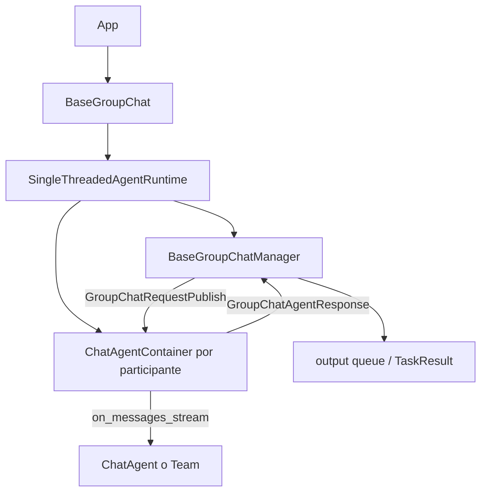

# AutoGen — auditoría L3 del código real (HEAD `027ecf0`, 2026-07-13)

## Resumen

Esta auditoría examina el código clonado de `microsoft/autogen` en el commit exacto `027ecf0a379bcc1d09956d46d12d44a3ad9cee14` y contrasta sus contratos, implementaciones, tests y manifiestos con el artículo previo [`autogen.md`](./autogen.md). El resultado confirma la arquitectura por capas, el runtime de actores, los cinco tipos de `Team`, MCP, memoria, ejecución de código y clientes OpenAI/Azure/Anthropic, pero corrige afirmaciones importantes: el runtime local actual se llama `SingleThreadedAgentRuntime`, no `RpcAgentRuntime`; gRPC es una extensión opcional y no la base obligatoria de AgentChat; no existen `McpAgent`, `AgentContainer` ni una implementación del protocolo A2A en este árbol; y varias rutas publicadas en el documento anterior ya no existen.

La evidencia primaria es el código, no el README. Se leyó el flujo completo desde `BaseGroupChat.run_stream()` hasta `BaseGroupChatManager`, `ChatAgentContainer`, los selectores concretos y el runtime. Se verificaron además los contratos de memoria, MCP, code executors, clientes de modelo, tests y manifiestos. Todos los `path:line` de este documento se refieren al commit anterior y fueron comprobados contra el clon local. Cuando el código no contiene lo buscado, se indica expresamente **no encontrado en el código**.

## Objetivo

El objetivo es responder con evidencia reproducible a estas preguntas:

1. ¿Cuál es la estructura real del monorepo y qué capas están activas?
2. ¿Cómo funciona de verdad el actor model de `autogen-core`?
3. ¿Cómo construye AgentChat un GroupChat sobre actores, topics y contenedores?
4. ¿Cómo seleccionan speaker `RoundRobinGroupChat`, `SelectorGroupChat` y `Swarm`?
5. ¿Qué implementa MCP y qué nombres solicitados no existen?
6. ¿Existe A2A en AutoGen o solo se menciona como capacidad del sucesor MAF?
7. ¿Qué garantías y riesgos tienen Docker, subprocess local y Jupyter?
8. ¿Cuál es el contrato de memoria y cómo lo consume `AssistantAgent`?
9. ¿Qué `Team` y clientes LLM están realmente presentes?
10. ¿Qué claims de `autogen.md` se confirman, cuáles requieren matiz y cuáles deben corregirse?

## Estado

🟢 **Verificado sobre código real** — auditoría L3 sobre un clon `--depth 1`.

- **Repositorio**: <https://github.com/microsoft/autogen>
- **Commit auditado**: `027ecf0a379bcc1d09956d46d12d44a3ad9cee14`
- **Fecha del commit**: 2026-04-06
- **Mensaje de HEAD**: `Update maintenance mode banner in readme (#7521)`
- **Fecha de acceso y auditoría**: 2026-07-13
- **Inventario local**: 1.837 archivos fuera de `.git`; 546 `.py`, 497 `.cs`, 96 `.tsx`, 29 `.ts`, 162 `.md`, 49 notebooks `.ipynb`.
- **Chequeo ejecutado**: `python -m compileall -q` sobre los `src` de `autogen-core`, `autogen-agentchat` y `autogen-ext`: `COMPILEALL_OK`.
- **Límite honesto**: no se ejecutó la suite completa, porque requiere extras, servicios y credenciales (Docker, Redis, ChromaDB, MCP servers, APIs). Los ejemplos de comportamiento se contrastaron con tests existentes y se citan por `path:line`.

El propio README marca el proyecto en maintenance mode y remite los proyectos nuevos a Microsoft Agent Framework (`README.md:14-25`). El estado no se infiere de rumores: el banner y la advertencia están en el árbol auditado. Los paquetes Python principales declaran versión `0.7.5` y Python `>=3.10`; AgentChat depende exactamente de `autogen-core==0.7.5` (`python/packages/autogen-agentchat/pyproject.toml:5-19`).

## Versiones compatibles

| Componente | Evidencia de este commit | Conclusión verificable |
|---|---|---|
| `autogen-core` | `python/packages/autogen-core/pyproject.toml:5-18` | versión 0.7.5, Python `>=3.10` |
| `autogen-agentchat` | `python/packages/autogen-agentchat/pyproject.toml:5-19` | versión 0.7.5, Python `>=3.10`, pin exacto a core 0.7.5 |
| `autogen-ext` | `python/packages/autogen-ext/pyproject.toml:5-19` | versión 0.7.5, Python `>=3.10`, pin exacto a core 0.7.5 |
| `autogenstudio` | `python/packages/autogen-studio/pyproject.toml:5-38` | Python `>=3.9`, pero dependencias AutoGen `<0.7`; no está sincronizado con 0.7.5 |
| runtime .NET nuevo | `dotnet/src/Microsoft.AutoGen/Contracts/Microsoft.AutoGen.Contracts.csproj:1-10` | `net8.0` |
| gRPC .NET | `dotnet/src/Microsoft.AutoGen/Core.Grpc/Microsoft.AutoGen.Core.Grpc.csproj:11-24` | usa los protos compartidos y paquetes gRPC |

No se encontró en los manifiestos principales un límite superior de Python 3.13. Por tanto, la frase previa “Python 3.10–3.13” debe sustituirse por “Python `>=3.10` según los paquetes 0.7.5; compatibilidad máxima no acotada por el manifiesto”. Studio constituye una excepción y, además, su pin `<0.7` evidencia una línea de versión rezagada.

## Proyectos compatibles

El código auditado es una biblioteca, no una matriz de compatibilidad con proyectos concretos. Sí expone puntos de integración verificables:

- clientes de modelo mediante la abstracción `ChatCompletionClient` y adaptadores en `autogen-ext`;
- MCP mediante `McpWorkbench`, adapters stdio/SSE/streamable HTTP y `McpSessionHost` (`python/packages/autogen-ext/src/autogen_ext/tools/mcp/__init__.py:1-46`);
- runtimes locales y gRPC cross-process/cross-language (`python/packages/autogen-ext/src/autogen_ext/runtimes/grpc/_worker_runtime.py:215-225`);
- memoria cronológica, ChromaDB, RedisVL y Mem0;
- ejecutores local, Docker, Jupyter y Azure Container Apps dynamic sessions;
- equipos AgentChat y posibilidad de anidar `Team` en ciertos GroupChats mediante `ChatAgentContainer`.

La compatibilidad con Aithera es conceptual, no una integración existente: no se encontró `Aithera` en el repositorio. La recomendación arquitectónica de la JWIKI —estudiar patrones sin adoptar AutoGen como núcleo nuevo— es consistente con maintenance mode, pero sigue siendo una decisión de Aithera, no una propiedad del código.

## Dependencias

### Capas internas

`autogen-agentchat` solo declara `autogen-core==0.7.5`; `autogen-ext` también depende del core y pone proveedores, memoria, runtimes y executors en extras (`python/packages/autogen-ext/pyproject.toml:17-46`). Esto confirma una separación deliberada: contratos abajo, orquestación de alto nivel en AgentChat, adaptadores con dependencias pesadas en Ext.

### Extras relevantes

El manifiesto confirma `anthropic>=0.48`, Docker 7.x, Ollama, OpenAI `>=1.93`, ChromaDB, Mem0, Redis, gRPC, Jupyter, Google Gemini vía `google-genai`, MCP `>=1.11.0` y RedisVL (`python/packages/autogen-ext/pyproject.toml:21-46`, `:75-104`, `:151-158`). La existencia de un extra no prueba por sí sola una clase concreta; por eso esta auditoría también rastrea imports y clases.

### Referencias JWIKI

- [`autogen.md`](./autogen.md) — documento preexistente auditado.
- [`autogen-architecture.md`](./autogen-architecture.md) — diagramas derivados del código de este commit.
- [`agent-frameworks.md`](./agent-frameworks.md) — comparativa de frameworks.
- [`langgraph.md`](./langgraph.md) — contraste actor model frente a state graph.
- [`../06_AGENTS/README.md`](../06_AGENTS/README.md) — patrones de agentes.
- [`../07_MEMORY/README.md`](../07_MEMORY/README.md) — persistencia y retrieval.
- [`../11_SECURITY/README.md`](../11_SECURITY/README.md) — sandboxing y prompt injection.

## Arquitectura

### 1. Monorepo real

El raíz contiene `python/`, `dotnet/`, `protos/`, `docs/`, automatización de CI y configuración. En `python/packages/` hay diez directorios de paquete: `autogen-core`, `autogen-agentchat`, `autogen-ext`, `autogen-studio`, `autogen-magentic-one`, `magentic-one-cli`, `agbench`, `pyautogen`, utilidades de tests y generación de schemas. En `dotnet/src/` coexisten la familia histórica `AutoGen.*` y el árbol más nuevo `Microsoft.AutoGen`.

No es correcto resumir el repositorio como “Python con cuatro NuGet packages”. En el clon hay 497 archivos C# y diez `.csproj` bajo `dotnet/src/Microsoft.AutoGen` solamente. Eso no prueba que los diez se publiquen en NuGet; sí prueba que la topología del código es mayor que cuatro proyectos. Los proyectos `Core.Grpc` consumen los mismos `agent_worker.proto` y `cloudevent.proto` que referencia el runtime Python (`dotnet/src/Microsoft.AutoGen/Core.Grpc/Microsoft.AutoGen.Core.Grpc.csproj:11-24`).

### 2. El contrato actor en `autogen-core`

El actor mínimo no es `BaseChatAgent`. El contrato bajo es el protocolo `Agent`: metadata, `AgentId`, binding al runtime, `on_message`, estado JSON y cierre (`python/packages/autogen-core/src/autogen_core/_agent.py:12-64`). `BaseAgent` implementa binding, delega el método final `on_message()` a `on_message_impl()` y ofrece `send_message()` y `publish_message()` sobre el runtime (`python/packages/autogen-core/src/autogen_core/_base_agent.py:60-151`).

```python
# verified path:line: python/packages/autogen-core/src/autogen_core/_base_agent.py:117-151
@final
async def on_message(self, message: Any, ctx: MessageContext) -> Any:
    return await self.on_message_impl(message, ctx)

@abstractmethod
async def on_message_impl(self, message: Any, ctx: MessageContext) -> Any: ...

async def send_message(
    self,
    message: Any,
    recipient: AgentId,
    *,
    cancellation_token: CancellationToken | None = None,
    message_id: str | None = None,
) -> Any:
    """See :py:meth:`autogen_core.AgentRuntime.send_message` for more information."""
    if cancellation_token is None:
        cancellation_token = CancellationToken()

    return await self._runtime.send_message(
        message,
        sender=self.id,
        recipient=recipient,
        cancellation_token=cancellation_token,
        message_id=message_id,
    )

async def publish_message(
    self,
    message: Any,
    topic_id: TopicId,
    *,
    cancellation_token: CancellationToken | None = None,
) -> None:
    await self._runtime.publish_message(message, topic_id, sender=self.id, cancellation_token=cancellation_token)
```

`RoutedAgent` añade dispatch por tipo. Los decorators inspeccionan type hints, registran tipos objetivo y tipos de retorno, y diferencian RPC de eventos con `MessageContext.is_rpc` (`python/packages/autogen-core/src/autogen_core/_routed_agent.py:97-165`, `:217-285`, `:337-405`). El descubrimiento de handlers ocurre al construir el actor; `on_message_impl()` busca la lista por el tipo concreto y ejecuta el primer router que coincide (`python/packages/autogen-core/src/autogen_core/_routed_agent.py:415-502`).

```python
# verified path:line: python/packages/autogen-core/src/autogen_core/_routed_agent.py:474-486
async def on_message_impl(self, message: Any, ctx: MessageContext) -> Any | None:
    """Handle a message by routing it to the appropriate message handler.
    Do not override this method in subclasses. Instead, add message handlers as methods decorated with
    either the :func:`event` or :func:`rpc` decorator."""
    key_type: Type[Any] = type(message)  # type: ignore
    handlers = self._handlers.get(key_type)  # type: ignore
    if handlers is not None:
        # Iterate over all handlers for this matching message type.
        # Call the first handler whose router returns True and then return the result.
        for h in handlers:
            if h.router(message, ctx):
                return await h(self, message, ctx)
    return await self.on_unhandled_message(message, ctx)  # type: ignore
```

Esto es actor model porque una instancia tiene dirección (`AgentId`), mailbox administrado por runtime, mensajes directos RPC y publicación por topic. `AgentId` se define como dirección única incluso en runtime distribuido y serializa `type/key` (`python/packages/autogen-core/src/autogen_core/_agent_id.py:12-50`). `TopicId` declara explícitamente que el runtime implementa pub/sub para broadcast (`python/packages/autogen-core/src/autogen_core/_topic.py:11-38`). `TypeSubscription` asigna `topic.type` a un `agent_type` y usa `topic.source` como key de instancia (`python/packages/autogen-core/src/autogen_core/_type_subscription.py:10-60`).

### 3. `AgentRuntime`: protocolo y dos implementaciones distintas

`AgentRuntime` es un `Protocol`, no una clase gRPC concreta. Sus dos primitivas centrales son `send_message()` con respuesta y `publish_message()` sin respuestas, además de registro de factories/instancias, subscriptions y estado (`python/packages/autogen-core/src/autogen_core/_agent_runtime.py:20-81`, `:133-233`).

```python
# verified path:line: python/packages/autogen-core/src/autogen_core/_agent_runtime.py:20-30
@runtime_checkable
class AgentRuntime(Protocol):
    async def send_message(
        self,
        message: Any,
        recipient: AgentId,
        *,
        sender: AgentId | None = None,
        cancellation_token: CancellationToken | None = None,
        message_id: str | None = None,
    ) -> Any:
        ...
```

La implementación local se llama `SingleThreadedAgentRuntime`. Usa una sola `asyncio.Queue`, conserva orden de entrega al encolar y procesa cada mensaje en una tarea asyncio; su docstring advierte que sirve para desarrollo y aplicaciones standalone, no alto throughput (`python/packages/autogen-core/src/autogen_core/_single_threaded_agent_runtime.py:149-164`). `send_message()` crea un future, encola `SendMessageEnvelope`, enlaza cancelación y espera la respuesta (`:331-385`). `publish_message()` encola `PublishMessageEnvelope` (`:387-429`). En procesamiento directo, el runtime construye un `MessageContext(is_rpc=True)`, invoca `recipient_agent.on_message()` y encola una respuesta (`:466-555`).

La implementación distribuida está en `autogen-ext`, no en core: `GrpcWorkerAgentRuntime`. Su docstring dice “remote or cross-language agents” y exige schemas protobuf compartidos para mensajes cross-language (`python/packages/autogen-ext/src/autogen_ext/runtimes/grpc/_worker_runtime.py:215-225`). Abre conexión al host, corre un read loop y despacha `request`, `response` o `cloudEvent` en tareas (`:261-306`). Para RPC serializa payload y IDs a `agent_worker_pb2.RpcRequest` (`:366-411`).

Caveat importante: en este runtime gRPC, `save_state`, `load_state`, metadata y state por agente levantan `NotImplementedError` (`python/packages/autogen-ext/src/autogen_ext/runtimes/grpc/_worker_runtime.py:492-505`). El documento anterior presentaba persistencia y runtime distribuido como si sus capacidades fueran simétricas; no lo son.

### 4. Cómo AgentChat monta GroupChat sobre actores

AgentChat no convierte directamente `AssistantAgent` en un `BaseAgent`. `BaseGroupChat` registra cada participante dentro de un `ChatAgentContainer`, un `SequentialRoutedAgent`. Después registra un manager y configura subscriptions para topic individual, topic grupal y output (`python/packages/autogen-agentchat/src/autogen_agentchat/teams/_group_chat/_base_group_chat.py:178-243`). Si el caller no pasa runtime, el team usa un `SingleThreadedAgentRuntime` embebido y lo arranca en `run_stream()` (`:483-493`).

`ChatAgentContainer` acumula mensajes en buffer. Cuando recibe `GroupChatRequestPublish`, llama `Team.run_stream()` si el participante es un team anidado o `ChatAgent.on_messages_stream()` si es un agente; luego publica `GroupChatTeamResponse` o `GroupChatAgentResponse` hacia el manager (`python/packages/autogen-agentchat/src/autogen_agentchat/teams/_group_chat/_chat_agent_container.py:24-54`, `:85-159`).

```python
# verified path:line: python/packages/autogen-agentchat/src/autogen_agentchat/teams/_group_chat/_chat_agent_container.py:131-148
response: Response | None = None
async for msg in self._agent.on_messages_stream(self._message_buffer, ctx.cancellation_token):
    if isinstance(msg, Response):
        await self._log_message(msg.chat_message)
        response = msg
    else:
        await self._log_message(msg)
self._message_buffer.clear()
await self.publish_message(
    GroupChatAgentResponse(response=response, name=self._agent.name),
    topic_id=DefaultTopicId(type=self._parent_topic_type),
    cancellation_token=ctx.cancellation_token,
)
```

El manager base mantiene el thread y turn count. `handle_start()` valida, publica el input al output y al topic de grupo, actualiza el thread, aplica terminación y transiciona a speaker (`python/packages/autogen-agentchat/src/autogen_agentchat/teams/_group_chat/_base_group_chat_manager.py:86-132`). Al recibir respuesta, espera a que todos los speakers activos terminen, aplica terminación y vuelve a seleccionar (`:134-170`). `_transition_to_next_speakers()` valida nombres, publica `GroupChatRequestPublish` al topic individual y registra speakers activos (`:172-193`).

Este flujo corrige el pseudo-call stack previo. El manager no llama `agent.on_messages(messages, ctx)`; publica una solicitud al topic, y el contenedor llama `on_messages_stream(buffer, cancellation_token)`.

### 5. Selección de speaker por `Team`

#### Round robin

`RoundRobinGroupChatManager` guarda `_next_speaker_index`. La selección toma ese índice, lo incrementa módulo número de participantes y devuelve un solo nombre (`python/packages/autogen-agentchat/src/autogen_agentchat/teams/_group_chat/_round_robin_group_chat.py:46-82`). El estado serializado conserva thread, turno e índice (`:58-70`).

```python
# verified path:line: python/packages/autogen-agentchat/src/autogen_agentchat/teams/_group_chat/_round_robin_group_chat.py:72-82
async def select_speaker(self, thread: Sequence[BaseAgentEvent | BaseChatMessage]) -> List[str] | str:
    """Select a speaker from the participants in a round-robin fashion.

    .. note::

        This method always returns a single speaker.
    """
    current_speaker_index = self._next_speaker_index
    self._next_speaker_index = (current_speaker_index + 1) % len(self._participant_names)
    current_speaker = self._participant_names[current_speaker_index]
    return current_speaker
```

No hay termination default. El constructor documenta `termination_condition=None` y `max_turns=None`; sin condición puede continuar indefinidamente (`python/packages/autogen-agentchat/src/autogen_agentchat/teams/_group_chat/_round_robin_group_chat.py:112-123`). Por tanto, la tabla previa que asignaba `MaxMessageTermination(n)` como default es incorrecta.

#### Selector

`SelectorGroupChatManager` aplica prioridades explícitas. Primero prueba `selector_func`; si devuelve nombre válido, evita el modelo. Después puede filtrar candidatos con `candidate_func`. Si no hay función, excluye al speaker previo salvo que `allow_repeated_speaker=True`. Solo entonces construye roles e invoca el `ChatCompletionClient` (`python/packages/autogen-agentchat/src/autogen_agentchat/teams/_group_chat/_selector_group_chat.py:152-217`).

La selección LLM construye prompt con roles, candidatos e historial. Usa `SystemMessage` para familias OpenAI y `UserMessage` para otras. Reintenta si no hay un nombre, hay varios o se repite un speaker prohibido; al agotar intentos usa speaker anterior o primer candidato (`:232-308`). Esto es más preciso que “un LLM elige”: hay overrides deterministas, filtro de candidatos, validación, retries y fallback.

```python
# verified path:line: python/packages/autogen-agentchat/src/autogen_agentchat/teams/_group_chat/_selector_group_chat.py:247-284
num_attempts = 0
while num_attempts < max_attempts:
    num_attempts += 1
    response = await self._model_client.create(messages=select_speaker_messages)
    mentions = self._mentioned_agents(response.content, self._participant_names)
    if len(mentions) == 0:
        feedback = f"No valid name was mentioned. Please select from: {str(participants)}."
        select_speaker_messages.append(UserMessage(content=feedback, source="user"))
    elif len(mentions) > 1:
        feedback = f"Expected exactly one name to be mentioned. Please select only one from: {str(participants)}."
        select_speaker_messages.append(UserMessage(content=feedback, source="user"))
```

Tampoco tiene `TextMentionTermination("TERMINATE")` por defecto; es una configuración opcional (`:376-399`).

#### Swarm

Swarm empieza con el primer participante. Recorre el thread desde el final; el último `HandoffMessage` cambia `_current_speaker` a su target. Si no hay handoff, conserva el speaker (`python/packages/autogen-agentchat/src/autogen_agentchat/teams/_group_chat/_swarm_group_chat.py:45-98`). Valida que el target pertenezca a participantes (`:47-73`). No soporta teams anidados, a diferencia de RoundRobin y Selector (`:126-138`).

```python
# verified path:line: python/packages/autogen-agentchat/src/autogen_agentchat/teams/_group_chat/_swarm_group_chat.py:90-98
if len(thread) == 0:
    return [self._current_speaker]
for message in reversed(thread):
    if isinstance(message, HandoffMessage):
        self._current_speaker = message.target
        # The latest handoff message should always target a valid participant.
        assert self._current_speaker in self._participant_names
        return [self._current_speaker]
return self._current_speaker
```

`HandoffTermination` tampoco es default; el ejemplo lo compone explícitamente (`:188-220`).

#### Magentic-One y GraphFlow

`MagenticOneGroupChat` usa `MagenticOneOrchestrator`, default `max_turns=20`, `max_stalls=3`, y no acepta teams como participantes (`python/packages/autogen-agentchat/src/autogen_agentchat/teams/_group_chat/_magentic_one/_magentic_one_group_chat.py:36-58`, `:109-145`). El helper `autogen_ext.teams.magentic_one.MagenticOne` instancia FileSurfer, WebSurfer, Coder y `CodeExecutorAgent("ComputerTerminal")`; opcionalmente agrega `UserProxyAgent` (`python/packages/autogen-ext/src/autogen_ext/teams/magentic_one.py:203-221`).

GraphFlow está marcado experimental. Ejecuta un directed graph con secuencia, fan-out, branching, joins y loops con salida explícita (`python/packages/autogen-agentchat/src/autogen_agentchat/teams/_group_chat/_graph/_digraph_group_chat.py:551-593`). No es un `networkx.DiGraph`; AutoGen define `DiGraph` y `DiGraphBuilder` propios. La selección drena una cola de nodos ready y puede devolver varios speakers, a diferencia de los otros tres managers (`:458-462`).

### 6. Condiciones de terminación y estado

El contrato de terminación es stateful, recibe solo el delta desde la llamada previa y debe resetearse. Admite `&` y `|`, no solo OR (`python/packages/autogen-agentchat/src/autogen_agentchat/base/_termination.py:15-85`). El árbol incluye `StopMessageTermination`, `MaxMessageTermination`, `TextMentionTermination`, `FunctionalTermination`, `TokenUsageTermination`, `HandoffTermination`, `TimeoutTermination`, `ExternalTermination`, `SourceMatchTermination`, `TextMessageTermination` y `FunctionCallTermination` (`python/packages/autogen-agentchat/src/autogen_agentchat/conditions/_terminations.py:24-566`).

El manager llama la condición con el delta; si devuelve `StopMessage`, resetea condición y turno, señaliza terminación y para. `max_turns` es una segunda barrera independiente (`python/packages/autogen-agentchat/src/autogen_agentchat/teams/_group_chat/_base_group_chat_manager.py:195-228`).

AgentChat es stateful: `TaskRunner` dice que llamadas subsecuentes continúan donde terminó la anterior (`python/packages/autogen-agentchat/src/autogen_agentchat/base/_task.py:19-58`). `ChatAgentContainer.save_state()` conserva estado del delegado y buffer (`python/packages/autogen-agentchat/src/autogen_agentchat/teams/_group_chat/_chat_agent_container.py:197-213`). En runtime local, el estado guarda agentes instanciados, pero no subscriptions (`python/packages/autogen-core/src/autogen_core/_single_threaded_agent_runtime.py:431-464`). Esta última limitación debe aparecer siempre junto al claim de persistencia.

### 7. MCP: soporte real y nombres no encontrados

El soporte real se articula alrededor de `McpWorkbench`, `McpSessionActor`, adapters y `McpSessionHost`. `McpWorkbench` implementa `Workbench`, lista/calla tools y también expone resources, resource templates y prompts. Sampling, roots y elicitation son opcionales vía host (`python/packages/autogen-ext/src/autogen_ext/tools/mcp/_workbench.py:47-90`). El typo “Ellicitation” está en el docstring del código; la clase host usa `Elicitor`.

`McpSessionActor` no hereda `autogen_core.RoutedAgent`: es un actor interno de sesión basado en una `asyncio.Queue`, con una task separada (`python/packages/autogen-ext/src/autogen_ext/tools/mcp/_actor.py:54-87`). Acepta comandos para tools, prompts y resources (`:98-129`) y conecta callbacks de sampling, elicitation y roots al `ClientSession` (`:140-195`).

```python
# verified path:line: python/packages/autogen-ext/src/autogen_ext/tools/mcp/_actor.py:188-203
async with create_mcp_server_session(
    self.server_params,
    sampling_callback=self._sampling_callback,
    elicitation_callback=self._elicitation_callback,
    list_roots_callback=self._list_roots,
) as session:
    self._initialize_result = await session.initialize()
    while True:
        cmd = await self._command_queue.get()
        if cmd["type"] == "call_tool":
            result = session.call_tool(name=cmd["name"], arguments=cmd["args"])
```

**Resultado de búsqueda estricta**:

- `McpAgent`: **no encontrado en el código**.
- `AgentContainer`: **no encontrado en el código**.
- `ChatAgentContainer`: sí existe, pero es infraestructura de GroupChat y no un contenedor MCP (`python/packages/autogen-agentchat/src/autogen_agentchat/teams/_group_chat/_chat_agent_container.py:24-35`).
- `McpSessionActor`: sí existe, pero no es un `RoutedAgent` del core.

Por tanto, cualquier claim que describa MCP como `AgentContainer` + `McpAgent` debe corregirse, no reinterpretarse.

### 8. A2A protocol

La búsqueda case-sensitive y case-insensitive de `A2A`, `agent-to-agent` y archivos `*a2a*` no encontró implementación del protocolo A2A. Sí aparece lenguaje genérico “agent-to-agent communication” en `messages.py`, pero se refiere a mensajes internos de AgentChat, no al protocolo A2A (`python/packages/autogen-agentchat/src/autogen_agentchat/messages.py:1-4`, `:71-75`).

La única mención literal `A2A` en el árbol auditado está en el README y atribuye “cross-runtime interoperability via A2A and MCP” a **Microsoft Agent Framework**, el sucesor (`README.md:18-25`). Conclusión: **A2A no encontrado en el código de AutoGen auditado**. La frase previa “A2A limitado (delegado a MAF)” es aceptable únicamente si se redacta como ausencia en AutoGen y recomendación externa de migración, no como soporte parcial implementado.

### 9. Ejecución de código: local, Docker y Jupyter

`LocalCommandLineCodeExecutor` advierte expresamente que ejecuta en la máquina local. Guarda cada bloque como archivo y soporta Python y shells (`python/packages/autogen-ext/src/autogen_ext/code_executors/local/__init__.py:45-67`). Emite además un warning recomendando Docker (`:162-169`). La ejecución real usa `asyncio.create_subprocess_exec`, hereda el entorno del proceso, fija cwd al work dir y aplica timeout; en timeout o cancelación termina el proceso (`:390-462`). Es aislamiento por proceso, **no sandbox**.

Docker guarda archivos en el workdir montado y los ejecuta dentro del container (`python/packages/autogen-ext/src/autogen_ext/code_executors/docker/_docker_code_executor.py:85-130`). Ejecuta `timeout <seconds> <interpreter> <file>` vía `container.exec_run` (`:292-306`, `:327-376`). El constructor permite volúmenes y hosts extra; por tanto, Docker reduce exposición por defecto pero la seguridad final depende de mounts, red, imagen, privilegios y configuración del daemon.

Jupyter ejecuta statefully con `nbclient` y avisa que corre código en la máquina local (`python/packages/autogen-ext/src/autogen_ext/code_executors/jupyter/_jupyter_code_executor.py:48-54`). Crea cells, enlaza cancelación y usa `asyncio.wait_for` (`:162-207`). Tampoco es sandbox.

El factory `create_default_code_executor()` prefiere Docker si está disponible y cae a local con warning si Docker no está o falla (`python/packages/autogen-ext/src/autogen_ext/code_executors/__init__.py:41-80`). El helper MagenticOne usa ese factory si no se pasa executor (`python/packages/autogen-ext/src/autogen_ext/teams/magentic_one.py:203-215`). Así, la afirmación “Docker default en Magentic-One” necesita matiz: es preferencia dinámica; el fallback real es ejecución local.

`CodeExecutorAgent` es experimental y delega finalmente a `self._code_executor.execute_code_blocks()` (`python/packages/autogen-agentchat/src/autogen_agentchat/agents/_code_executor_agent.py:89-92`, `:717-721`). El approval callback existe, pero el helper Magentic-One declara que si `approval_func=None`, el código se ejecuta sin aprobación (`python/packages/autogen-ext/src/autogen_ext/teams/magentic_one.py:35-40`).

### 10. Memoria v0.4+

El contrato `Memory` separa cinco operaciones: `update_context`, `query`, `add`, `clear`, `close`. Una implementación decide almacenamiento y retrieval, y es responsable de mutar el model context con memorias relevantes (`python/packages/autogen-core/src/autogen_core/memory/_base_memory.py:60-132`). `MemoryContent` acepta string, bytes, dict o Image con MIME y metadata (`:13-57`).

```python
# verified path:line: python/packages/autogen-core/src/autogen_core/memory/_base_memory.py:60-91
class Memory(ABC, ComponentBase[BaseModel]):
    """Protocol defining the interface for memory implementations.

    A memory is the storage for data that can be used to enrich or modify the model context.

    A memory implementation can use any storage mechanism, such as a list, a database, or a file system.
    It can also use any retrieval mechanism, such as vector search or text search.
    It is up to the implementation to decide how to store and retrieve data.

    It is also a memory implementation's responsibility to update the model context
    with relevant memory content based on the current model context and querying the memory store.

    See :class:`~autogen_core.memory.ListMemory` for an example implementation.
    """

    component_type = "memory"

    @abstractmethod
    async def update_context(
        self,
        model_context: ChatCompletionContext,
    ) -> UpdateContextResult:
        """
        Update the provided model context using relevant memory content.

        Args:
            model_context: The context to update.

        Returns:
            UpdateContextResult containing relevant memories
        """
        ...
```

`ListMemory` es cronológica, devuelve todo sin filtrar y agrega una sola `SystemMessage` con las memorias (`python/packages/autogen-core/src/autogen_core/memory/_list_memory.py:22-30`, `:104-157`). No es persistencia duradera: es lista en memoria serializable como componente.

`ChromaDBVectorMemory` soporta cliente persistente local o HTTP remoto, embeddings default/SentenceTransformer/OpenAI/custom y retrieval semántico (`python/packages/autogen-ext/src/autogen_ext/memory/chromadb/_chromadb.py:35-59`, `:189-279`). Su `update_context()` usa el último mensaje como query y añade resultados como `SystemMessage` (`:310-333`). `RedisMemory` puede ser semántica o secuencial, usa RedisVL y HFTextVectorizer (`python/packages/autogen-ext/src/autogen_ext/memory/redis/_redis_memory.py:21-51`, `:175-192`). `Mem0Memory` admite cloud o local mediante `mem0ai` (`python/packages/autogen-ext/src/autogen_ext/memory/mem0/_mem0.py:47-64`, `:166-191`).

`AssistantAgent` mantiene una secuencia de memorias. Antes de llamar al LLM, itera cada store, ejecuta `update_context()` y emite `MemoryQueryEvent` cuando hay resultados (`python/packages/autogen-agentchat/src/autogen_agentchat/agents/_assistant_agent.py:1027-1053`). Luego obtiene todos los mensajes y llama al model client con tools del workbench y handoffs (`:1055-1115`).

Esto corrige la frase previa “AutoGen usa save_state/load_state estilo custom (no ChromaDB out-of-the-box)”. El framework sí contiene una interfaz de Memory y una implementación oficial ChromaDB en `autogen-ext`; lo que no tiene es un checkpointer transparente equivalente a una base duradera del runtime completo. Estado conversacional y memoria de retrieval son conceptos distintos.

### 11. Clientes LLM

`ChatCompletionClient` es la interfaz común. `AssistantAgent` no conoce OpenAI: recibe el cliente, obtiene mensajes compatibles y llama `create()` o `create_stream()` (`python/packages/autogen-agentchat/src/autogen_agentchat/agents/_assistant_agent.py:1055-1115`).

Clases verificadas:

- `OpenAIChatCompletionClient` (`python/packages/autogen-ext/src/autogen_ext/models/openai/_openai_client.py:1179-1202`);
- `AzureOpenAIChatCompletionClient` (`:1520-1542`);
- `AnthropicChatCompletionClient` (`python/packages/autogen-ext/src/autogen_ext/models/anthropic/_anthropic_client.py:1177-1197`);
- `AnthropicBedrockChatCompletionClient` (`:1284-1305`);
- `OllamaChatCompletionClient` (`python/packages/autogen-ext/src/autogen_ext/models/ollama/_ollama_client.py:894-896`);
- `AzureAIChatCompletionClient` (`python/packages/autogen-ext/src/autogen_ext/models/azure/_azure_ai_client.py:181-183`);
- `LlamaCppChatCompletionClient` (`python/packages/autogen-ext/src/autogen_ext/models/llama_cpp/_llama_cpp_completion_client.py:168-170`);
- `SKChatCompletionAdapter`, que abre acceso a conectores de Semantic Kernel (`python/packages/autogen-ext/src/autogen_ext/models/semantic_kernel/_sk_chat_completion_adapter.py:55-75`).

OpenAI-compatible endpoints están admitidos por el cliente OpenAI, pero el docstring advierte que modelos no OpenAI no están probados ni garantizados (`python/packages/autogen-ext/src/autogen_ext/models/openai/_openai_client.py:1179-1192`). Anthropic sí es cliente nativo. Azure OpenAI es clase separada con endpoint, deployment y api version obligatorios (`:1520-1539`).

Para Gemini, el manifiesto incluye `google-genai>=1.0.0`, pero en este árbol no se encontró una clase `GeminiChatCompletionClient`. El camino documentado en código es `SKChatCompletionAdapter` con `GoogleAIChatCompletion` (`python/packages/autogen-ext/src/autogen_ext/models/semantic_kernel/_sk_chat_completion_adapter.py:157-190`) o compatibilidad OpenAI según endpoint/model transform. Por ello, “Google Gemini vía adaptadores” se confirma; “cliente Gemini nativo first-party con esa clase” no.

### 12. Observabilidad

El core define spans OTel semánticos `create_agent` e `invoke_agent`; los atributos incluyen operación, sistema, nombre, id y descripción (`python/packages/autogen-core/src/autogen_core/_telemetry/_genai.py:103-160`, `:163-214`). `BaseChatAgent` abre estos spans en constructor y ejecución (`python/packages/autogen-agentchat/src/autogen_agentchat/agents/_base_chat_agent.py:41-46`, `:116-122`, `:167-173`). `ChatAgentContainer` también traza invocación del delegado (`python/packages/autogen-agentchat/src/autogen_agentchat/teams/_group_chat/_chat_agent_container.py:123-129`).

No se encontró una llamada equivalente a `trace_*` dentro de los clientes OpenAI/Anthropic auditados. Eso respalda el caveat previo de que los spans de runtime/agente no equivalen automáticamente a spans por request del SDK. No se ejecutó un collector para verificar exportación end-to-end; ese punto queda limitado a instrumentación estática.

## Flujo interno

El flujo real de un GroupChat embebido es:

1. `BaseGroupChat.run_stream()` normaliza `task` a `TextMessage`, valida tipos y evita dos ejecuciones simultáneas (`python/packages/autogen-agentchat/src/autogen_agentchat/teams/_group_chat/_base_group_chat.py:455-485`).
2. Arranca `SingleThreadedAgentRuntime` si el runtime es embebido y registra actores/subscriptions si aún no inicializó (`:487-493`, `:191-245`).
3. Envía `GroupChatStart` al manager.
4. El manager relaya mensajes al topic de grupo, actualiza thread, evalúa termination y llama `select_speaker()` (`python/packages/autogen-agentchat/src/autogen_agentchat/teams/_group_chat/_base_group_chat_manager.py:86-132`).
5. Publica `GroupChatRequestPublish` al topic del speaker (`:172-193`).
6. `ChatAgentContainer` llama `on_messages_stream()` del participante y publica la respuesta al parent topic (`python/packages/autogen-agentchat/src/autogen_agentchat/teams/_group_chat/_chat_agent_container.py:123-159`).
7. El manager agrega el delta, espera todos los speakers activos, evalúa termination y selecciona siguiente (`python/packages/autogen-agentchat/src/autogen_agentchat/teams/_group_chat/_base_group_chat_manager.py:134-164`).
8. Output events llegan a la queue y `run_stream()` produce finalmente `TaskResult`; el contrato exige que sea el último item (`python/packages/autogen-agentchat/src/autogen_agentchat/base/_task.py:44-58`).

## Call Stack / API

```text
# verified path:line: python/packages/autogen-agentchat/src/autogen_agentchat/teams/_group_chat/_base_group_chat.py:351-493
BaseGroupChat.run_stream(task)
  -> SingleThreadedAgentRuntime.start() [solo embedded]
  -> BaseGroupChat._init(runtime)
     -> ChatAgentContainer.register(...) por participante
     -> BaseGroupChatManager.register(...)
     -> TypeSubscription(...) por topics
  -> GroupChatStart -> manager.handle_start()
  -> manager._transition_to_next_speakers()
  -> GroupChatRequestPublish -> container.handle_request()
  -> ChatAgent.on_messages_stream(buffer, cancellation_token)
  -> GroupChatAgentResponse -> manager.handle_agent_response()
  -> termination / siguiente speaker
  -> TaskResult(messages, stop_reason)
```

API pública de alto nivel verificada por clases y exports:

| API | Función real | Caveat |
|---|---|---|
| `AssistantAgent` | loop LLM/tools/memory/handoffs | no es actor core directamente |
| `CodeExecutorAgent` | extrae y ejecuta bloques | experimental; seguridad depende executor/approval |
| `RoundRobinGroupChat` | turnos cíclicos | sin terminación default |
| `SelectorGroupChat` | selector custom/candidatos/LLM | fallback tras retries |
| `Swarm` | routing por último handoff | sin teams anidados |
| `MagenticOneGroupChat` | orchestrator con ledger | max_turns 20, no inner teams |
| `GraphFlow` | directed graph | experimental, callables no serializables |
| `McpWorkbench` | tools/resources/prompts MCP | host opcional para sampling/roots/elicitation |
| `Memory` | contrato store/retrieval/context | persistencia depende implementación |
| `AgentRuntime` | RPC + pub/sub + lifecycle | gRPC state incompleto |

## Diagramas

Los diagramas exhaustivos, con imports y aristas justificadas, están en [`autogen-architecture.md`](./autogen-architecture.md). El resumen mínimo es:



## Código relacionado

Rutas correctas para este commit:

- `python/packages/autogen-core/src/autogen_core/_agent.py` — protocolo `Agent`, no `BaseAgent`.
- `python/packages/autogen-core/src/autogen_core/_base_agent.py` — `BaseAgent`.
- `python/packages/autogen-core/src/autogen_core/_agent_runtime.py` — protocolo `AgentRuntime`.
- `python/packages/autogen-core/src/autogen_core/_single_threaded_agent_runtime.py` — runtime local.
- `python/packages/autogen-core/src/autogen_core/_routed_agent.py` — decorators y dispatch tipado.
- `python/packages/autogen-ext/src/autogen_ext/runtimes/grpc/_worker_runtime.py` — runtime gRPC.
- `python/packages/autogen-agentchat/src/autogen_agentchat/teams/_group_chat/` — toda la implementación de teams actuales.
- `python/packages/autogen-core/src/autogen_core/memory/` — contrato y `ListMemory`.
- `python/packages/autogen-ext/src/autogen_ext/memory/` — ChromaDB, Redis y Mem0.
- `python/packages/autogen-ext/src/autogen_ext/tools/mcp/` — MCP real.
- `python/packages/autogen-ext/src/autogen_ext/code_executors/` — executors.
- `python/packages/autogen-ext/src/autogen_ext/models/` — clientes y adapters.

## Ejemplos

### Ejemplo verificado: agente core con RPC tipado

Este ejemplo deriva del contrato y del ejemplo integrado en el runtime. Requiere solo `autogen-core==0.7.5`.

```python
# verified path:line: python/packages/autogen-core/src/autogen_core/_single_threaded_agent_runtime.py:172-200
import asyncio
from dataclasses import dataclass
from autogen_core import AgentId, MessageContext, RoutedAgent, SingleThreadedAgentRuntime, message_handler

@dataclass
class MyMessage:
    content: str

class MyAgent(RoutedAgent):
    @message_handler
    async def handle_my_message(self, message: MyMessage, ctx: MessageContext) -> None:
        print(f"Received message: {message.content}")

async def main() -> None:
    runtime = SingleThreadedAgentRuntime()
    await MyAgent.register(runtime, "my_agent", lambda: MyAgent("My agent"))
    runtime.start()
    await runtime.send_message(MyMessage("Hello, world!"), recipient=AgentId("my_agent", "default"))
    await runtime.stop()

asyncio.run(main())
```

El test del runtime/intervention verifica tanto `send_message()` como `publish_message()` y conteos del handler (`python/packages/autogen-core/tests/test_intervention.py:37-58`).

### Ejemplo verificado: memoria inyectada antes del LLM

```python
# verified path:line: python/packages/autogen-core/src/autogen_core/memory/_list_memory.py:41-59
memory = ListMemory(name="chat_history")
content = MemoryContent(content="User prefers formal language", mime_type="text/plain")
await memory.add(content)
model_context = BufferedChatCompletionContext(buffer_size=10)
await memory.update_context(model_context)
print(await model_context.get_messages())
```

Los tests de `AssistantAgent` construyen `MockMemory`, pasan `memory=[memory]`, ejecutan el agente y verifican `MemoryQueryEvent` (`python/packages/autogen-agentchat/tests/test_assistant_agent.py:98-139`, `:1377-1429`, `:1497-1503`).

### Ejemplo verificado: ejecución local con timeout

```python
# verified path:line: python/packages/autogen-ext/tests/code_executors/test_commandline_code_executor.py:170-177
cancellation_token = CancellationToken()
executor = LocalCommandLineCodeExecutor(timeout=1, work_dir=temp_dir)
code_blocks = [CodeBlock(code="import time; time.sleep(10); print('hello world!')", language="python")]
code_result = await executor.execute_code_blocks(code_blocks, cancellation_token)
assert code_result.exit_code and "Timeout" in code_result.output
```

Este test existente respalda el ejemplo; no demuestra sandboxing, solo enforcement de timeout en ese executor.

## Buenas prácticas

1. **Separar contratos de adaptadores**. Copiar el patrón Core/AgentChat/Ext evita meter SDKs pesados en el núcleo. El pin exacto reduce combinaciones incompatibles, aunque exige releases coordinadas.
2. **No llamar “sandbox” a subprocess local o Jupyter**. El código advierte que ambos ejecutan en host (`local/__init__.py:49-58`; `jupyter/_jupyter_code_executor.py:48-54`).
3. **Inyectar executor explícito y approval callback**. El fallback automático a local es útil para demos, peligroso para producción (`code_executors/__init__.py:41-80`).
4. **Persistir estado y subscriptions por separado**. `SingleThreadedAgentRuntime.save_state()` no guarda subscriptions (`_single_threaded_agent_runtime.py:431-458`).
5. **Tratar GroupChat como protocolo de mensajes**. Manager y participantes deben tener topics y subscriptions coherentes; el manager lo declara como responsabilidad del caller (`_base_group_chat_manager.py:25-35`).
6. **Poner terminación explícita**. RoundRobin, Selector y Swarm no traen un corte default. Usar condición y/o `max_turns`.
7. **Validar names de selector**. AutoGen reintenta y tiene fallback; una implementación Aithera equivalente debe conservar validación, no confiar en output libre del LLM.
8. **Cerrar recursos**. MCP, model clients, memoria y executors tienen lifecycle. Usar context managers cuando estén disponibles.
9. **No confundir retrieval memory con checkpointing**. `Memory.update_context()` enriquece prompt; `save_state()` reanuda estado de agentes/team. Son planos diferentes.
10. **Versionar citas por commit**. Las rutas antiguas del artículo previo muestran por qué `main` sin SHA no es suficiente.

## Errores comunes

- Citar `_runtime.py`: no existe en este commit.
- Citar `RpcAgentRuntime`: no encontrado en código.
- Decir que `BaseAgent` vive en `_agent.py`: vive en `_base_agent.py`.
- Describir `BaseChatAgent` como actor runtime directo: AgentChat lo envuelve en `ChatAgentContainer`.
- Presentar gRPC como obligatorio: AgentChat usa runtime local embebido por defecto.
- Suponer state parity entre runtimes: gRPC lanza `NotImplementedError` para state.
- Asignar termination defaults inventados a los Teams.
- Confundir `McpSessionActor` con `RoutedAgent` o inventar `McpAgent`.
- Llamar A2A a cualquier mensaje agente-agente: el protocolo A2A no está implementado aquí.
- Suponer que Docker siempre será el executor de Magentic-One: hay fallback local.
- Afirmar “Google client nativo” sin clase: Gemini se alcanza por adapter/compatibilidad, no por una clase `GeminiChatCompletionClient` encontrada.
- Decir “no ChromaDB out-of-the-box”: existe `ChromaDBVectorMemory` en Ext, aunque exige extra.

## Breaking Changes

El código actual conserva una frontera fuerte respecto a AutoGen 0.2. El README remite explícitamente a migration guide al actualizar desde 0.2 (`README.md:27-36`). En 0.7.5, agentes core son async y routed handlers se tipan/decoran; AgentChat usa `run`/`run_stream`, teams y components. Esta auditoría no reconstruyó el tag 0.2, por lo que no afirma un diff línea por línea contra esa versión.

Dentro del árbol actual hay señales de drift: Studio requiere AutoGen `<0.7`, mientras core/AgentChat/Ext están en 0.7.5 (`python/packages/autogen-studio/pyproject.toml:34-38`). Magentic-One CLI fija `<0.5` (`python/packages/magentic-one-cli/pyproject.toml:11-21`). Estos no son necesariamente bugs; sí impiden tratar todo el monorepo como una release monolítica sincronizada.

## Cambios entre versiones

| Línea | Evidencia | Implicación |
|---|---|---|
| AgentChat/Core/Ext 0.7.5 | pyprojects de cada paquete | línea estable principal auditada |
| Studio `<0.7` | `autogen-studio/pyproject.toml:34-38` | Studio no consume 0.7.5 según su manifest |
| Magentic-One CLI `<0.5` | `magentic-one-cli/pyproject.toml:11-21` | CLI separado/legacy |
| MAF successor | `README.md:18-25` | nuevas features no llegarán a AutoGen |

No se verificó el contenido de tags históricos por usar clone depth 1. Cualquier cronología precisa v0.2→v0.4 debe conservar fuente externa o repetirse con fetch de tags; no se presenta aquí como hallazgo de diff local.

## Contraste explícito con `autogen.md`

| Claim del documento previo | Código real | Veredicto / corrección necesaria |
|---|---|---|
| AutoGen está en maintenance mode y MAF es sucesor | `README.md:14-25` | ✅ Confirmado. |
| Versión principal 0.7.5 | AgentChat/Ext/Core pyproject `:5-18` | ✅ Confirmado para esos paquetes. |
| Python 3.10–3.13 | `autogen-agentchat/pyproject.toml:11`; sin upper bound | ⚠️ Cambiar a `>=3.10`; máximo no verificado. Studio es `>=3.9`. |
| Arquitectura “gRPC-based” | local embedded en `_base_group_chat.py:487-493`; gRPC en Ext | ❌ Corregir: actor model runtime-neutral; local default, gRPC opcional. |
| `RpcAgentRuntime` in-process | búsqueda: no encontrado; `SingleThreadedAgentRuntime` en core `:149` | ❌ Nombre inventado/obsoleto. |
| `BaseAgent` en `_agent.py` | `_agent.py:12-64` es `Agent` Protocol; `_base_agent.py:60` es clase | ❌ Corregir path y concepto. |
| `_runtime.py` contiene runtimes | archivo no existe | ❌ Sustituir por `_agent_runtime.py`, `_single_threaded_agent_runtime.py` y Ext gRPC. |
| Cinco Teams | clases RoundRobin, Selector, Swarm, MagenticOne, GraphFlow verificadas | ✅ Confirmado. |
| Defaults: RR MaxMessage, Selector TextMention, Swarm Handoff | constructores/docs declaran None | ❌ Quitar defaults inventados; Magentic sí tiene `max_turns=20`. |
| GroupChat llama `agent.on_messages(messages, ctx)` | container llama `on_messages_stream(buffer, cancellation_token)` (`_chat_agent_container.py:131-148`) | ❌ Corregir call stack. |
| Persistencia `save_state/load_state` | local y containers sí; gRPC state NotImplemented | ⚠️ Confirmado con caveat obligatorio. |
| “No ChromaDB out-of-the-box” | `ChromaDBVectorMemory` existe en Ext `:35-59` | ❌ Corregir: existe como extra, no como core default. |
| MCP first-class con Workbench | `_workbench.py:47-90`; `_actor.py:140-195` | ✅ Confirmado. |
| MCP basado en `AgentContainer`/`McpAgent` | ambos nombres no encontrados | ❌ No usar esos nombres. |
| Sampling, Roots, Elicitation | callbacks y host en `_actor.py:140-195` | ✅ Confirmado como soporte opcional vía host. |
| A2A limitado/delegado a MAF | solo README atribuye A2A a MAF `:25`; no implementación AutoGen | ⚠️ Redactar como ausencia en AutoGen. |
| Docker, local y Jupyter executors | clases verificadas | ✅ Confirmado; Jupyter y local ejecutan en host. |
| Docker default Magentic-One | factory prefiere Docker pero cae a local `code_executors/__init__.py:41-80` | ⚠️ Matizar “preferido con fallback local”. |
| OpenAI, Azure y Anthropic | clases verificadas | ✅ Confirmado. |
| Google Gemini directo | SK adapter y OpenAI compatibility; no clase Gemini nativa encontrada | ⚠️ Matizar vía adapter/compatible endpoint. |
| 4 paquetes .NET | diez `.csproj` bajo `Microsoft.AutoGen`; publicación no verificada | ❌ No afirmar cuatro desde este árbol. |
| Paths de Teams en raíz `_round_robin_group_chat.py` etc. | están bajo `teams/_group_chat/` | ❌ Actualizar todas las rutas. |
| GraphFlow `_graph.py` | implementación en `_group_chat/_graph/_digraph_group_chat.py` | ❌ Actualizar path. |
| MagenticOne `_magentic_one.py` en AgentChat | archivo es `_magentic_one/_magentic_one_group_chat.py` | ❌ Actualizar path. |
| OTel create/invoke/execute tool | create/invoke verificados; `trace_tool_span` existe | ✅ Parcial; no se verificó exportación e2e. |
| “TaskResult(source=...)” en call stack | `TaskResult` solo tiene `messages` y `stop_reason` (`base/_task.py:9-16`) | ❌ Quitar `source` de TaskResult. |
| TypeScript es SDK parcial | TS está principalmente en Studio; no se encontró SDK AgentChat TS | ✅ Confirmado con formulación más estricta. |

### Lista accionable de correcciones a `autogen.md`

1. Reemplazar todas las rutas de “Código relacionado” por las rutas de este audit.
2. Reescribir el diagrama para mostrar local runtime por defecto y gRPC como extensión.
3. Sustituir `RpcAgentRuntime` por `SingleThreadedAgentRuntime`.
4. Diferenciar `Agent`, `BaseAgent`, `RoutedAgent`, `ChatAgent` y `ChatAgentContainer`.
5. Corregir el call stack de GroupChat a topics + request/response events.
6. Eliminar termination defaults no existentes.
7. Añadir la limitación de state en gRPC.
8. Documentar Memory ABC y stores ChromaDB/Redis/Mem0.
9. Sustituir el claim MCP `AgentContainer/McpAgent` por `McpWorkbench/McpSessionActor/McpSessionHost`.
10. Declarar “A2A no implementado en este código; README lo atribuye a MAF”.
11. Matizar Docker default como preferencia con fallback local.
12. Corregir Python a `>=3.10` y separar Studio.
13. Revisar el conteo .NET; el source contiene diez proyectos `Microsoft.AutoGen`.
14. Corregir `TaskResult`: no tiene `source`.
15. Cambiar “no ChromaDB out-of-the-box” por “ChromaDB disponible como extra de Ext; no es checkpoint del runtime”.
16. Matizar Gemini: adapter Semantic Kernel/OpenAI-compatible; no clase nativa encontrada.

## Impacto sobre otros sistemas

Para Aithera, el hallazgo más reutilizable es la separación entre message runtime y agentes de alto nivel. El manager puede ser actor y los participantes adaptarse mediante contenedores, evitando imponer actor semantics a cada agente de dominio. También es reutilizable el orden de selección: función determinista, filtro de candidatos, LLM, validación, retries, fallback. La capa Memory muestra un contrato pequeño donde cada store controla retrieval y contexto, pero debería reforzarse con políticas de confianza, deduplicación y presupuesto.

La principal advertencia es de seguridad. La facilidad de conectar MCP, navegador y code execution amplía la superficie de prompt injection. AutoGen documenta el riesgo en `MagenticOne` y recomienda containers, supervisión, acceso limitado y protección de datos (`python/packages/autogen-ext/src/autogen_ext/teams/magentic_one.py:42-52`). Aithera no debe adoptar el fallback local automático para código generado en producción.

## Referencias cruzadas

- [Arquitectura AutoGen verificada](./autogen-architecture.md)
- [Overview previo a corregir](./autogen.md)
- [Comparativa de frameworks](./agent-frameworks.md)
- [LangGraph](./langgraph.md)
- [Agentes](../06_AGENTS/README.md)
- [Memoria](../07_MEMORY/README.md)
- [Seguridad](../11_SECURITY/README.md)
- [Tooling](../12_TOOLING/README.md)

## Fuentes

1. **Código primario**: `microsoft/autogen`, commit `027ecf0a379bcc1d09956d46d12d44a3ad9cee14`, clonado 2026-07-13. <https://github.com/microsoft/autogen/tree/027ecf0a379bcc1d09956d46d12d44a3ad9cee14>
2. **README del mismo commit**, maintenance mode y migración a MAF (`README.md:14-25`), acceso 2026-07-13.
3. **Tests del repositorio**, en particular runtime, AgentChat memory y code executors, citados en los ejemplos; contrastan contratos con comportamiento esperado.
4. **Documentación oficial estable**: <https://microsoft.github.io/autogen/stable/>, acceso 2026-07-13. Se usa como fuente secundaria; el código prevalece.
5. **Migration guide oficial**: <https://microsoft.github.io/autogen/stable/user-guide/agentchat-user-guide/migration-guide.html>, acceso 2026-07-13.
6. **Microsoft Agent Framework**: <https://github.com/microsoft/agent-framework>, acceso 2026-07-13; fuente independiente para el destino recomendado, no para afirmar features de AutoGen.
7. **JWIKI preexistente**: [`autogen.md`](./autogen.md), revisado línea por línea como objeto de contraste, no como fuente primaria.

## Validación CONSTITUTION §8 — 6/6

- [x] **Código revisado**: clon y commit específicos; lectura de core, AgentChat, Ext, manifests, .NET y tests.
- [x] **Fuentes contrastadas**: código + tests + README + docs oficiales + repositorio MAF, todas con fecha de acceso.
- [x] **Compatibilidad documentada**: versiones de paquetes, Python, Studio y .NET separadas.
- [x] **Ejemplos verificados**: snippets con comentarios `verified path:line` y referencias a tests existentes; `compileall` ejecutado con resultado real `COMPILEALL_OK`.
- [x] **Referencias cruzadas**: enlaces a arquitectura, overview previo y dominios Agents/Memory/Security/Tooling.
- [x] **Revisión independiente**: esta auditoría fue realizada por un agente auditor distinto del autor del documento previo y registra divergencias explícitas. No se representa una segunda ejecución completa de la suite como si hubiera ocurrido.

## Nivel de confianza

**96% para estructura, clases, rutas y flujos estáticos; 88% para comportamiento operativo total.** La confianza es alta porque cada claim técnico principal se ancla al commit y se leyó el camino de ejecución. Baja para integración end-to-end de gRPC, MCP remoto, proveedores y stores externos porque no se levantaron servicios ni credenciales. Los benchmarks, stars, descargas y cronología histórica del documento previo no se reauditaron: no son necesarios para explicar el código y requerirían fuentes externas/tags completos.

## Pendientes

1. Ejecutar suites con extras en CI reproducible: core, AgentChat, MCP, Chroma, Redis, Docker y gRPC.
2. Auditar host gRPC y gateway .NET end-to-end, incluidos Orleans y cross-language.
3. Verificar empaquetado NuGet publicado; el source por sí solo no da un conteo fiable de artefactos públicos.
4. Repetir diff con tags 0.2, 0.4 y 0.7.5 si se necesita una migration matrix histórica.
5. Corregir [`autogen.md`](./autogen.md) usando la lista accionable; este audit no lo modifica para preservar trazabilidad.
6. Confirmar observabilidad con un collector OTel real.
7. Evaluar seguridad de Docker con perfil rootless/seccomp/network egress; la implementación base no impone esas políticas.

## Changelog

### 2026-07-13 — auditoría inicial

- Clonado HEAD `027ecf0` con depth 1.
- Inventariado monorepo Python/.NET/TypeScript.
- Verificados actor model, GroupChat, Teams, MCP, A2A ausente, execution, memory y model clients.
- Registradas divergencias contra `autogen.md`.
- Ejecutado `compileall` sobre los tres paquetes principales.
- Estado: 🟢 verificado con límites operativos declarados.
