# Hermes Agent — arquitectura real del sistema (commit `f96b2e6`)

## Resumen

Hermes Agent es una aplicación agentic multi-surface con un núcleo Python, frontends TypeScript/Electron, adaptadores de red, plugins, skills y protocolos externos. La arquitectura real no coincide con un diagrama lineal “mensaje → agente → tools”: hay resolución de sesión y provider por surface, un loop iterativo con múltiples transports, middleware y hooks, un registry de tools que incorpora componentes dinámicos, persistencia incremental y trabajo post-turn. Esta página modela esas capas desde código clonado en el commit `f96b2e6ef75ba6ed678c99954bc8f3ee7f6a38ba`.

El patrón rector es un **narrow waist**: las surfaces terminan construyendo un `AIAgent`; el agente ve mensajes OpenAI-like y schemas de functions; las capabilities terminan en el `ToolRegistry` o en un provider de memoria. Alrededor de ese waist hay mucha heterogeneidad: Anthropic Messages, OpenAI Chat/Responses, Bedrock, Gemini, Codex app-server, MoA, MCP, ACP, gateway plugins, terminal sandboxes y distintos formatos de voz. El precio de esa amplitud es complejidad concentrada en varios god-files, especialmente `gateway/run.py`, `cli.py`, `hermes_state.py` y `agent/conversation_loop.py`.

## Objetivo

- Mostrar componentes y límites del sistema sin inventar clases abstractas que no existen.
- Explicar el camino de un turno desde CLI, gateway, API o ACP hasta el modelo y vuelta.
- Documentar dónde se registran tools, platforms, providers, skills y memory backends.
- Explicar MoA como transport facade dentro del mismo loop, no como un segundo agente aislado.
- Explicar MCP en ambas direcciones.
- Marcar trust boundaries reales y los lugares donde **no** existe aislamiento.
- Traducir la arquitectura en decisiones concretas para Aithera.

## Estado

🟢 **Verificado contra código fuente real.**

- Clone shallow de `NousResearch/hermes-agent`, branch `main`.
- SHA: `f96b2e6ef75ba6ed678c99954bc8f3ee7f6a38ba`.
- Fecha: 2026-07-13.
- Versión declarada: `0.18.2` en `pyproject.toml:8-12`.
- La release pública 0.18.2 apunta al commit anterior `9de9c25`; esta página representa `main` post-release.
- La auditoría narrativa, inventario y lista de claims corregidos están en [hermes-agent-code-audit.md](./hermes-agent-code-audit.md).

## Versiones compatibles

| Capa | Contrato/versiones | Evidencia |
|---|---|---|
| Python core | Python `>=3.11,<3.14` | `pyproject.toml:13-20` |
| Node surfaces | Node `>=20` | `package.json:43-45` |
| Package scripts | `hermes`, `hermes-agent`, `hermes-acp` | `pyproject.toml:307-310` |
| MCP client/server | `mcp==1.26.0`, Starlette `1.0.1` en extra | `pyproject.toml:200-207` |
| ACP | `agent-client-protocol==0.9.0` | `pyproject.toml:217` |
| Agent transports | chat completions, Anthropic Messages, Bedrock Converse, Codex Responses/app-server | `agent/conversation_loop.py:1169-1174,1320-1331,1373-1448` |
| Terminal | local, Docker, SSH, Modal, Daytona, Singularity | `hermes_cli/web_server.py:623-628` |
| TTS | Edge default + providers cloud/local/command | `tools/tts_tool.py:3-29,166-249` |

## Proyectos compatibles

La arquitectura está diseñada para interconectar ecosistemas, no para proveer una API Python mínima estable a terceros. Sus contratos externos útiles son:

- **OpenAI-compatible input:** API server agentic.
- **OpenAI-compatible output/upstream:** OAuth proxy transparente.
- **MCP client:** tools remotas incorporadas al mismo registry.
- **MCP server:** conversaciones del gateway expuestas por stdio.
- **ACP server:** sesiones, tools y permisos para IDEs.
- **Gateway:** adapters propios y plugin adapters.
- **Skills:** archivos de instrucciones y supporting files.
- **Plugins:** platforms, memory, model providers, tools y hooks.
- **Terminal backends:** ejecución local/aislada/remota.

“Compatible” no significa aislado o seguro por defecto. `SECURITY.md:58-65` dice que solo OS isolation es boundary; `SECURITY.md:70-88` limita la garantía del terminal backend.

## Dependencias

### Dependencias arquitectónicas internas

```text
run_agent.py
├─ agent.agent_init
├─ agent.conversation_loop
├─ agent.turn_context
├─ agent.turn_finalizer
├─ model_tools
│  └─ tools.registry
├─ hermes_state
└─ provider transports/adapters

gateway.run
├─ gateway.config
├─ gateway.session / session_context
├─ gateway.platform_registry
├─ gateway.platforms.base
├─ plugins.platforms.*
└─ run_agent.AIAgent

mcp_serve.py ──> hermes_state / gateway routing data
tools.mcp_tool ──> MCP SDK ──> tools.registry
acp_adapter.server ──> AIAgent + MCP registration + permission callback
```

### Dependencias externas que importan para la forma

- `openai==2.24.0`: SDK base y Responses API.
- `pydantic==2.13.4`: schemas/validación, con comentario sobre pydantic-core y threads (`pyproject.toml:56-60`).
- `fastapi`/`uvicorn`: dashboard/web, aunque el gateway API server y proxy usan aiohttp en paths separados.
- `croniter==6.0.0`: scheduler core.
- `mcp==1.26.0`: cliente y FastMCP server opcionales.
- `agent-client-protocol==0.9.0`: ACP.
- SDKs de platform/provider se cargan de manera optional/lazy.

## Arquitectura

### Vista C4 — Contexto

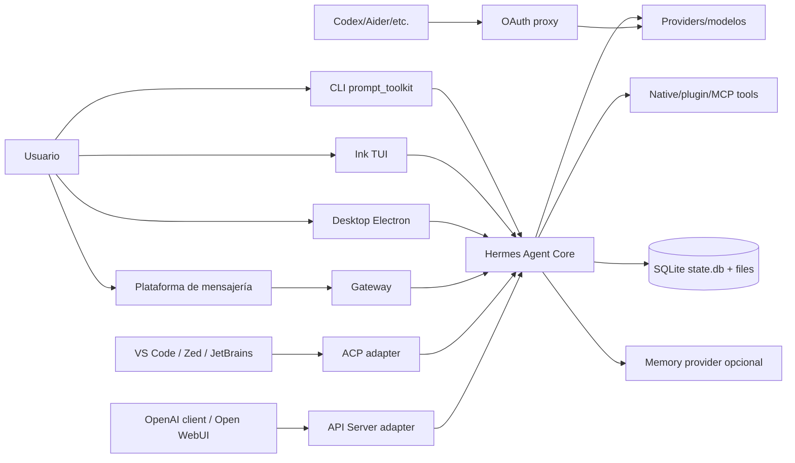

**Anclas:** entry points `pyproject.toml:307-310`; API surface `gateway/platforms/api_server.py:1-28`; proxy behavior `hermes_cli/proxy/server.py:1-10`; ACP dependency `pyproject.toml:217`.

### Vista de contenedores lógicos

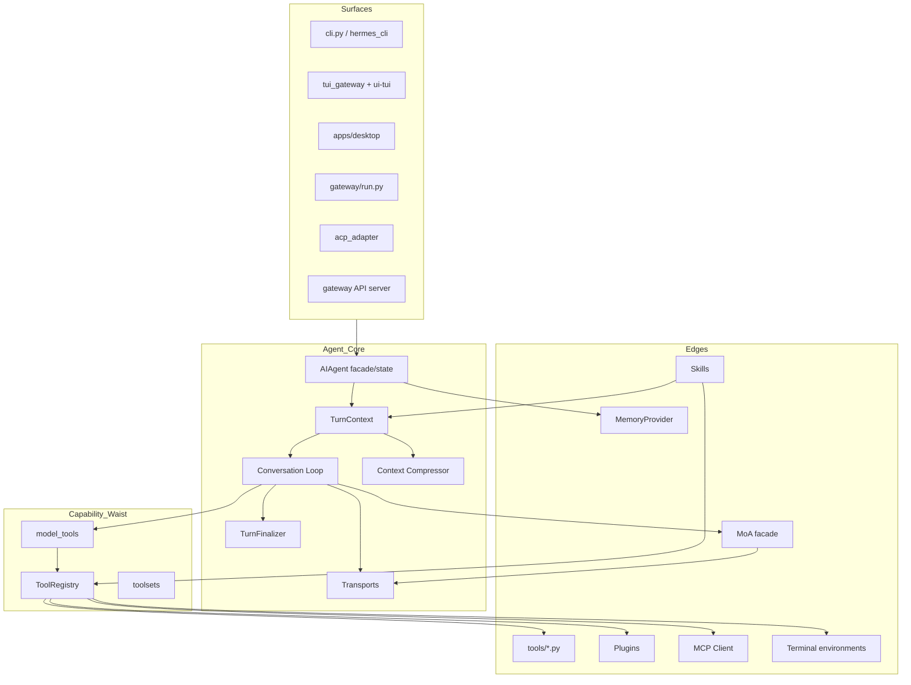

Esta vista evita dos errores del doc previo: (1) no hay una clase verificable `ToolSelector.pick`; (2) MoA no sustituye al loop, se presenta como cliente OpenAI-compatible cuya respuesta del aggregator vuelve al mismo loop.

### Directorios vs runtime

```text
source checkout                    runtime/profile
-------------------------------    ----------------------------------
skills/ + optional-skills/   --->  $HERMES_HOME/skills/
plugins/platforms/           --->  registry lazy + config platform
plugins/memory/              --->  un MemoryProvider activo
optional-mcps/               --->  catálogo; config mcp_servers decide activo
gateway/platforms/           --->  built-ins instanciados on demand
hermes_cli/config.py          --->  $HERMES_HOME/config.yaml + auth/.env
```

El packaging conserva módulos top-level (`pyproject.toml:312-313`) y encuentra paquetes explícitos (`pyproject.toml:356-357`). Esta es una arquitectura histórica/evolutiva, no un clean-slate package layout.

## Descripción técnica

### 1. Surface layer

#### CLI

`hermes = hermes_cli.main:main` es el entry recomendado; `hermes-agent = run_agent:main` mantiene el runner directo (`pyproject.toml:307-310`). `cli.py` contiene la interacción prompt_toolkit, streaming, slash commands y voz. En un turno normal termina llamando `self.agent.run_conversation(...)` con callbacks y metadata (`cli.py:12344-12356`).

Arquitectónicamente, CLI no es solo una vista: contiene orchestration de UI, hot reload de skills/MCP, model switching y playback. Esto genera acoplamiento con core y explica el tamaño del archivo.

#### TUI y Desktop

El root npm declara workspaces `apps/*`, `ui-tui`, packages TUI y `web` (`package.json:6-10`). Los scripts distinguen instalación web/TUI/desktop (`package.json:12-18`). Python empaqueta `hermes_cli/tui_dist` y `web_dist` (`pyproject.toml:338-340`). Así, TUI/desktop no reimplementan el agente: consumen gateways/backends locales.

#### Gateway

`GatewayRunner` es el controlador (`gateway/run.py:2775+`). Mantiene adapter maps, sesiones activas, busy/interrupt queues, cached agents, restart/drain y deliveries. `_handle_message()` es la entrada multi-platform (`gateway/run.py:8853+`) y `_handle_message_with_agent()` ejecuta bajo guards de sesión (`gateway/run.py:10773+`). El resultado se obtiene con `agent.run_conversation()` dentro de un executor/flow async en distintos paths (`gateway/run.py:13439-13442,18910`).

#### ACP

ACP crea una sesión Hermes con toolset específico y agrega `mcp-<server>` para servers configurados (`acp_adapter/session.py:128-142,611-623`). El server puede recibir servidores MCP proporcionados por el cliente ACP, registrarlos y refrescar la tool surface (`acp_adapter/server.py:792-837`). Las permissions se mapean a callbacks thread-local/context-local para evitar carreras entre sesiones (`acp_adapter/server.py:1450-1504`).

#### API Server

`APIServerAdapter` es una `BasePlatformAdapter` (`gateway/platforms/api_server.py:828+`). Su docstring de módulo enumera Chat Completions, Responses, models, capabilities, runs y health (`gateway/platforms/api_server.py:1-28`). Es stateless por defecto para chat, con continuity opt-in por headers; Responses sí usa `previous_response_id`.

#### OAuth Proxy

No comparte semántica agentic. El server reemplaza auth, pasa headers/cuerpo y preserva SSE (`hermes_cli/proxy/server.py:1-10,32-56`). Nunca debe dibujarse dentro del core loop: es un camino paralelo `client → proxy → upstream LLM`.

### 2. Agent facade e inicialización

`AIAgent` sigue definido en `run_agent.py:393+`, preservando el API público y lugares que tests monkeypatch. La inicialización real se distribuye en `agent/agent_init.py` y helpers. Allí:

- se resuelve provider/client/transport;
- se construyen tools por toolset;
- se activa un MemoryProvider;
- se inyectan schemas extra de memoria;
- se configura nudge de skills;
- se construye compressor y policy de tool use.

Snippet — `agent/agent_init.py:1449-1477`:

```python
from agent.memory_manager import inject_memory_provider_tools
inject_memory_provider_tools(agent)
agent._skill_nudge_interval = 10
skills_config = _agent_cfg.get("skills", {})
agent._skill_nudge_interval = int(skills_config.get("creation_nudge_interval", 10))
...
agent._tool_use_enforcement = _agent_section.get("tool_use_enforcement", "auto")
agent._task_completion_guidance = bool(
    _agent_section.get("task_completion_guidance", True)
)
```

La inicialización es policy-heavy. Para Aithera, conviene extraer una configuración inmutable por session, evitando que muchas surfaces escriban env vars globales.

### 3. TurnContext: el prologue

El forwarder exacto está en `run_agent.py:5787-5810`; el implementation target en `agent/conversation_loop.py:523-533`. En lugar de mezclar toda preparación en el while, el loop llama a `build_turn_context()` (`agent/conversation_loop.py:568-592`). El resultado contiene:

- mensaje saneado y original;
- historial/mensajes activos;
- system prompt activo;
- task/turn ids;
- índice del user turn;
- flags de memory review;
- plugin context;
- cache de external-memory prefetch (`agent/conversation_loop.py:593-603`).

Esta extracción es un buen boundary: cada turno necesita un snapshot estable antes de entrar al loop. Además preserva prompt caching: el sistema intenta no mutar system prompt/tool schemas dentro de una conversación.

### 4. Conversation loop

#### Invariantes

El loop mantiene:

- `api_call_count`;
- `iteration_budget` independiente;
- grace call;
- interrupt flag;
- retries por provider/response;
- retries de JSON/tool truncation;
- compression attempts;
- pending verification response (`agent/conversation_loop.py:605-627`).

Snippet — `agent/conversation_loop.py:643-668`:

```python
while (api_call_count < agent.max_iterations
       and agent.iteration_budget.remaining > 0) or agent._budget_grace_call:
    agent._checkpoint_mgr.new_turn()
    if agent._interrupt_requested:
        interrupted = True
        break
    api_call_count += 1
    if agent._budget_grace_call:
        agent._budget_grace_call = False
    elif not agent.iteration_budget.consume():
        break
```

No hay “un call al LLM y ya”. Cada tool batch crea otra iteración; algunos `execute_code` RPC-only calls reembolsan budget (`agent/conversation_loop.py:4753-4758`).

#### Message preparation

Antes de API, se sanea la secuencia de tools (`:900-905`), se eliminan thinking-only API copies (`:907-918`), se estabiliza whitespace/JSON (`:920-951`) y se sanea Unicode (`:953-957`). Este proceso existe por compatibilidad inter-provider y prompt caching.

#### Compression

El estimate incluye tool schemas (`agent/conversation_loop.py:959-969`). El pre-API compression mira threshold, cooldown, intentos y rough-vs-real usage (`:988-1063`). Tras tool execution también usa prompt tokens reales o fallback estimate (`:4760-4805`). La arquitectura trata la compresión como una transición de estado que puede rotar/rebaselinar sesión, no como un string summary trivial.

#### Provider call

La request se construye mediante `agent._build_api_kwargs`, pasa middleware y plugin hooks (`agent/conversation_loop.py:1156-1261`). Streaming es preferido por health checks, con excepciones para ACP, mocks y MoA sin consumers (`:1266-1318`). La ejecución final pasa por `run_llm_execution_middleware` (`:1320-1350`).

#### Transport normalization

La misma conversación puede viajar por:

```text
codex_responses     -> Responses transport
anthropic_messages  -> Anthropic transport
bedrock_converse    -> Bedrock transport
chat_completions    -> OpenAI-like transport (incluye MoA facade outer)
codex_app_server    -> bypass completo del loop estándar
```

Esto se ve en `agent/conversation_loop.py:629-641` para app-server y `:1373-1448` para validación/normalización.

### 5. Tools: schema plane y execution plane

#### Schema plane

Todos los módulos built-in se descubren al importar `model_tools` (`model_tools.py:184-188`). Los plugins se descubren después (`model_tools.py:203-208`). MCP se difiere al startup de cada surface para no bloquear event loops (`model_tools.py:190-201`).

`get_tool_definitions()` usa cache por enabled/disabled sets, registry generation, fingerprint de config y kanban context (`model_tools.py:303-353`). `_compute_tool_definitions()` resuelve toolsets, aplica disabled como sustracción y pide al registry solo schemas disponibles (`model_tools.py:357-451`).

#### Execution plane

Cuando hay tool calls, el loop:

1. repara nombres parecidos;
2. rechaza desconocidos y devuelve error al modelo;
3. valida JSON;
4. detecta truncation y se niega a ejecutar;
5. deduplica/delega caps;
6. persiste assistant call;
7. ejecuta;
8. adjunta tool results;
9. comprime si hace falta;
10. continúa (`agent/conversation_loop.py:4446-4811`).

Snippet — persist-before-side-effect, `agent/conversation_loop.py:4687-4715`:

```python
messages.append(assistant_msg)
agent._emit_interim_assistant_message(assistant_msg)
agent._flush_messages_to_session_db(messages, conversation_history)
...
agent._execute_tool_calls(
    assistant_message, messages, effective_task_id, api_call_count
)
```

Ese orden es crítico para crash recovery: si una tool reinicia Hermes, el transcript ya sabe cuál se intentó.

`AIAgent._execute_tool_calls` termina en las funciones de `agent/tool_executor.py`: concurrente para batches y secuencial para tools interactivas (`agent/tool_executor.py:325+` y `:1022+`). Ambas llaman a `run_agent.handle_function_call`, reexportado desde `model_tools` (`run_agent.py:135-139`).

`handle_function_call()` no hace un dispatch ciego. Scopea Tool Search bridge, aplica middleware/hooks, approvals y pasa metadata (`model_tools.py:1025-1164`). Finalmente el registry normaliza sync/async y errores (`tools/registry.py:605-635`).

### 6. Provider architecture

#### Auth registry vs model catalog

Hay dos planos distintos:

- `hermes_cli/auth.py:176-445`: cómo autenticar/resolver endpoints.
- `hermes_cli/models.py:190+`: catálogos de model IDs y provider picker.

No todos los providers están en el literal auth dict porque OpenRouter/custom se manejan fuera (`hermes_cli/auth.py:447-475`). Plugins model-provider pueden auto-extender ambos (`hermes_cli/auth.py:447+`, `hermes_cli/models.py:1092-1109`).

#### Transport adaptation

La presencia de `agent/anthropic_adapter.py`, `bedrock_adapter.py`, `gemini_native_adapter.py`, `codex_responses_adapter.py`, `vertex_adapter.py` y `agent/transports/` muestra que provider-agnostic no significa formato único. El loop normaliza resultados hacia un assistant message común, pero request/response semantics varían.

#### Fallback

El loop clasifica rate limits, malformed responses, content filters, quota y transport failures; puede activar un fallback y sincronizar system message (`agent/conversation_loop.py:1105-1154,1474-1565`). Provider fallback es parte del runtime, no solo config selection inicial.

### 7. MoA dentro de la arquitectura

#### Diseño

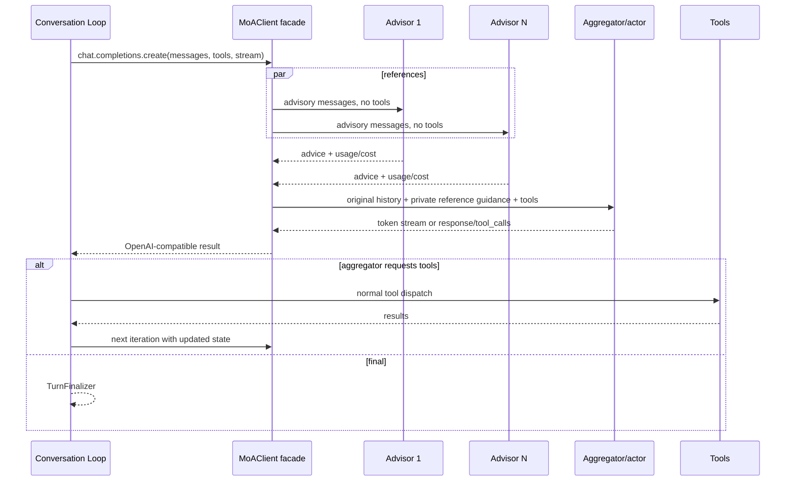

Anclas: advisors sin tools `agent/moa_loop.py:93-117`; fan-out `:336-385`; facade `:683-721,800-1038`; `MoAClient` `:1041+`.

#### Semántica

References son consultores; aggregator es actor. El aggregator recibe schemas y puede llamar tools (`agent/moa_loop.py:960-1022`). El fan-out puede ser por iteración o user turn (`:847-884`). Esto hace que MoA tenga costos potencialmente multiplicados por cada tool step. El code mitiga con cache por signature, límites opcionales de advisor output, accounting por modelo y prompt caching.

#### Boundaries

- No permite aggregator MoA recursivo (`agent/moa_loop.py:977-978`).
- Una reference configurada como MoA se salta con nota (`:363-369`).
- Fallos de advisor se convierten en notas, no abortan (`:324-333`).
- Una failure del aggregator puede caer a joined advice en el helper one-shot, pero el persistent facade usa el normal fallback/retry path.

### 8. Skills architecture

#### Índice y body separados

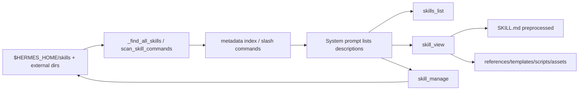

`_find_all_skills()` cachea metadata (`tools/skills_tool.py:669-777`). `skills_list()` devuelve tier 1 (`:785-848`). `skill_view()` hace resolución segura, plugin-qualified names y collision detection (`:961-1218`). El system prompt también mantiene su propio manifest/snapshot de metadata (`agent/prompt_builder.py:1250-1365`).

#### Prompt caching

`reload_skills()` no reconstruye el system prompt de la conversación; rescanea slash commands y difiere contenido a `skill_view` (`agent/skill_commands.py:405-467`). Esta decisión protege prefix caching, pero implica eventual consistency en el índice mostrado dentro de una sesión. Una note one-shot puede informar cambios sin mutar historia previa.

#### Learning loop

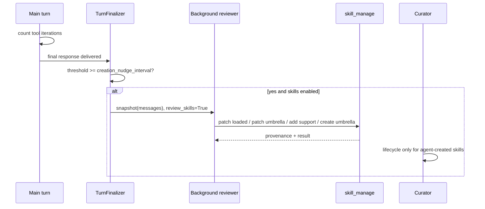

El review ocurre post-response (`agent/turn_finalizer.py:484-510`). Su prompt prioriza consolidación class-level (`agent/background_review.py:181-241`). Es una soft-autonomy layer: best-effort, LLM-mediated y con protections, no un compiler automático de toda experiencia.

### 9. Memory architecture

#### Session state no es long-term memory provider

`hermes_state.py` mantiene SQLite sessions/messages y FTS5. `session_search` usa ese store sin LLM (`tools/session_search_tool.py:5-29`). Long-term memory externa pasa por `MemoryManager` y un `MemoryProvider` activo (`agent/memory_manager.py:1-16`; `plugins/memory/__init__.py:1-19`).

Hay ocho providers empaquetados:

1. ByteRover.
2. Hindsight.
3. Holographic.
4. Honcho.
5. Mem0.
6. OpenViking.
7. RetainDB.
8. Supermemory.

Los manifiestos describen semantics diferentes: graph/entity resolution, dialectic user model, semantic memory, local FTS5/HRR, etc. Solo uno está activo a la vez (`plugins/memory/__init__.py:12-19`). `MemoryManager` puede inyectar schemas de provider en la tool surface (`agent/memory_manager.py:100-136`). Tools de memoria que no viven en registry se rutearán explícitamente por manager en `agent/tool_executor.py:1430-1433`.

#### Flujo

```text
TurnContext -> prefetch external memory (si provider)
Loop -> usa context + memory tools
TurnFinalizer -> sync completed turn
SessionDB -> persiste transcript canónico
session_search -> FTS5 directo, no auxiliary summary
```

La separación es útil: transcript exacto, retrieval local y memoria semántica no comparten necesariamente retention/trust/cost.

### 10. MCP architecture

#### Hermes como cliente

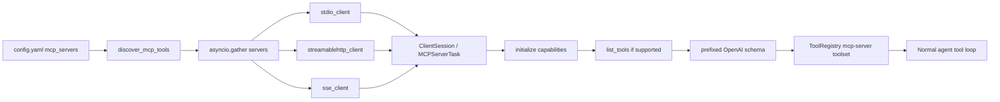

Imports/transports: `tools/mcp_tool.py:207-233`. Lifecycle same Task: `:1508-1516`. Capability gate: `:1595-1613`. Dynamic refresh: `:1662-1728`. Registration: `:4780-4868`. Parallel discovery: `:4938-4944`.

Un detalle crítico es seguridad del env: subprocess MCP no hereda toda la keyring; baseline y vars declaradas se filtran (`tools/mcp_tool.py:350-353,425-433`). Pero, conforme `SECURITY.md`, eso reduce exposición accidental; no convierte al subprocess en sandbox.

#### Hermes como servidor

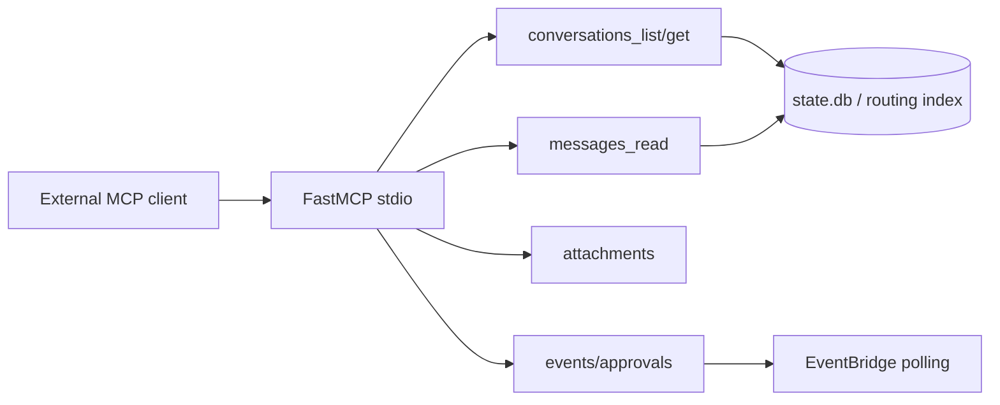

`create_mcp_server()` crea FastMCP y registra functions decoradas (`mcp_serve.py:543-722`). `run_mcp_server()` levanta un `EventBridge` y `run_stdio_async()` (`mcp_serve.py:959-990`). Es un bridge de messaging/session data, no “exponer todas las native tools de Hermes como MCP” en ese archivo.

#### Optional MCP catalog

`pyproject.toml:323-336` empaqueta manifests individuales de `optional-mcps` porque `data-files` aplana globs. Catálogo ≠ conexión; config/CLI decide activación. Este distinction debe mantenerse en cualquier arquitectura derivada.

### 11. Gateway architecture

#### Adapter contract

`BasePlatformAdapter` define capabilities comunes y métodos abstractos (`gateway/platforms/base.py:2276-2348,2886-2909`). Cada message entra como `MessageEvent`/`SessionSource`, y el runner asigna session key, authorization, busy policy y agent.

#### Registry

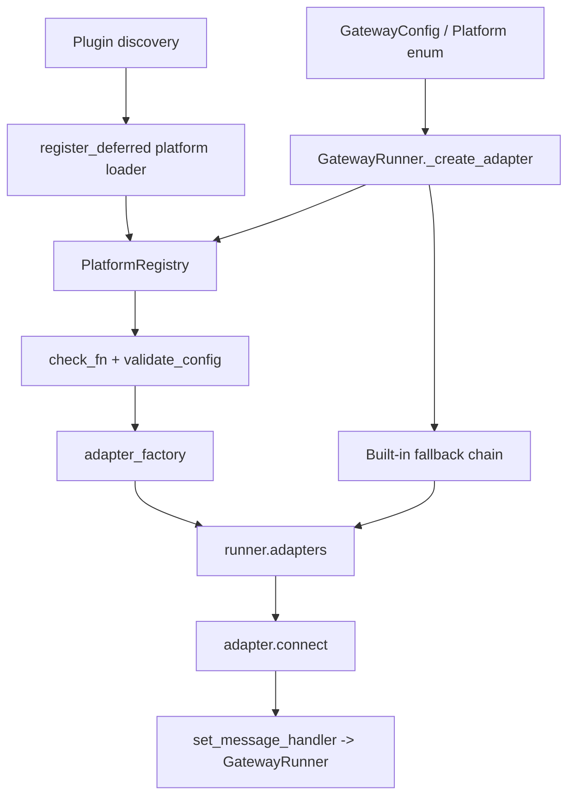

Deferred loaders evitan imports pesados (`gateway/platform_registry.py:169-183`). `create_adapter()` falla cerrado si requirements/config no pasan (`:278-328`). Runner consulta registry antes de built-ins (`gateway/run.py:8665-8708`).

#### Platform identity

`Platform` enum incluye Telegram, Discord, WhatsApp, WhatsApp Cloud, Slack, Signal, Mattermost, Matrix, Home Assistant, email, SMS, DingTalk, API server, webhook, MS Graph webhook, Feishu, WeCom, WeCom callback, Weixin, BlueBubbles, QQBot, Yuanbao y Relay, además de local (`gateway/config.py:212-243`). Plugins desconocidos solo crean pseudo-member si un plugin bundled/runtime está registrado (`:245-308`).

El inventario source de 20 plugin dirs no coincide uno-a-uno con enum: Telegram/Discord etc. son enum values históricos pero implementations plugin; WeCom puede registrar dos platforms; built-ins no siempre son mensajería humana. Esta es la razón por la que “22+” no debe ser un count arquitectónico sin definición.

#### Message sequence

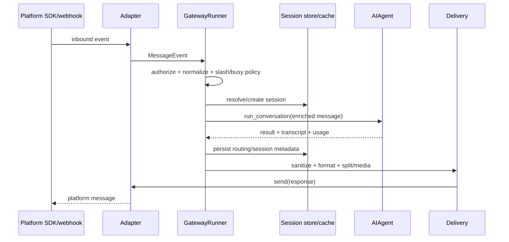

Security applies antes de dispatch y antes de outbound. `gateway/run.py:311-437` redacts/sanitizes user-facing responses. `SECURITY.md:192-219` exige allowlist por network adapter y aclara que session IDs no autorizan.

#### Scale-to-zero y drain

`gateway/scale_to_zero.py`, `drain_control.py`, `memory_monitor.py` y `restart_loop_guard.py` existen. Sin embargo, el watcher auditado resuelve específicamente relay adapter y llama `go_dormant` cuando idle (`gateway/run.py:4291-4326`). La arquitectura segura de documentar es:

```text
Gateway process + relay/connector deployment
  ├─ idle detection
  ├─ drain active work/restart markers
  └─ relay go_dormant -> platform/container may suspend
```

No generalizar a “todos los adapters se desconectan y despiertan por evento” sin seguir cada deployment path.

### 12. Terminal environments

`tools/environments/` contiene `local.py`, `docker.py`, `ssh.py`, `singularity.py`, `modal.py`, `managed_modal.py` y `daytona.py`. `tools/terminal_tool.py:946-953` importa esas clases. `managed_modal` es una implementation/mode del backend Modal; el selector público sigue teniendo seis valores.

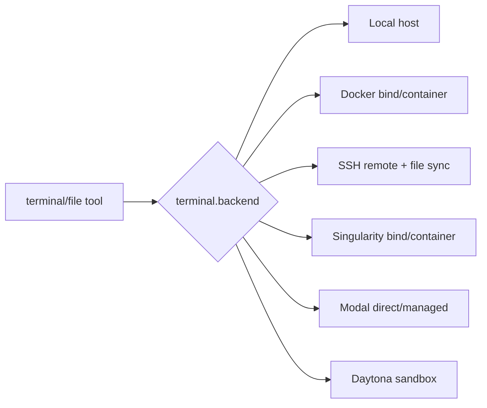

`tools/environments/file_sync.py:1-6` explica que SSH/Modal/Daytona usan sync transaccional, mientras Docker/Singularity usan bind mounts. Esto afecta consistencia de files y credenciales.

#### Trust boundary

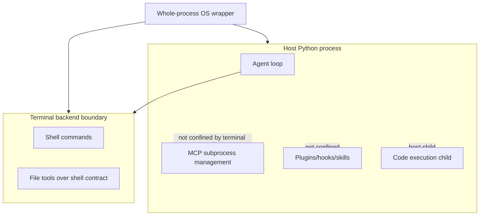

Evidencia: `SECURITY.md:70-95`. Para contenido no confiable, upstream recomienda whole-process wrapping (`SECURITY.md:97-119`).

### 13. TTS/voice architecture

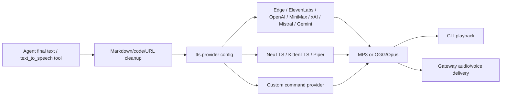

Providers constan en `tools/tts_tool.py:3-22`; defaults y models en `:166-190`; caps per provider en `:219-249`; dispatch en `:2153-2347`. La limpieza/playback CLI está en `cli.py:11354-11415`. `gateway/platforms/base.py:27-35,110-130` define formatos y reglas de audio por platform, especialmente Telegram.

Hay separación STT/TTS en agents registries (`agent/transcription_registry.py`, `agent/tts_registry.py`), pero este documento se concentra en TTS solicitado. Voice mode también controla recording/continuous loop desde CLI; no todo pasa por el model tool.

### 14. Persistence and session architecture

`state.db` es canónico para sesiones. El loop persiste de forma incremental antes/después de tool batches; gateway mantiene routing metadata. `mcp_serve.py` prefiere DB y cae a JSON index legacy (`mcp_serve.py:82-192`). El API server mantiene además response IDs/runs. Profiles cambian `HERMES_HOME`, por lo que paths deben resolverse call-time; skills code evita confiar siempre en constantes import-time (`tools/skills_tool.py:143-151`).

Invariantes importantes:

- no dos roles iguales inválidos en provider wire;
- tool result debe corresponder a tool call;
- transcript puede conservar reasoning que se elimina del API copy;
- session ID es routing, no authorization;
- compression puede rotar/rebaselinar historial;
- gateway agent cache debe invalidarse al reset/model/toolset changes.

### 15. Plugin architecture

Plugins pueden registrar:

- platforms via `PlatformEntry`;
- tools via registry;
- hooks de lifecycle/API/tool;
- memory providers;
- model providers;
- dashboard assets/backend (con security gates).

El registry de tools bloquea shadowing accidental y exige `allow_tool_override` para plugins (`tools/registry.py:356-448`). Platform registry, en cambio, documenta last-writer-wins para permitir overrides (`gateway/platform_registry.py:231-248`). Este contraste es importante: no todos los extension points tienen la misma policy.

La security policy dice que plugins corren con privilegios completos del agent process (`SECURITY.md:155-169`). El boundary es review/enablement, no import isolation.

## Flujo interno

### Flujo completo de un turno CLI

1. `hermes_cli.main` resuelve config/profile/model.
2. CLI crea o reutiliza `AIAgent`.
3. Input/slash skill se transforma en mensaje. Una skill puede expandirse a body + user instruction.
4. CLI configura callbacks de streaming/reasoning/tool progress.
5. `AIAgent.run_conversation` delega al loop (`run_agent.py:5787-5810`).
6. `build_turn_context` restaura/build system prompt y agrega user message (`agent/conversation_loop.py:568-603`).
7. Loop consume budget (`:643-668`).
8. Construye API copy saneada/estabilizada y comprime si hace falta (`:900-1063`).
9. Construye kwargs y corre middleware/hooks (`:1156-1261`).
10. Ejecuta streaming preferido (`:1266-1350`).
11. Transport normaliza response (`:1370-1448`).
12. Si hay tools, valida, persiste, despacha y repite (`:4446-4811`).
13. Si no hay tools, procesa final/recoveries (`:4813+`).
14. `TurnFinalizer` persiste, sync memory y puede lanzar background skill review (`agent/turn_finalizer.py:484-537`).
15. CLI termina stream, opcionalmente TTS y playback (`cli.py:11354-11415`).

### Flujo completo de un turno gateway

1. Plugin/built-in adapter convierte update a `MessageEvent`.
2. Base adapter/runner aplica busy-session guard.
3. Runner autoriza sender/channel; allowlist es obligatoria en boundary de red.
4. Slash command puede resolverse sin LLM.
5. Runner resuelve SessionSource → session key/ID y cached agent.
6. Mensaje se enriquece con platform/thread/media context.
7. Agent corre en executor para no bloquear loop async.
8. Tool progress/status puede llegar durante el turno.
9. Final se sanea y formatea; API/local raw-text surfaces tienen excepciones controladas.
10. Adapter divide long text, envía media/audio y final.
11. Background completion watchers pueden entregar eventos posteriores si `supports_async_delivery=True` (`gateway/platforms/base.py:2297-2311`).

### Flujo de skill auto-mejora

1. Tool iteration counter sube.
2. Final response se entrega.
3. Finalizer compara threshold.
4. Se crea reviewer fork/background thread.
5. Reviewer recibe transcript snapshot, no compite con main response.
6. Reviewer carga skills y patch/create/support file según prompt.
7. `skill_manage` guarda provenance y telemetry.
8. Curator puede archivar/consolidar solo agent-created según config; nunca auto-delete.

## Call Stack / API

### Surface → agent

| Surface | Call site | Nota |
|---|---|---|
| CLI | `cli.py:12344-12356` | pasa stream callback, clean persisted user message y MoA config. |
| Gateway | `gateway/run.py:13439-13442,18910` | agent en runtime multi-session. |
| ACP | `acp_adapter/server.py:1313+` | convierte content blocks y permissions. |
| API server | `gateway/platforms/api_server.py` | convierte OpenAI request a MessageEvent/agent run. |
| Direct runner | `run_agent.py:5839+` | CLI Fire legacy/direct. |

### Core loop stack

```text
AIAgent.run_conversation
  -> agent.conversation_loop.run_conversation
     -> build_turn_context
     -> agent._build_api_kwargs
     -> run_llm_execution_middleware
        -> agent._interruptible_streaming_api_call / _interruptible_api_call
           -> transport/client
     -> normalize response
     -> agent._execute_tool_calls
        -> tool_executor concurrent/sequential
           -> model_tools.handle_function_call
              -> middleware/hooks/approval
              -> ToolRegistry.dispatch
     -> finalize_turn
```

### Gateway adapter stack

```text
plugin discover
  -> PlatformRegistry.register_deferred
  -> GatewayRunner._create_adapter
     -> PlatformRegistry.create_adapter
        -> check_fn
        -> validate_config
        -> adapter_factory
  -> adapter.set_message_handler
  -> adapter.connect
  -> event -> GatewayRunner._handle_message
```

### Provider stack

```text
config/model picker
  -> auth/runtime_provider resolver
  -> agent_init client + api_mode
  -> transport-specific request builder
  -> conversation loop middleware
  -> provider SDK/HTTP
  -> transport normalize_response
```

### MoA stack

```text
provider=moa
  -> agent_init.MoAClient
  -> loop builds ordinary chat kwargs
  -> MoAChatCompletions.create
     -> resolve preset
     -> _reference_messages
     -> _run_references_parallel
     -> attach reference guidance
     -> call_llm(real aggregator + tools)
  -> loop receives normal response/tool_calls
```

## Diagramas

### Arquitectura física simplificada

```text
hermes-agent/
├─ run_agent.py                  # AIAgent public facade + forwarders
├─ agent/
│  ├─ conversation_loop.py       # loop real
│  ├─ turn_context.py            # prologue
│  ├─ turn_finalizer.py          # epilogue/post-turn
│  ├─ agent_init.py              # provider/tools/memory/compression init
│  ├─ transports/                # wire adapters
│  ├─ moa_loop.py                # virtual provider facade
│  ├─ memory_manager.py          # provider integration
│  └─ prompt_builder.py          # system prompt + skills index
├─ model_tools.py                # schema plane + dispatch orchestration
├─ toolsets.py                   # bundles/postures
├─ tools/
│  ├─ registry.py                # singleton registry
│  ├─ mcp_tool.py                # MCP client
│  ├─ skills_tool.py             # list/view
│  ├─ skill_manager_tool.py      # mutations
│  ├─ tts_tool.py                # synthesis providers
│  └─ environments/              # terminal backends
├─ gateway/
│  ├─ run.py                     # multi-session controller
│  ├─ config.py                  # Platform/PlatformConfig
│  ├─ platform_registry.py       # plugin registry
│  └─ platforms/                 # built-ins + API server
├─ plugins/
│  ├─ platforms/                 # 20 plugin dirs
│  └─ memory/                    # 8 providers
├─ mcp_serve.py                  # MCP server stdio
├─ acp_adapter/                  # IDE protocol
├─ hermes_state.py               # SQLite/FTS5 session store
├─ hermes_cli/                   # CLI/config/auth/proxy
├─ skills/ + optional-skills/    # catalogs
├─ ui-tui/ + apps/desktop + web/ # surfaces
└─ tests/                        # 2.080 tracked paths
```

### Trust matrix

| Componente | Corre dentro del agent process | Terminal backend lo confina | Whole-process wrapper lo confina |
|---|---:|---:|---:|
| LLM shell command vía terminal | No, subprocess/backend | Sí | Sí |
| File tools sobre shell contract | No, backend | Sí | Sí |
| `execute_code` child | Host subprocess según policy | No según SECURITY | Sí |
| MCP stdio subprocess | Spawn desde agent environment | No | Sí |
| Plugin Python/hooks | Sí | No | Sí |
| Skill loader/preprocessor | Sí | No | Sí |
| Provider HTTP calls | Sí | No | Sí, según network policy |
| Gateway adapters | Sí | No | Sí |

Fuente: `SECURITY.md:58-119`.

## Código relacionado

### Núcleo

- `run_agent.py:393-5810`
- `agent/conversation_loop.py:523-5355`
- `agent/turn_context.py`
- `agent/turn_finalizer.py:470-537`
- `agent/agent_init.py:800-1600`
- `agent/transports/`

### Tools

- `model_tools.py:184-208,279-478,1025-1276`
- `tools/registry.py:208-756`
- `agent/tool_executor.py:325+,1022+`
- `toolsets.py`

### Extensibilidad

- `gateway/platform_registry.py:38-332`
- `plugins/platforms/*/plugin.yaml`
- `plugins/memory/__init__.py:1-203`
- `providers/`
- `hermes_cli/plugins.py`

### Protocolos

- `tools/mcp_tool.py:207-5042`
- `mcp_serve.py:543-990`
- `acp_adapter/server.py:792-1240,1313-1510`

### Skills/memory

- `tools/skills_tool.py:669-1759`
- `tools/skill_manager_tool.py:1320-1546`
- `agent/skill_commands.py:320-510`
- `agent/background_review.py:181-283,943-968`
- `agent/memory_manager.py`
- `tools/session_search_tool.py:5-29,619+`

### Gateway/voice

- `gateway/config.py:212-308`
- `gateway/platforms/base.py:2276-2405,2791-2909`
- `gateway/run.py:2775+,8665-8815,8853+,10773+`
- `gateway/platforms/api_server.py:1-28,828+`
- `hermes_cli/proxy/server.py:1-56`
- `tools/tts_tool.py:3-249,2153-2468`
- `cli.py:11354-11415`

## Ejemplos

### Ejemplo 1 — el facade preserva compatibilidad

```python
# run_agent.py:5787-5810
def run_conversation(...):
    from agent.conversation_loop import run_conversation
    return run_conversation(self, user_message, system_message, ...)
```

Esto permite extraer implementación sin obligar a cambiar todos los callers/tests que parchean `run_agent.AIAgent`.

### Ejemplo 2 — registry con override protegido

```python
# tools/registry.py:393-426
elif override:
    owner = self._plugin_owner_of(handler)
    if owner is not None and not self._plugin_override_policy.get(owner, False):
        raise PermissionError(...)
else:
    logger.error("Tool registration REJECTED ... would shadow existing tool")
    return
```

No todo plugin puede reemplazar tools silenciosamente; requiere opt-in del operador.

### Ejemplo 3 — provider routes no son modelos

```python
# hermes_cli/auth.py:192-205
"openai-api": ProviderConfig(
    id="openai-api",
    auth_type="api_key",
    inference_base_url="https://api.openai.com/v1",
),
"xai-oauth": ProviderConfig(
    id="xai-oauth",
    auth_type="oauth_external",
    inference_base_url=DEFAULT_XAI_OAUTH_BASE_URL,
),
```

Dos entries representan auth/runtime routes, no una enumeración de model IDs.

### Ejemplo 4 — platform plugin first

```python
# gateway/run.py:8685-8705
from gateway.platform_registry import platform_registry
if platform_registry.is_registered(platform.value):
    adapter = platform_registry.create_adapter(platform.value, config)
    if adapter is not None:
        return adapter
    return None
# fall through to built-in adapters
```

La creación no busca un giant if/elif primero; registry tiene precedencia.

### Ejemplo 5 — MCP capability gate

```python
# tools/mcp_tool.py:1595-1613
def _advertises_tools(self) -> bool:
    init_result = self.initialize_result
    caps = getattr(init_result, "capabilities", None)
    if caps is None:
        return True
    return getattr(caps, "tools", None) is not None
```

Evita llamar `tools/list` a servidores prompt/resource-only.

### Ejemplo 6 — background learning post-response

```python
# agent/turn_finalizer.py:484-508
if agent._iters_since_skill >= agent._skill_nudge_interval:
    _should_review_skills = True
...
if final_response and not interrupted and (...):
    agent._spawn_background_review(
        messages_snapshot=list(messages),
        review_memory=_should_review_memory,
        review_skills=_should_review_skills,
    )
```

El review no bloquea la respuesta principal.

### Ejemplo 7 — proxy no es agent server

```python
# hermes_cli/proxy/server.py:1-10
"""HTTP server that forwards OpenAI-compatible requests ...
Authorization header replaced by a freshly-resolved bearer ...
response is streamed back unmodified ...
does NOT mediate, log, transform, or rewrite request/response bodies.
"""
```

El diagrama de producto debe mostrar proxy paralelo, no dentro de AIAgent.

## Buenas prácticas

### Para mantener Hermes

- Continuar extraer clusters de `gateway/run.py` y `cli.py` sin romper patch points.
- Mantener system prompt y tool schemas byte-stable por conversation.
- Persistir intent antes de side effects.
- Hacer config/profile resolution call-time en long-lived processes.
- Diferir imports pesados de SDKs y conexiones network.
- Mantener capability flags en adapters en lugar de branches por nombre.
- Tratar tools dinámicas MCP igual que tools nativas, pero conservar provenance.
- No permitir que Tool Search bridge eluda toolset scope (`model_tools.py:1082-1128`).
- Contabilizar costos MoA por advisor y aggregator reales.
- No prometer async delivery en stateless adapters (`supports_async_delivery=False`).

### Para Aithera

- Adoptar un `TurnContext` inmutable y `TurnFinalizer` explícito.
- Usar un registry de tools con metadata, availability y override policy.
- Definir `ChannelAdapter` con capability flags; Aithera puede conservar su nombre aunque Hermes use `BasePlatformAdapter`.
- Separar API agentic de inference proxy.
- Mantener session transcript exacto separado de semantic memory.
- Tratar skills como procedures runtime y JWIKI como knowledge source; no fusionarlos sin provenance.
- Implementar MCP client antes que un server puramente cosmético: el valor principal es tool discovery first-class.
- Si se implementa MoA, ofrecer `fanout=user_turn` para controlar costo y latencia.
- Documentar isolation de forma honesta: sandbox de terminal no cubre plugins/MCP host-side.

## Errores comunes

- Dibujar `run_agent.py` como implementación completa del loop actual.
- Dibujar provider-agnostic como “todo OpenAI-compatible”.
- Dibujar MoA como N agentes con tools paralelas; solo aggregator actúa con tools.
- Dibujar MCP como una única caja; hay client y server distintos.
- Dibujar `skills/` del repo como la raíz runtime exclusiva.
- Dibujar memory como un único DB; session DB, FTS5 y external provider están separados.
- Dibujar todo gateway adapter como plugin o todo como built-in; es híbrido.
- Contar surfaces no conversacionales como mensajerías sin etiqueta.
- Dibujar OAuth proxy como el API server.
- Marcar approval gate dentro del trust boundary.
- Suponer que Docker terminal backend confina el agent process entero.
- Suponer que `version=1.0.0` del workspace npm define la versión del producto Python.

## Breaking Changes

### Cambios que una arquitectura consumidora debe aislar

| Seam | Cambio posible | Defensa |
|---|---|---|
| Provider/model catalogs | endpoints/model IDs cambian continuamente | resolución dinámica + aliases; no snapshots rígidos. |
| Tool registry generation | MCP/plugins agregan/quitan tools | invalidar schema cache por generation. |
| Skills filesystem | add/remove/patch durante runtime | manifest/TTL + reload sin prompt mutation. |
| Gateway adapters | implementations migran core↔plugin | depender de `BasePlatformAdapter`/registry, no import path concreto. |
| Session storage | JSON legacy → SQLite canónico | readers con fallback/migration. |
| Agent loop modules | extraction desde god-file | facade/forwarders y tests por comportamiento. |
| MCP SDK | capabilities/transport APIs evolucionan | feature detection y fallbacks (`inspect.signature`). |
| Voice providers | SDKs y límites cambian | provider registry/config caps. |

### No verificado como breaking release

El clone shallow no permite declarar qué commit introdujo cada seam. No se atribuyen breaking changes a 0.18.0/0.18.1 sin diff histórico.

## Cambios entre versiones

| Snapshot | Arquitectura |
|---|---|
| Release `9de9c25` (0.18.2) | Baseline pública del 2026-07-08. |
| Main `f96b2e6` | Estructura auditada 2026-07-13; incluye hardening posterior. |

La versión de package continúa 0.18.2. Para reproducir exactamente líneas de este doc debe usarse el SHA de main, no el tag.

## Impacto sobre otros sistemas

### Orquestación Aithera

Hermes ofrece evidencia de que un loop custom puede escalar a muchos providers/surfaces, pero también demuestra el costo de crecer sin boundaries tempranos. Para V1.0, Aithera debería mantener un loop mucho menor y trasladar policy a módulos: context, routing, execution, finalization.

### Gateway Aithera

La combinación registry + adapter capabilities + session source es portable. Lo más valioso no es llegar a 20 channels, sino evitar conditionals de platform en el core. No obstante, Hermes aún conserva un fallback if/elif built-in, recordatorio de que la migración puede ser gradual.

### MOS/Memory Aithera

El diseño recomienda tres stores conceptuales:

1. transcript de sesión exacto;
2. índice lexical/FTS barato;
3. memoria semántica/user model opcional.

Aithera ya tiene MemoryRouter; debe evitar convertir toda conversación o skill body expandida en memoria, problema que Hermes maneja recuperando la user instruction (`agent/skill_commands.py:32-38`).

### Voice Aithera

Mover provider selection y limits a config/registry. La surface decide playback/delivery; el modelo solo invoca una tool con texto. Para auto-TTS de cada final response, el UI/gateway puede activar policy sin obligar al modelo a llamar tool.

### MCP Aithera

Un MCP client debe registrar tools con prefijo/provenance, controlar colisiones, timeouts y env filtering. Un MCP server debe exponer un set deliberado; no es necesario publicar todas las capabilities internas.

### Security Aithera

Si Aithera usa Electron + backend local y recibe mensajes externos, el trust envelope incluye host user access. Para claims de producción multi-user se requiere process/container isolation y auth por surface; CORS/allowlists no contienen un LLM adversarial.

## Referencias cruzadas

- [Auditoría de código Hermes Agent](./hermes-agent-code-audit.md)
- [Landscape Hermes Agent previo](./hermes-agent.md)
- [Plugin architecture](../02_ARCHITECTURE/plugin-architecture.md)
- [Client/server](../02_ARCHITECTURE/client-server.md)
- [SSE streaming](../02_ARCHITECTURE/sse-streaming.md)
- [MCP](../06_AGENTS/mcp.md)
- [Approval flows](../06_AGENTS/approval-flows.md)
- [Memory](../07_MEMORY/README.md)
- [Voice](../08_VOICE/README.md)
- [Integrations](../09_INTEGRATIONS/README.md)
- [Security](../11_SECURITY/README.md)
- [Tooling](../12_TOOLING/README.md)

## Fuentes

1. https://github.com/NousResearch/hermes-agent — repo clonado, acceso 2026-07-13.
2. https://github.com/NousResearch/hermes-agent/commit/f96b2e6ef75ba6ed678c99954bc8f3ee7f6a38ba — commit auditado, acceso 2026-07-13.
3. https://github.com/NousResearch/hermes-agent/releases/tag/v2026.7.7.2 — release pública anterior, acceso 2026-07-13.
4. https://github.com/NousResearch/hermes-agent/blob/f96b2e6ef75ba6ed678c99954bc8f3ee7f6a38ba/SECURITY.md — trust model, acceso 2026-07-13.
5. https://hermes-agent.nousresearch.com/docs/ — docs oficiales, contraste secundario, acceso 2026-07-13.
6. https://modelcontextprotocol.io/ — spec independiente del protocolo, acceso 2026-07-13.
7. https://agentclientprotocol.com/ — referencia independiente ACP, acceso 2026-07-13.
8. https://agentskills.io/ — formato externo de skills, acceso 2026-07-13.
9. [CONSTITUTION.md](../CONSTITUTION.md) — reglas de validación JWIKI.

## Nivel de confianza

**96/100 para arquitectura del commit.**

- Components/call stacks: 98%.
- Provider/MCP/skills/MoA/gateway/TTS: 96%.
- Trust boundaries: 100%, porque la policy los declara explícitamente.
- Conteo comercial “22+ platforms / 300+ models”: 75%, por ambigüedad y catálogo dinámico; por eso no se usa como primitive del diagrama.
- Evolución histórica: 65%, clone shallow.

## Pendientes

- `VERIFICACIÓN PENDIENTE`: diagrama deployment exacto de desktop remote-gateway; requiere seguir Electron main/preload y autenticación completa.
- `VERIFICACIÓN PENDIENTE`: benchmark real de prompt-cache hit solo vs MoA; el código incluye cifras en comentarios, pero no se reprodujo.
- `VERIFICACIÓN PENDIENTE`: E2E de cada platform adapter; se auditó contrato/registro y tests, no 20 credenciales externas.
- `VERIFICACIÓN PENDIENTE`: mapping completo de hooks/plugins al loop; el sistema tiene más hooks que los críticos citados.
- `VERIFICACIÓN PENDIENTE`: diff histórico que fecha la extracción de `conversation_loop.py` y transición de MoA.
- `VERIFICACIÓN PENDIENTE`: documentar el dispatcher Kanban y cron como diagramas dedicados; se consideran edges, pero no eran foco solicitado.

## Validación CONSTITUTION §8

- [x] **Código revisado:** clone real, SHA completo y líneas del checkout.
- [x] **Fuentes contrastadas:** código, release, security policy, docs oficiales y specs MCP/ACP/skills.
- [x] **Compatibilidad documentada:** Python/Node/MCP/ACP/transports/backends/release vs main.
- [x] **Ejemplos verificados:** snippets reales y call stacks vinculados a tests existentes del repo.
- [x] **Referencias cruzadas:** landscape, audit, arquitectura, agents, memory, voice, integrations, security, tooling.
- [x] **Revisión independiente:** subagente auditor de código distinto del autor del landscape previo; la arquitectura se reconstruyó desde source y no del diagrama anterior.

---

*Documento generado a partir de `f96b2e6ef75ba6ed678c99954bc8f3ee7f6a38ba`. Los números de línea pueden cambiar en `main`; use el SHA para reproducibilidad.*
