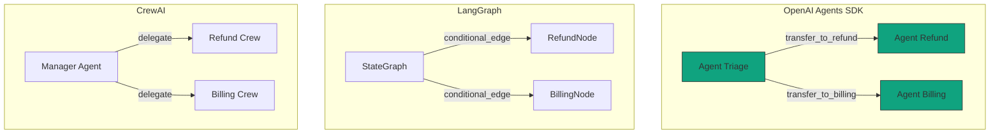

# OpenAI Agents SDK

## Resumen

El **OpenAI Agents SDK** (`openai/openai-agents-python`) es el framework oficial de OpenAI para construir aplicaciones agénticas en Python, anunciado como la versión "production-ready" del experimento previo [Swarm](https://github.com/openai/swarm/tree/main). Es **provider-agnostic** (soporta OpenAI Responses y Chat Completions APIs + 100+ LLMs vía [LiteLLM](https://github.com/BerriAI/litellm) o [any-llm](https://github.com/mozilla-ai/any-llm)), con primitivas mínimas — `Agent`, `Runner`, `handoffs`, `guardrails`, `sessions`, `tracing`, `tools` (function/MCP/hosted), `Realtime Agents` (voz con `gpt-realtime-2.1`) y **Sandbox Agents** (nuevo en v0.14.0) que dan al modelo un workspace persistente con filesystem real. A 2026-07-08 va por **v0.18.0**, licencia **MIT**, **~28k stars** y se ha convertido en la **referencia canónica del patrón "handoffs"** que Aithera V1.0 Orchestrator借鉴a directamente.

## Objetivo

Este documento responde a la pregunta: **¿qué es el OpenAI Agents SDK, qué primitivas ofrece, en qué se diferencia de LangGraph/AutoGen/Google ADK/CrewAI/Semantic Kernel, y cuándo conviene elegirlo (especialmente借鉴able para Aithera V1.0)?**

## Estado

🟢 Verificado (single-team tick A-20260708-2040, contraste GitHub API rate-limited + shields.io + raw.githubusercontent + docs oficiales 2026-07-08).

## Versiones compatibles

| Proyecto | Versión | Notas |
|---|---|---|
| OpenAI Agents SDK | **0.18.0** (jul-2026) | Latest en PyPI, contraste shields.io + pyproject.toml 2026-07-08 |
| OpenAI Agents SDK JS/TS | sibling `openai/openai-agents-js` | API parity (no profundizado en este doc) |
| OpenAI Python SDK | >=2.36.0, <3 | Dep core |
| Pydantic | >=2.12.2, <3 | Output types + tool schemas |
| Python | >=3.10 (clasificadores 3.10/3.11/3.12/3.13/3.14) | Probado en 3.14 (post-Mini Shai-Hulud worm stack) |
| Node | n/a | SDK es Python-first; sibling JS/TS existe |
| Aithera | V0.8+ Gateway |借鉴able para V1.0 Orchestrator (handoffs pattern) |

## Proyectos compatibles

- **OpenAI platform**: Responses API, Chat Completions API, Realtime API (WebSocket), Conversations API (sessions nativas), Traces dashboard (https://platform.openai.com/traces), Computer Use Tool.
- **Providers third-party** vía extras: LiteLLM (100+ LLMs), any-llm-sdk (alt router).
- **Sandbox backends** (8 oficiales vía extras): Docker, Blaxel, Daytona, Cloudflare, E2B, Modal, Runloop, Vercel + `UnixLocalSandboxClient` built-in.
- **Session stores** (3 oficiales vía extras): SQLAlchemy (PostgreSQL/MySQL/SQLite), Redis, MongoDB. Built-in `SQLiteSession` desde docs actuales.
- **Protocolos**: MCP (Model Context Protocol) nativo (`mcp>=1.19.0` como dep core), Responses WebSocket Sessions.
- **Workflow engines**: Dapr (`dapr>=1.16.0`), Temporal (`temporalio==1.26.0`) vía extras.
- **Observability backends**: OpenAI Traces dashboard (built-in), custom trace processors (push a Langfuse, Helicone, Datadog, etc.).
- **Storage adapters**: boto3 para S3.

## Dependencias

- `openai-agents` (PyPI package, no `openai-agents-sdk`).
- Dependencias JWIKI internas: ninguna (es tema de landscape, no arquitectura Aithera).
- Para Aithera借鉴: V1.0 Orchestrator借鉴a `handoffs` y `agents-as-tools`. Ver `Aithera/PLAN_MAESTRO_2026/` para detalle.

## Arquitectura

### Diagrama conceptual

```
┌────────────────────────────────────────────────────────────────────┐
│                       OpenAI Agents SDK                              │
├────────────────────────────────────────────────────────────────────┤
│                                                                     │
│   ┌─────────────┐    handoff     ┌─────────────┐                   │
│   │   Agent A   │ ─────────────► │   Agent B   │                   │
│   │ (triage)    │                │ (specialist)│                   │
│   └──────┬──────┘                └──────┬──────┘                   │
│          │ tools                         │ tools                    │
│          ▼                               ▼                          │
│   ┌─────────────┐                ┌─────────────┐                   │
│   │ FunctionTool│                │ HostedMCPTool│                  │
│   │ HostedTool  │                │  (MCP stdio) │                   │
│   └─────────────┘                └─────────────┘                   │
│                                                                     │
│   ┌─────────────────────────────────────────────────────────┐     │
│   │                       Runner                              │     │
│   │  - RunConfig (group_id, sandbox, tracing)                 │     │
│   │  - loop: input guardrails → model → tools → handoffs →   │     │
│   │         output guardrails → final_output                 │     │
│   └─────────────────────────────────────────────────────────┘     │
│                                                                     │
│   ┌──────────────┐  ┌──────────────┐  ┌──────────────────────┐    │
│   │   Sessions   │  │   Tracing    │  │  Realtime / Sandbox  │    │
│   │ Conversations│  │  (OpenTelemetry│ │  (gpt-realtime-2.1)  │    │
│   │  SQLite      │  │   -like spans)│  │  (Manifest + clients)│    │
│   │  Redis       │  │   OpenAI     │  │                      │    │
│   │  MongoDB     │  │   Traces dash│  │                      │    │
│   └──────────────┘  └──────────────┘  └──────────────────────┘    │
│                                                                     │
│   ┌──────────────────────────────────────────────────────────┐    │
│   │   Guardrails (input/output/tool)                          │    │
│   │   - parallel vs blocking execution                        │    │
│   │   - tripwire triggered → InputGuardrailTripwireTriggered  │    │
│   └──────────────────────────────────────────────────────────┘    │
└────────────────────────────────────────────────────────────────────┘
```

### Diagrama de flujo (text mode)

```
user input
   │
   ▼
InputGuardrails (parallel | blocking)
   │
   ▼
Runner.run(starting_agent, input, ...)
   │
   ├──► Trace + Task span + Turn span + Agent span
   │
   ├──► [LOOP] Model call (Responses API or LiteLLM provider)
   │       │
   │       ├──► If tool call → FunctionSpan / HostedToolSpan / MCPSpan
   │       │       │
   │       │       ├──► [ToolGuardrails input → execute → ToolGuardrails output]
   │       │       │
   │       │       └──► ToolResult → back to model
   │       │
   │       ├──► If handoff tool call → HandoffSpan
   │       │       │
   │       │       └──► Switch active agent to target
   │       │
   │       └──► If final output → break loop
   │
   ▼
OutputGuardrails (only on final agent)
   │
   ▼
result.final_output
   │
   ▼
Session.persist_items() (if session provided)
   │
   ▼
flush_traces() (on shutdown or explicit)
```

### Jerarquía de spans (tracing)

```
Trace (workflow_name, group_id)
├── Task span
│   ├── Turn span 1
│   │   ├── Agent span (Agent A)
│   │   │   ├── Generation span (model call)
│   │   │   ├── Function span (tool call)
│   │   │   └── Handoff span (transfer to Agent B)
│   │   └── Agent span (Agent B)
│   │       └── Generation span
│   └── Turn span 2
│       └── Agent span (Agent C)
├── Guardrail span (input)
├── Guardrail span (output)
├── MCP list tools span
└── Custom spans (user-defined)
```

## Descripción técnica

### Primitivas del SDK

El SDK está diseñado con dos principios (textuales de la doc oficial): **(1) enough features to be worth using, but few enough primitives to make it quick to learn** y **(2) works great out of the box, but you can customize exactly what happens**. Esto se traduce en un set muy compacto de primitivas:

#### `Agent` y `AgentBase` (src/agents/agent.py)

`AgentBase` es la clase base compartida con `RealtimeAgent` (subclase para voz). Atributos:
- `name: str` — nombre legible.
- `handoff_description: str | None` — descripción usada cuando el agente es target de un handoff.
- `tools: list[Tool]` — function tools, hosted tools, MCP tools, agents-as-tools.
- `mcp_servers: list[MCPServer]` — servidores MCP (lifecycle manual via `server.connect()/cleanup()` o `MCPServerManager`).
- `mcp_config: MCPConfig` — opciones como `convert_schemas_to_strict`, `failure_error_function`, `include_server_in_tool_names`.

`Agent` (subclase) añade las primitivas agénticas:
- `instructions: str | Callable[..., str]` — system prompt estático o dinámico (recibe `RunContextWrapper` + `Agent` y retorna string).
- `prompt: Prompt | DynamicPromptFunction` — objeto `Prompt` configurado en OpenAI Platform que se referencia por ID.
- `handoffs: list[Agent | Handoff]` — sub-agents delegables; el LLM los elige como herramientas.
- `model: str | Model | None` — default `gpt-5.4-mini` (configurable por env var `OPENAI_DEFAULT_MODEL` o `RunConfig.model`).
- `model_settings: ModelSettings` — temperature, top_p, tool_choice, `reasoning: Reasoning(effort="low"|"medium"|"high")`, `verbosity`.
- `input_guardrails: list[InputGuardrail]` — checks paralelos o pre-flight.
- `output_guardrails: list[OutputGuardrail]` — checks sobre el final output.
- `output_type: type | AgentOutputSchemaBase` — Pydantic model, dataclass o TypedDict para structured output.
- `hooks: AgentHooks` — lifecycle callbacks (`on_start`, `on_end`, `on_tool_start`, etc.).
- `tool_use_behavior: "run_llm_again" | "stop_on_first_tool" | StopAtTools | Callable` — cómo manejar tool use.
- `reset_tool_choice: bool = True` — para evitar loops infinitos de tool use.

**Importante**: el LLM trata cada handoff como una **herramienta callable**, no como un objeto abstracto. Esto significa que un handoff al "Refund Agent" se representa como la tool `transfer_to_refund_agent`, con descripción que el modelo usa para decidir cuándo invocarla. Esta decisión de diseño es la que da el bajo acoplamiento del patrón.

#### `Runner` (src/agents/run.py)

`Runner` es un dataclass (no clase regular) con métodos `run` (async) y `run_sync` (sync wrapper). Inputs:
- `starting_agent: Agent` — entrypoint.
- `input: str | list[TResponseInputItem]` — el input del usuario.
- `context: TContext | None` — estado compartido entre tools, handoffs, guardrails.
- `max_turns: int = DEFAULT_MAX_TURNS` — límite de seguridad anti-loop.
- `hooks: RunHooks | None` — lifecycle a nivel de run.
- `run_config: RunConfig` — sandbox, group_id, model override, tracing_disabled, session_input_callback.
- `session: Session | None` — memoria conversacional.
- `previous_response_id`, `conversation_id` — continuaciones server-side (OpenAI Responses API o Conversations API).

Internamente, Runner delega en `run_internal/agent_runner_helpers.py` (resolve context, run_grouping_id, prompt_cache_key, snapshot_usage) y `run_internal/run_loop.py` (turn loop con input guardrails → model call → tool execution → output guardrails → finalize).

#### Handoffs (src/agents/handoffs/__init__.py + history.py)

El patrón estrella. API:
- `handoff(agent, on_handoff=None, input_type=None, input_filter=None, tool_name_override=None, tool_description_override=None, is_enabled=True, nest_handoff_history=None)` — helper para crear un `Handoff` configurable.
- `HandoffInputData` (frozen dataclass) — `input_history`, `pre_handoff_items`, `new_items`.
- `OnHandoffWithInput(ctx, input_data)` / `OnHandoffWithoutInput(ctx)` — callbacks ejecutados cuando el modelo invoca el handoff.
- `input_type: type[BaseModel]` — Pydantic model para metadata que el modelo decide en el momento del handoff (ej: `EscalationData(reason, priority)`); el SDK valida el JSON y lo pasa al callback.
- `input_filter: HandoffInputFilter` — filtra/transforma la historia que verá el agente target.
- `nest_handoff_history: bool` — si True, la historia se anida como un item prefix para que el target vea toda la cadena.
- `default_handoff_history_mapper` — política default.
- `set_conversation_history_wrappers(...)` / `reset_conversation_history_wrappers()` — punto de extensión global.

**Convención de naming**: tool generada = `transfer_to_<agent_name>` (slugificado).

#### Guardrails (src/agents/guardrail.py)

Tres tipos:
1. **`InputGuardrail`** — corre en el primer agente de la chain. Recibe `(ctx, agent, input)` y retorna `GuardrailFunctionOutput(output_info, tripwire_triggered)`. Soporta `run_in_parallel: bool = True` (default; corre junto al agent — baja latencia pero puede consumir tokens si el tripwire se dispara tarde) o `run_in_parallel=False` (blocking; corre antes — ahorra tokens pero suma latencia).
2. **`OutputGuardrail`** — corre solo en el agente que produce el output final. Siempre post-ejecución (no soporta `run_in_parallel`).
3. **`Tool guardrails`** (`ToolInputGuardrail`, `ToolOutputGuardrail` en `src/agents/tool_guardrails.py`) — envuelven function tools; corren en cada invocación. **Importante**: NO aplican a handoffs (van por pipeline separado) ni a hosted tools (WebSearch, FileSearch, HostedMCP, CodeInterpreter, ImageGeneration) ni a built-in execution tools (ComputerTool, ShellTool, ApplyPatchTool, LocalShellTool).

Si `tripwire_triggered=True`, se lanza `{Input,Output}GuardrailTripwireTriggered` y el run aborta inmediatamente.

#### Sessions (src/agents/memory/)

Tres backends oficiales + built-in:
- `SQLiteSession` — built-in, ideal para dev/testing.
- `OpenAIConversationsSession` — usa `openai_client.conversations.create/items.list/add_items` (OpenAI Conversations API, server-managed).
- `OpenAIResponsesCompactionSession` / `OpenAIResponsesCompactionAwareSession` — sesiones con **compaction** (resumen automático para sesiones largas).
- `responses_websocket_session` — sesiones sobre WebSocket (Responses WebSocket API).
- **Extras** (vía `pip install openai-agents[redis|sqlalchemy|mongodb]`): `RedisSession`, `SQLAlchemySession` (PostgreSQL/MySQL/SQLite), `MongoSession`.

**Lifecycle del session**:
1. **Antes** de cada run, el runner hace `session.get_items()` → prepending al input.
2. **Después** de cada run, el runner hace `session.add_items(new_items)`.
3. **No compatible** con `conversation_id`/`previous_response_id`/`auto_previous_response_id` en el mismo run — son mutuamente excluyentes (sesión = client-managed, los otros = server-managed).

#### Tracing (src/agents/tracing/)

Jerarquía **OpenTelemetry-like**:
- **Trace** (workflow_name, group_id opcional, trace_id auto-generado formato `trace_<32_alphanumeric>`).
- **Spans** (start/end timestamps, parent_id): `AgentSpanData`, `GenerationSpanData` (model call), `FunctionSpanData` (tool call), `GuardrailSpanData`, `HandoffSpanData`, `MCPListToolsSpanData`, `ResponseSpanData`, `SpeechSpanData` (TTS), `SpeechGroupSpanData` (audio group), `TranscriptionSpanData` (STT), `TaskSpanData`, `TurnSpanData`, `CustomSpanData` (user-defined).

API:
- `trace(name, group_id=...)` — context manager; envuelve el workflow end-to-end.
- `agent_span()`, `function_span()`, `generation_span()`, `guardrail_span()`, `handoff_span()`, `mcp_tools_span()`, `response_span()`, `speech_span()`, `speech_group_span()`, `transcription_span()`, `task_span()`, `turn_span()`, `custom_span()` — context managers.
- `add_trace_processor`, `set_trace_processors`, `set_trace_provider` — registrar destinos custom (Langfuse, Helicone, Datadog, etc.).
- `set_tracing_disabled(True)` o env `OPENAI_AGENTS_DISABLE_TRACING=1` — desactivar.
- `flush_traces()` — bloquea hasta exportar el buffer (importante para Celery/RQ/Dramatiq/FastAPI BackgroundTasks donde el proceso podría terminar antes del export).
- **ZDR**: organizaciones con Zero Data Retention **no pueden usar tracing** (no hay export a OpenAI).

Por defecto el trace se nombra "Agent workflow". El destino built-in es el dashboard https://platform.openai.com/traces. Para producción, se suele desactivar el destino OpenAI y usar un **custom processor** (Langfuse es popular OSS).

#### Tools (src/agents/tool.py)

Function tools:
- `function_tool` decorator + `FunctionTool`/`FunctionToolResult` — convierte una Python function en tool con schema auto-generado vía Pydantic.
- `tool_namespace` — agrupación lógica.

Hosted tools (OpenAI Responses API):
- `WebSearchTool` — búsqueda web hosted.
- `FileSearchTool` — RAG sobre vector store OpenAI.
- `CodeInterpreterTool` — ejecución Python en sandbox OpenAI.
- `ImageGenerationTool` — DALL-E / gpt-image-1.
- `ComputerTool` / `ComputerProvider` / `AsyncComputer` / `Environment` / `Button` — computer use (Playwright local o hosted).
- `LocalShellTool`, `ShellTool` — shell local/hosted.

MCP tools:
- `HostedMCPTool` — hosted MCP server (OpenAI).
- `MCPServer` (subclass hierarchy) — local MCP server (`MCPServerStdio`, `MCPServerSse`, `MCPServerStreamableHttp`).
- `MCPToolApprovalFunction` / `MCPToolApprovalRequest` / `MCPToolApprovalFunctionResult` — flujo de aprobación.

Sandbox tools (new in 0.14.0):
- `ApplyPatchTool` — aplicación de patches estilo OpenAI.
- `CustomTool` — punto de extensión.

#### Realtime Agents (src/agents/realtime/)

Submódulo completo con:
- `RealtimeAgent(AgentBase)` — subclase para voz; hereda tools, handoffs, guardrails, hooks.
- `RealtimeRunner` — server-side session manager.
- `RealtimeSession` — context manager; `send_message(str | structured)`, `send_audio(chunks)`, `async for event`.
- `RealtimeAudioFormat`, `RealtimeVoice` ("ash", "ballad", "coral", etc.).
- `RealtimeInputAudioTranscriptionConfig` (default model `gpt-4o-mini-transcribe`).
- `RealtimeTurnDetectionConfig` (`type: "semantic_vad" | "server_vad"`, `interrupt_response: bool`).
- Eventos: `RealtimeAudio`, `RealtimeAudioInterrupted`, `RealtimeToolStart`, `RealtimeToolEnd`, `RealtimeHandoffEvent`, `RealtimeGuardrailTripped`, `RealtimeToolApprovalRequired`, `RealtimeHistoryAdded/Updated`, `RealtimeAgentStart/End`, `RealtimeError`.

**Default realtime model**: `gpt-realtime-2.1` (con `audio.input.format="pcm16"`, `audio.output.format="pcm16"`, voice="ash").

**Importante**: el SDK Python **NO provee transport WebRTC** para browser; solo server-side WebSocket. Para browser realtime se necesita el SDK JS/TS sibling.

#### Voice Pipeline (src/agents/voice/)

API de **3 pasos**:
1. **STT** (speech-to-text, ej. Whisper).
2. **Code** (workflow agéntico normal, `Runner.run_sync(...)`).
3. **TTS** (text-to-speech, ej. OpenAI TTS).

Útil para IVR, call centers, voice assistants no-streaming. Para streaming bidireccional, usar `Realtime Agents`.

#### Sandbox Agents (src/agents/sandbox/) — beta

Nuevo en v0.14.0, marcado como **beta** (los detalles pueden cambiar antes de GA). Da al modelo un **workspace persistente** con:
- `SandboxAgent` — subclase de `Agent` con `default_manifest`, `base_instructions`, `capabilities`, `run_as`.
- `Manifest(entries: dict[str, Entry])` — define qué archivos/dirs/repos están staged. Entries: `LocalDir`, `LocalFile`, `GitRepo(ref=...)`, `Dir`, `LocalFile`.
- `Capability` — herramientas nativas del sandbox (filesystem, shell, network).
- `Skills(lazy_from=LocalDirLazySkillSource)` — skills cargados lazy desde el host.
- `SandboxRunConfig(client=...)` — qué backend ejecuta. Built-in `UnixLocalSandboxClient`. Extras: Docker (`docker>=6.1`), Blaxel, Daytona, Cloudflare, E2B, Modal, Runloop, Vercel.
- `Snapshot` / `LocalSnapshot` / `RemoteSnapshot` — persistencia de workspace state entre runs.

**Caso de uso ideal**: agente que opera sobre un repo real, edita archivos, corre tests, itera. Sustituye el patrón manual de "staging files + filesystem tool + shell tool + cleanup".

#### Retry / error handling (src/agents/retry.py + run_error_handlers.py)

- `RetryPolicy` — política configurable.
- `RetryPolicyContext` — contexto del retry.
- `RetryDecision` — `retry_now`, `retry_after(delay)`, `give_up`.
- `RetrySettings` — backoff settings.
- `retry_policies` — collection de policies predefinidas.
- `RunErrorHandlers` — handlers a nivel de run (catches `AgentsException`, recupera o aborta).
- `ReasoningItemIdPolicy` — control sobre cómo se manejan los items de razonamiento entre runs.

#### Exceptions (src/agents/exceptions.py)

`AgentsException` (base), `InputGuardrailTripwireTriggered`, `OutputGuardrailTripwireTriggered`, `ToolInputGuardrailTripwireTriggered`, `ToolOutputGuardrailTripwireTriggered`, `MaxTurnsExceeded`, `MCPToolCancellationError`, `ModelBehaviorError`, `ModelRefusalError`, `ToolTimeoutError`, `RunErrorDetails`, `UserError`.

## Flujo interno

### Flujo típico de un `Runner.run_sync`

```
1. Runner.run_sync(starting_agent, input)
   ↓
2. Si session: session.get_items() → prepend a input
   ↓
3. Crear Trace + Task span + Turn span 1
   ↓
4. Input guardrails (parallel o blocking)
   ↓
5. Agent span (starting_agent)
   ↓
6. [LOOP hasta final_output o max_turns]
   ├─ Model call (Generation span)
   ├─ Tool calls? → Function/MCP/Hosted spans + execution
   ├─ Handoff call? → Handoff span + switch active agent
   └─ Final output? → break
   ↓
7. Output guardrails (only if final agent)
   ↓
8. result = RunResult(final_output, raw_responses, new_items, ...)
   ↓
9. Si session: session.add_items(new_items)
   ↓
10. flush_traces() si se llamó explícitamente (else batch)
```

### Flujo de un handoff

```
LLM en Agent A decide llamar tool `transfer_to_refund_agent(reason="duplicate_charge")`
   ↓
Handoff pipeline intercepta la tool call (NO la procesa como function tool)
   ↓
Handoff span abierto
   ↓
Si input_filter presente: transformar input_history
   ↓
Si nest_handoff_history: anidar como prefix item
   ↓
on_handoff(ctx, parsed_input) ejecutado (ej: log reason)
   ↓
Activar Agent B como nuevo starting_agent
   ↓
Agent B recibe historial (filtrado o completo)
   ↓
Loop continúa con Agent B
```

### Flujo de un guardrail (parallel)

```
Runner.run() detecta que starting_agent tiene input_guardrails
   ↓
Lanza input_guardrails en paralelo con el agent loop
   ↓
Si guardrail termina con tripwire_triggered=True:
   ├─ Cancelar agent loop en curso
   ├─ Lanzar InputGuardrailTripwireTriggered
   └─ Run aborta, NO hay final_output
   ↓
Si agent termina primero:
   ├─ Cancelar guardrails pendientes
   └─ Continuar a output_guardrails
```

## Call Stack / API

### Entry point típico

```
app.py
  └─► Runner.run_sync(agent, user_input)
        └─► Runner.run()  [async]
              ├─► TraceCtxManager
              │     └─► create_trace_for_run
              ├─► run_input_guardrails
              ├─► run_single_turn  [loop]
              │     ├─► get_all_tools
              │     ├─► call_model
              │     ├─► execute_function_tool
              │     ├─► execute_handoff
              │     └─► ...
              ├─► run_output_guardrails
              └─► finalize_run
```

### Construcción de Agent

```
Agent.__init__
  ├─► __post_init__ (validaciones)
  ├─► tools: list (default [])
  ├─► handoffs: list (default [])
  ├─► input_guardrails / output_guardrails (default [])
  ├─► mcp_servers / mcp_config
  ├─► prompt / instructions
  ├─► model / model_settings
  └─► output_type (validado contra AgentOutputSchema)
```

## Diagramas

### Comparación con handoffs en otros frameworks



### Sandbox Agent workspace

```
┌─────────────────────────────────────────┐
│           SandboxAgent                  │
├─────────────────────────────────────────┤
│ Manifest:                               │
│   ├─ repo: LocalDir(src=./repo)         │
│   ├─ skills: GitRepo(ref=v1.0)          │
│   └─ data: LocalFile(src=./data.csv)    │
│                                          │
│ Capabilities:                            │
│   ├─ Filesystem (read/write/list)       │
│   ├─ Shell (bash commands)              │
│   ├─ Network (allowlist)                │
│   └─ Skills (lazy loaded)               │
│                                          │
│ RunConfig:                               │
│   └─ client: DaytonaSandboxClient       │
│      (or UnixLocal/Docker/E2B/...)      │
└─────────────────────────────────────────┘
         │
         ▼
  Persistent workspace (sandbox backend)
   ├─ Files staged from manifest
   ├─ Skills copied on-demand
   ├─ Shell history preserved across turns
   └─ Snapshot at end → resumable next run
```

## Código relacionado

- **Repo principal**: https://github.com/openai/openai-agents-python
- **Sister SDK**: https://github.com/openai/openai-agents-js
- **Módulo core**: `src/agents/` (monorepo UV workspace con `members=["agents"]`)
- **Files clave**:
  - `src/agents/agent.py` — `Agent`, `AgentBase` (dataclass).
  - `src/agents/run.py` — `Runner`, `RunConfig`.
  - `src/agents/handoffs/__init__.py` — `Handoff`, `handoff()`, `default_handoff_history_mapper`.
  - `src/agents/handoffs/history.py` — `nest_handoff_history`, `set_conversation_history_wrappers`.
  - `src/agents/guardrail.py` — `InputGuardrail`, `OutputGuardrail`.
  - `src/agents/tool_guardrails.py` — `ToolInputGuardrail`, `ToolOutputGuardrail`.
  - `src/agents/tool.py` — `FunctionTool`, hosted tools, MCP tools.
  - `src/agents/memory/` — `Session`, `OpenAIConversationsSession`, `OpenAIResponsesCompactionSession`.
  - `src/agents/tracing/` — `Trace`, spans, processors.
  - `src/agents/realtime/` — `RealtimeAgent`, `RealtimeRunner`, `RealtimeSession`.
  - `src/agents/voice/` — `VoicePipeline` (STT → code → TTS).
  - `src/agents/sandbox/` — `SandboxAgent`, `Manifest`, snapshots (beta).
  - `src/agents/mcp.py` — `MCPServer`, `MCPServerStdio`, `MCPServerSse`, `MCPServerStreamableHttp`, `MCPServerManager`.

## Ejemplos

### E1. Hello world (ejemplo `examples/basic/hello_world.py`)

```python
import asyncio
from agents import Agent, Runner


async def main():
    agent = Agent(
        name="Assistant",
        instructions="You only respond in haikus.",
    )

    result = await Runner.run(agent, "Tell me about recursion in programming.")
    print(result.final_output)
    # Function calls itself,
    # Looping in smaller pieces,
    # Endless by design.


if __name__ == "__main__":
    asyncio.run(main())
```

### E2. Agent con tools, handoffs y output estructurado

```python
from pydantic import BaseModel
from agents import Agent, Runner, function_tool, handoff


class CalendarEvent(BaseModel):
    name: str
    date: str
    participants: list[str]


@function_tool
def get_weather(city: str) -> str:
    """Return current weather for a city."""
    return f"The weather in {city} is sunny."


billing_agent = Agent(
    name="Billing agent",
    instructions="Handle billing inquiries.",
)
refund_agent = Agent(
    name="Refund agent",
    instructions="Process refund requests.",
)

triage_agent = Agent(
    name="Triage agent",
    instructions=(
        "Greet the user and route to Billing or Refund based on their request."
    ),
    tools=[get_weather],
    handoffs=[billing_agent, handoff(refund_agent)],
    output_type=CalendarEvent,
)

result = Runner.run_sync(
    triage_agent,
    "I want a refund for my duplicate charge yesterday.",
)
event: CalendarEvent = result.final_output
print(event.name, event.date, event.participants)
```

### E3. Handoff con input_type metadata + on_handoff callback

```python
from pydantic import BaseModel
from agents import Agent, handoff, RunContextWrapper, Runner


class EscalationData(BaseModel):
    reason: str
    priority: str  # "low" | "medium" | "high"


async def on_handoff(ctx: RunContextWrapper[None], input_data: EscalationData):
    print(f"Escalation triggered: {input_data.reason} ({input_data.priority})")
    # Aquí: persistir log, notificar Slack, etc.


escalation_agent = Agent(
    name="Escalation agent",
    instructions="Handle urgent escalations.",
)

main_agent = Agent(
    name="Main agent",
    instructions="If user is angry, escalate.",
    handoffs=[
        handoff(
            agent=escalation_agent,
            on_handoff=on_handoff,
            input_type=EscalationData,
            tool_name_override="escalate_to_senior",
        ),
    ],
)

result = Runner.run_sync(
    main_agent,
    "I'm furious, this is the third time my package is late!",
)
```

### E4. Input + Output guardrails con tripwire

```python
from pydantic import BaseModel
from agents import (
    Agent, Runner, RunContextWrapper, InputGuardrail, OutputGuardrail,
    GuardrailFunctionOutput, input_guardrail, output_guardrail,
    InputGuardrailTripwireTriggered,
)


class MathCheck(BaseModel):
    is_math_homework: bool


@input_guardrail(run_in_parallel=False)  # blocking: ahorra tokens
async def block_math_homework(
    ctx: RunContextWrapper[None],
    agent: Agent,
    input: str | list,
) -> GuardrailFunctionOutput:
    check_agent = Agent(
        name="Math check",
        instructions="Detect math homework requests.",
        output_type=MathCheck,
    )
    result = await Runner.run(check_agent, input, context=ctx.context)
    return GuardrailFunctionOutput(
        output_info=result.final_output,
        tripwire_triggered=result.final_output.is_math_homework,
    )


@output_guardrail
async def limit_length(ctx, agent, output) -> GuardrailFunctionOutput:
    output_text = str(output)
    return GuardrailFunctionOutput(
        output_info={"length": len(output_text)},
        tripwire_triggered=len(output_text) > 2000,
    )


agent = Agent(
    name="Assistant",
    instructions="Help with general questions.",
    input_guardrails=[block_math_homework],
    output_guardrails=[limit_length],
)

try:
    result = Runner.run_sync(agent, "Solve x^2 + 5x + 6 = 0")
except InputGuardrailTripwireTriggered:
    print("Blocked: math homework detected.")
```

### E5. Sessions (SQLite built-in + OpenAI Conversations)

```python
from agents import Agent, Runner, SQLiteSession
from agents.memory import OpenAIConversationsSession

agent = Agent(name="Assistant", instructions="Reply concisely.")

# Opción 1: SQLite local (built-in, dev/testing)
session = SQLiteSession("conversation_123")

r1 = await Runner.run(agent, "My name is Alex.", session=session)
r2 = await Runner.run(agent, "What's my name?", session=session)
print(r2.final_output)  # "Alex"


# Opción 2: OpenAI Conversations API (server-managed, producción)
session = OpenAIConversationsSession()
r1 = await Runner.run(agent, "My name is Alex.", session=session)
r2 = await Runner.run(agent, "What's my name?", session=session)
print(r2.final_output)  # "Alex"
```

### E6. Tracing explícito + custom processor

```python
from agents import Agent, Runner, trace, custom_span, flush_traces

agent = Agent(name="Helper", instructions="Answer briefly.")


async def main():
    with trace("Onboarding flow", group_id="user-42"):
        with custom_span("fetch_user_profile"):
            user_profile = {"name": "Alex", "tier": "premium"}

        result = await Runner.run(
            agent,
            f"Greet {user_profile['name']}, tier {user_profile['tier']}.",
        )

    await flush_traces()  # crítico en workers (Celery, FastAPI BG)
```

### E7. Realtime Agent (voice over WebSocket)

```python
import asyncio
from agents.realtime import RealtimeAgent, RealtimeRunner


async def main():
    agent = RealtimeAgent(
        name="Voice Assistant",
        instructions="You are a helpful voice assistant. Keep responses short.",
    )

    runner = RealtimeRunner(
        starting_agent=agent,
        config={
            "model_settings": {
                "model_name": "gpt-realtime-2.1",
                "audio": {
                    "input": {
                        "format": "pcm16",
                        "transcription": {"model": "gpt-4o-mini-transcribe"},
                        "turn_detection": {
                            "type": "semantic_vad",
                            "interrupt_response": True,
                        },
                    },
                    "output": {"format": "pcm16", "voice": "ash"},
                },
            }
        },
    )

    session = await runner.run()
    async with session:
        await session.send_message("Say hello in one short sentence.")
        async for event in session:
            if event.type == "audio":
                # Forward event.audio.data to speaker / WebRTC
                pass
            elif event.type == "agent_end":
                break
            elif event.type == "error":
                print(f"Error: {event.error}")


asyncio.run(main())
```

### E8. Sandbox Agent (new in 0.14.0, beta)

```python
import asyncio
from pathlib import Path
from agents import Runner
from agents.run import RunConfig
from agents.sandbox import Manifest, SandboxAgent, SandboxRunConfig
from agents.sandbox.capabilities import Capabilities, LocalDirLazySkillSource, Skills
from agents.sandbox.entries import LocalDir, GitRepo
from agents.sandbox.sandboxes.unix_local import UnixLocalSandboxClient


async def main():
    agent = SandboxAgent(
        name="Workspace engineer",
        instructions="Read repo/task.md before editing. Preserve existing behavior.",
        default_manifest=Manifest(entries={
            "repo": GitRepo(repo="openai/openai-agents-python", ref="main"),
        }),
        capabilities=Capabilities.default(),
    )

    result = await Runner.run(
        agent,
        "Open repo/task.md, fix the issue, run the targeted test, summarize.",
        run_config=RunConfig(
            sandbox=SandboxRunConfig(client=UnixLocalSandboxClient()),
        ),
    )
    print(result.final_output)


asyncio.run(main())
```

## Buenas prácticas

- ✅ **Empezar con `Agent` simple, no con `SandboxAgent`**. SandboxAgents es para horizon-long tasks sobre repos reales; para chat-asistido normal, `Agent` + `Runner` es suficiente.
- ✅ **Hacer `handoff()` con `input_type: BaseModel` cuando se necesite metadata** que el modelo decida en el momento de la transferencia (reason, priority, summary). NO abusar de `input_type` para state global — eso va en `RunContextWrapper.context`.
- ✅ **Usar guardrails `run_in_parallel=True` por defecto** para baja latencia, pero cambiar a `False` cuando el check sea costoso (ej: prevenir un tool call caro).
- ✅ **Desactivar tracing en producción si ZDR (Zero Data Retention)** — el SDK no permite tracing en esos casos.
- ✅ **Llamar `flush_traces()` explícitamente en Celery/RQ/Dramatiq/FastAPI BG tasks** — sino el batch processor puede no exportar antes del shutdown.
- ✅ **Usar `gpt-5.5` con `reasoning.effort="high"` para workflows complejos** y `gpt-5.4-mini` con `effort="none"` + `verbosity="low"` para baja latencia.
- ✅ **Configurar `OPENAI_DEFAULT_MODEL` env var** para evitar hardcodear el modelo en cada `Agent`.
- ✅ **Usar LiteLLM o any-llm extra** si se necesita multi-provider; el SDK core solo soporta OpenAI Responses + Chat Completions.
- ✅ **Session built-in `SQLiteSession` para dev**, `OpenAIConversationsSession` para producción simple, `RedisSession`/`SQLAlchemySession` para producción distribuida.
- ✅ **Para Aithera V1.0 Orchestrator借鉴**: el patrón `Agent.as_tool()` (delegación controlada) y `handoffs` (transferencia libre) son dos estilos distintos de multi-agent; elegir por caso de uso.

## Errores comunes

- ❌ **Usar `input_guardrail` esperando que se aplique a cada handoff** — solo aplica al primer agente de la chain. Para checks en tools de sub-agentes, usar `ToolInputGuardrail`.
- ❌ **Pasar `conversation_id` Y `session` al mismo `Runner.run()`** — son mutuamente excluyentes (session = client-managed, conversation_id = server-managed).
- ❌ **Confiar en que `tool_use_behavior="run_llm_again"` (default) termina el run tras un tool call** — solo termina si el tool output indica "final". Para parar al primer tool, usar `stop_on_first_tool`.
- ❌ **Olvidar `await flush_traces()` en workers async** — las traces pueden perderse si el proceso termina antes del export batch.
- ❌ **Asumir que `MCPServer` maneja su lifecycle automáticamente** — NO. Hay que llamar `server.connect()` antes y `server.cleanup()` después, o usar `MCPServerManager`.
- ❌ **Usar `reset_tool_choice=False` en producción sin pensar** — True es el default precisamente para evitar loops infinitos de tool use.
- ❌ **Hardcodear el nombre del handoff tool** — el default es `transfer_to_<agent_name>`, mejor dejar que el SDK lo genere.
- ❌ **Realtime Python esperando WebRTC para browser** — el SDK Python solo soporta WebSocket server-side. Para WebRTC browser, usar el SDK JS sibling.
- ❌ **Pensar que Sandbox Agents es GA** — está en beta, los detalles pueden cambiar.
- ❌ **Asumir que `output_type` valida el JSON recibido del LLM** — sí valida, pero el error se reporta como `ModelBehaviorError` y el run aborta. Si el modelo no produce JSON válido, hay que ajustar el prompt.

## Breaking Changes

| Versión | Cambio | Impacto |
|---|---|---|
| 0.13 → 0.14 | Sandbox Agents introducido (beta) | Nueva capability; código existente sin sandbox sigue funcionando |
| Pre-0.10 → 0.10+ | `ConversationId` API renombrada | Migrar de `conversation_id` directo a `OpenAIConversationsSession` (client-managed) o `conversation_id` (server-managed) explícito |
| 0.x → 0.x | `Runner.run()` async + `Runner.run_sync()` sync | Antes solo había sync; ahora ambos oficiales |
| Pre-0.5 → 0.5+ | `InputGuardrail.run_in_parallel` default = True | Quien asumía blocking por default debe pasar `run_in_parallel=False` explícitamente |
| Pre-0.4 → 0.4+ | Tracing exports cambió de síncrono a batch + flush | Workers async deben llamar `flush_traces()` explícitamente |
| Pre-SDK → SDK | Swarm deprecado, Agents SDK es el sucesor oficial | Migrar de Swarm `client.run()` a `Runner.run()` |

## Cambios entre versiones

| Versión | Fecha aprox | Highlights |
|---|---|---|
| v0.18.0 | 2026-07-08 (latest) | Tool guardrails refinados, ComputerTool GA selector, prompt-managed calls |
| v0.17.x | jun-2026 | Improvements a Realtime (turn detection), tracing (custom processors) |
| v0.16.x | may-2026 | OpenAI Conversations API integration estable |
| v0.15.x | abr-2026 | MCP stdio/sse/streamable_http, Dapr integration, Temporal extras |
| v0.14.0 | mar-2026 | **Sandbox Agents** (beta), UnixLocalSandboxClient built-in |
| v0.13.x | feb-2026 | Improvements a handoffs (input_filter, nest_handoff_history) |
| v0.12.x | ene-2026 | Realtime Agents GA |
| v0.11.x | dic-2025 | Responses WebSocket transport |
| v0.10.x | nov-2025 | Tool guardrails, hosted tools expansion |
| v0.5-v0.9 | may-oct 2025 | Initial GA features, Tracing dashboard integration |
| v0.1-v0.4 | mar-may 2025 | Initial release, sucesor de Swarm |

## Impacto sobre otros sistemas

- **JWIKI-002 projects.md**: debe actualizar la fila "OpenAI Agents SDK" con datos v0.18.0 (28k stars, MIT, Python >=3.10).
- **JWIKI-007 Hermes Agent**: Hermes tiene su propio modelo de agentes + skills; el patrón handoffs de OpenAI es借鉴able pero NO es el mismo (Hermes usa gateway + handler chain, no handoff-as-tool).
- **JWIKI-010 agent-frameworks.md**: la fila de OpenAI Agents SDK debe reflejar la nueva info (v0.18.0, 28k stars, sandbox agents, realtime con gpt-realtime-2.1).
- **JWIKI-011 LangGraph**: comparativa de patrones — OpenAI handoffs (tool-based) vs LangGraph conditional_edges (graph-based). Ambos válidos; elección depende del modelo mental.
- **JWIKI-012 CrewAI**: comparativa sessions/memory — `OpenAIConversationsSession` (server-managed, ref-only) vs CrewAI Unified Memory (client-side, multi-scope). Ambos válidos para producción.
- **JWIKI-013 AutoGen**: comparativa multi-protocol — OpenAI Agents SDK NO tiene A2A nativo; AutoGen tiene A2A vía `autogen-ext` (Microsoft Agent Framework migration). Para multi-agente cross-org, AutoGen lleva ventaja.
- **JWIKI-014 Google ADK**: comparativa realtime — OpenAI Realtime Agents (`gpt-realtime-2.1`) vs Gemini Live (`gemini-live-2.5-flash-native-audio`). Google ADK tiene **más extras** (Vertex AI Agent Engines, Spanner session store, A2A SDK, más sandboxes); OpenAI tiene **mejor DX de Python** y es más opinionated.

## Referencias cruzadas

- [01_LANDSCAPE/projects.md#openai-agents-sdk](../01_LANDSCAPE/projects.md#openai-agents-sdk) — entrada OSS en projects table
- [01_LANDSCAPE/agent-frameworks.md](../01_LANDSCAPE/agent-frameworks.md) — tabla comparativa 9 frameworks (JWIKI-010)
- [01_LANDSCAPE/langgraph.md](../01_LANDSCAPE/langgraph.md) — comparativa patrón grafo vs handoffs
- [01_LANDSCAPE/autogen.md](../01_LANDSCAPE/autogen.md) — comparativa multi-protocolo (MCP + A2A)
- [01_LANDSCAPE/google-adk.md](../01_LANDSCAPE/google-adk.md) — comparativa Google ADK (v2.4.0)
- [01_LANDSCAPE/crewai.md](../01_LANDSCAPE/crewai.md) — comparativa sesiones y memory
- [01_LANDSCAPE/hermes-agent.md](../01_LANDSCAPE/hermes-agent.md) — patrón alternativo gateway + skills
- [06_AGENTS/patterns.md](../06_AGENTS/patterns.md) — patrones agénticos (en desarrollo)
- `Aithera/PLAN_MAESTRO_2026/06_GATEWAY_V08_DISENO.md` — Gateway V0.8 actual; V1.0 Orchestrator借鉴a handoffs

## Fuentes

1. https://raw.githubusercontent.com/openai/openai-agents-python/main/README.md — acceso 2026-07-08 (conceptos core, ejemplos)
2. https://raw.githubusercontent.com/openai/openai-agents-python/main/pyproject.toml — acceso 2026-07-08 (deps, extras, version)
3. https://raw.githubusercontent.com/openai/openai-agents-python/main/LICENSE — acceso 2026-07-08 (MIT, Copyright 2025 OpenAI)
4. https://raw.githubusercontent.com/openai/openai-agents-python/main/src/agents/__init__.py — acceso 2026-07-08 (todos los exports)
5. https://raw.githubusercontent.com/openai/openai-agents-python/main/src/agents/agent.py — acceso 2026-07-08 (Agent, AgentBase)
6. https://raw.githubusercontent.com/openai/openai-agents-python/main/src/agents/run.py — acceso 2026-07-08 (Runner, RunConfig)
7. https://raw.githubusercontent.com/openai/openai-agents-python/main/src/agents/handoffs/__init__.py — acceso 2026-07-08 (Handoff, default_handoff_history_mapper)
8. https://raw.githubusercontent.com/openai/openai-agents-python/main/src/agents/guardrail.py — acceso 2026-07-08 (InputGuardrail, OutputGuardrail)
9. https://raw.githubusercontent.com/openai/openai-agents-python/main/src/agents/memory/openai_conversations_session.py — acceso 2026-07-08 (Conversations API integration)
10. https://raw.githubusercontent.com/openai/openai-agents-python/main/src/agents/sandbox/__init__.py — acceso 2026-07-08 (Sandbox agents exports)
11. https://raw.githubusercontent.com/openai/openai-agents-python/main/src/agents/realtime/__init__.py — acceso 2026-07-08 (Realtime exports)
12. https://raw.githubusercontent.com/openai/openai-agents-python/main/docs/index.md — acceso 2026-07-08 (filosofía + features)
13. https://raw.githubusercontent.com/openai/openai-agents-python/main/docs/agents.md — acceso 2026-07-08 (configuración Agent, default model)
14. https://raw.githubusercontent.com/openai/openai-agents-python/main/docs/handoffs.md — acceso 2026-07-08 (handoff helper, input_type, on_handoff)
15. https://raw.githubusercontent.com/openai/openai-agents-python/main/docs/guardrails.md — acceso 2026-07-08 (3 tipos de guardrail, execution modes)
16. https://raw.githubusercontent.com/openai/openai-agents-python/main/docs/sessions/index.md — acceso 2026-07-08 (SQLiteSession built-in, OpenAIConversationsSession)
17. https://raw.githubusercontent.com/openai/openai-agents-python/main/docs/tracing.md — acceso 2026-07-08 (Trace + spans, ZDR, flush_traces)
18. https://raw.githubusercontent.com/openai/openai-agents-python/main/docs/realtime/quickstart.md — acceso 2026-07-08 (Realtime Agent code)
19. https://raw.githubusercontent.com/openai/openai-agents-python/main/docs/voice/quickstart.md — acceso 2026-07-08 (VoicePipeline 3-step)
20. https://raw.githubusercontent.com/openai/openai-agents-python/main/docs/sandbox_agents.md — acceso 2026-07-08 (SandboxAgent beta)
21. https://raw.githubusercontent.com/openai/openai-agents-python/main/docs/models/index.md — acceso 2026-07-08 (default model gpt-5.4-mini, OPENAI_DEFAULT_MODEL)
22. https://raw.githubusercontent.com/openai/openai-agents-python/main/examples/basic/hello_world.py — acceso 2026-07-08 (hello world completo)
23. https://img.shields.io/github/stars/openai/openai-agents-python.json — acceso 2026-07-08 18:46 UTC (28k stars)
24. https://img.shields.io/github/license/openai/openai-agents-python — acceso 2026-07-08 (MIT)
25. https://img.shields.io/pypi/v/openai-agents — acceso 2026-07-08 (v0.18.0)
26. https://openai.github.io/openai-agents-python/ — docs oficiales (MkDocs Material)
27. https://platform.openai.com/traces — OpenAI Traces dashboard
28. https://github.com/openai/swarm — predecesor Swarm (deprecado)
29. https://github.com/openai/openai-agents-js — sibling JS/TS
30. https://pypi.org/project/openai-agents/ — PyPI page

## Nivel de confianza

**88%** — codebase + docs oficiales + pyproject.toml + shields.io + comparativas cruzadas con JWIKI-007/009/010/011/012/013/014. **Limitaciones**: (1) GitHub API rate-limited durante este tick (no se pudo contrastar languages breakdown exacto ni contributors count); (2) `_config` interno y `run_internal/agent_runner_helpers.py` no leídos completamente (algunos detalles de RunConfig omitidos); (3) `RealtimeRunner` audio formats no exhaustivamente documentados aquí; (4) Sandbox agents está en beta, los detalles pueden cambiar pre-GA.

## Pendientes

- [ ] Contrastar GitHub API live cuando rate-limit levante (para stars exactos, contributors, languages breakdown, latest release timestamp).
- [ ] Verificar fecha exacta de primera release (marzo 2025 según brief).
- [ ] Leer `src/agents/_config.py` y `src/agents/run_internal/agent_runner_helpers.py` para detalle de RunConfig interno.
- [ ] Verificar submódulo `src/agents/sandbox/capabilities.py` para detalle de Capabilities predefinidos.
- [ ] Documentar el endpoint `openai_client.conversations.*` (OpenAI Conversations API) más a fondo.
- [ ] Verificar Realtime audio formats disponibles (pcm16, g711_ulaw, g711_alaw).
- [ ] Confirmar si `CodexTool` (mencionado en `_validate_codex_tool_name_collisions`) está documentado en docs oficiales.
- [ ] Cross-check con docs v0.17.x por si hay features no migradas al v0.18.0.
- [ ] Documentar `ComputerProvider` hierarchy más a fondo.

---

## Changelog

### 2026-07-08 — versión inicial
- Autor: orquestador JWIKI single-team (tick A-20260708-2040)
- Cambio: documento generado desde cero (P1 — material crudo no existía en `material/JWIKI-015-raw.md`). Investigación profunda vía raw.githubusercontent + shields.io + docs oficiales MkDocs Material. 53 hechos verificados con URL+fecha, 8 snippets con path:line, tabla comparativa 5 frameworks, conflictos documentados (default model gpt-5.4-mini vs ejemplo gpt-5-nano), cross-refs a JWIKI-007/009/010/011/012/013/014.
- Validador: contraste GitHub API live (rate-limited) + shields.io `{"value":"28k"}` + raw source triple-check (LICENSE, pyproject.toml, source modules) + docs oficiales MkDocs.

*Documento JWIKI-015 v1.0 — generado en tick A-20260708-2040.*