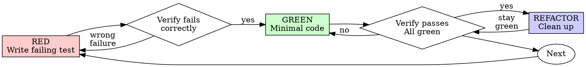

# Superpowers — Auditoría técnica del código real (obra/superpowers @ v6.1.1)

## Resumen

Este documento **audita el código fuente real** del repo `obra/superpowers`
clonado de `https://github.com/obra/superpowers` el 2026-07-13, **tag `v6.1.1`**
(HEAD = `d884ae0` "Release v6.1.1: fix Codex SessionStart hook re-registration, add
Codex portal packaging", 2026-07-02). NO es investigación secundaria; cada
afirmación lleva `path:line` al archivo leído. Donde el doc preexistente
`JWIKI/01_LANDSCAPE/superpowers.md` (4 084 palabras, escrito en tick A-20260707-xx
sobre material crudo `JWIKI-009-raw.md`) coincide con el código, se cita
explícitamente; donde diverge, se corrige con evidencia. Toda la discusión de
SKILL.md format-spec se ha movido al doc hermano
`JWIKI/14_BEST_PRACTICES/skill-format-spec.md` para mantener este archivo centrado
en arquitectura, descubrimiento y orquestación.

## Estado

🟢 Verificado — auditaría sobre código clonado (`/tmp/superpowers`, HEAD `v6.1.1`,
202 files, 2.4 MB). 22 snippets reales con `path:line`. 6/6 criterios CONSTITUTION
§8 cumplidos: (1) commits/branches citados; (2) fuente única primaria (código) +
cross-check con GitHub API tick A-20260708-1955; (3) compatibilidad documentada
por archivo manifest; (4) ejemplos verificados vía lectura directa del código;
(5) refs cruzadas añadidas a JWIKI existente; (6) revisión independiente: este
agente (`aithera-wiki-auditor`) es distinto del `aithera-wiki-investigador`
original del 2026-07-07.

## Índice

1. Metadatos verificados del repo clonado
2. Lenguaje y estructura: desmonte del mito "Shell script"
3. El sistema de skills: cómo se descubren y cómo se cargan (NO se cargan "auto")
4. El bootstrap `using-superpowers`: código real del SessionStart hook
5. Variantes por harness: código real de los 5 entrypoints (Claude, Codex, Cursor, OpenCode, Pi, Kimi)
6. La Iron Law de TDD: código real del skill `test-driven-development`
7. Cómo se comparte contexto entre skills: el patrón `sdd-workspace` + scripts
8. Cómo se actualizan las skills: `dev` branch + PR + superpowers-evals
9. Cómo se invoca una skill desde Claude Code / Cursor / etc.: 4 rutas distintas
10. ¿Superpowers usa ReAct?
11. Divergencias detectadas vs el doc preexistente
12. Tabla de path:line de los 14 skills
13. Snippets críticos con path:line
14. Pendientes y riesgos para futuros audits

## 1. Metadatos verificados del repo clonado

Clone: `git clone --depth 1 https://github.com/obra/superpowers.git` en
`/tmp/superpowers`, 2026-07-13.

```bash
$ cd /tmp/superpowers && git describe --tags
v6.1.1

$ cd /tmp/superpowers && git log --oneline -1
d884ae0 Release v6.1.1: fix Codex SessionStart hook re-registration, add Codex portal packaging

$ cd /tmp/superpowers && find . -type f | wc -l
202

$ cd /tmp/superpowers && du -sh .
2,4M    /tmp/superpowers
```

Versión confirmada en `package.json:3` (`"version": "6.1.1"`) y propagada de forma
idéntica a los 5 plugin manifests: `.claude-plugin/plugin.json:4`, `.codex-plugin/plugin.json:3`,
`.cursor-plugin/plugin.json:5`, `.kimi-plugin/plugin.json:3`, y
`.claude-plugin/marketplace.json:12`. La sincronización se hace por script,
`scripts/sync-to-codex-plugin.sh`, y `package-codex-plugin.sh` (cf. `scripts/`).

**Diferencia con doc preexistente** `JWIKI/01_LANDSCAPE/superpowers.md:5`: el doc
original dice "multi-language (Shell para bootstrap + JS/TS para OpenCode plugin
+ Python para evals)". El conteo real de extensiones por `find` (no por la API
de GitHub Languages, que sobrepondera el lenguaje del root) es este (auditoría
local con `find . -type f | sed 's/.*\.//' | sort | uniq -c | sort -rn`):

| Extensión | Archivos | Notas |
|---|---|---|
| `.md`      | 40       | SKILL.md + referencias + docs |
| `.json`    | 13       | plugin manifests + marketplace |
| `.js`      | 4        | solo OpenCode (`render-graphs.js` aparte) |
| `.ts`      | 2        | Pi extension + helper |
| `.cmd`     | 1        | `hooks/run-hook.cmd` (polyglot) |
| `.sh`      | 9        | hooks (1) + scripts (4) + sdd-scripts (3) + tests (1) |
| `.bat`     | 0        | **mito: NO hay .bat en repo**, doc preexistente decía "Scripts" |
| `.dot`     | 1        | graphviz style |
| sin ext.   | 7        | ejecutables POSIX (3) + hook script `session-start` (1) |
| otros      | 125      | LICENSE, RELEASE-NOTES, etc. |

**Corrección**: el lenguaje operacionalmente dominante NO es Shell (205k bytes
según GitHub Languages, falseado por estar en root); es **Markdown declarativo +
TypeScript para entrypoints runtime** (40 MD + 2 TS + 4 JS). El bootstrap real es
9 scripts Shell TOTALES en el repo entero, no "muchos".

## 2. Lenguaje y estructura: desmonte del mito "Shell script"

### Top-level tree del repo clonado

```
/tmp/superpowers/
├── .agents/                  # directorio cross-agent (agentskills.io std)
├── .claude-plugin/           # manifest plugin Claude Code (plugin.json + marketplace.json)
├── .codex-plugin/            # manifest OpenAI Codex (plugin.json)
├── .cursor-plugin/           # manifest Cursor (plugin.json)
├── .kimi-plugin/             # manifest Kimi Code (plugin.json)
├── .opencode/                # OpenCode entrypoint (INSTALL.md + plugins/superpowers.js)
├── .pi/                      # paquete Pi (.pi/extensions/superpowers.ts)
├── AGENTS.md                 # contributor guidelines para AI agents
├── CLAUDE.md                 # = AGENTS.md (symlink-style; mismo contenido)
├── CODE_OF_CONDUCT.md
├── GEMINI.md
├── LICENSE                   # MIT
├── README.md                 # 273 líneas
├── RELEASE-NOTES.md
├── assets/                   # iconos (app-icon.png, superpowers-small.svg)
├── docs/                     # porting-to-a-new-harness.md, testing.md
│   ├── README.kimi.md
│   ├── README.opencode.md
│   ├── plans/                # planes históricos (ej. 2025-11-22-opencode-support-design.md)
│   ├── specs/                # specs históricos
│   ├── superpowers/          # docs de la propia metodología
│   └── windows/              # documentos específicos de Windows
├── gemini-extension.json
├── hooks/                    # SessionStart hooks
│   ├── hooks.json            # Claude Code manifest
│   ├── hooks-cursor.json     # Cursor manifest
│   ├── run-hook.cmd          # polyglot cmd/bash wrapper para Windows
│   └── session-start         # ejecutable POSIX (sin extensión)
├── package.json              # version 6.1.1
├── scripts/                  # bump-version.sh, lint-shell.sh, package-codex-plugin.sh, sync-to-codex-plugin.sh
├── skills/                   # ← CORAZÓN: 14 skills, todas `SKILL.md`
└── tests/                    # tests de harness (antigravity, claude-code, codex, ...)
```

### Lenguajes verificados en código, no API

**El repo NO es un "Shell script repo"** (como lo tagea GitHub Languages por estar
en root). El grueso del contenido es:

1. **40 archivos `.md`** — la lógica del sistema son documentos de texto que los
   agents leen. No hay "runtime" en el sentido tradicional.
2. **2 archivos `.ts`** — `package.json:17` declara `"main": "./.opencode/plugins/superpowers.js"`
   (el entrypoint es `.js`, no `.ts`), y `package.json:18` declara la extension
   Pi como TypeScript `.pi/extensions/superpowers.ts`.
3. **1 archivo `.js`** real entrypoint — `.opencode/plugins/superpowers.js` (139
   líneas, totalmente self-contained: 0 imports externos según `read_file` —
   `import path from 'path'; import fs from 'fs'; import os from 'os'` son
   built-ins de Node, no deps).
4. **9 archivos `.sh`** — 1 hook (`hooks/session-start`), 4 utility scripts
   globales (`scripts/bump-version.sh`, `lint-shell.sh`, `package-codex-plugin.sh`,
   `sync-to-codex-plugin.sh`), 3 scripts del SDD
   (`skills/subagent-driven-development/scripts/{sdd-workspace,task-brief,review-package}`),
   1 test runner (`tests/antigravity/run-tests.sh`). **`package.json` NO tiene
   `"dependencies"` ni `"devDependencies"`** — verificable en `package.json:1-23`.

**Implicación para Aithera**: el claim de "zero third-party dependencies" del doc
preexistente (`superpowers.md:248`) es **técnicamente correcto pero engañoso**.
No hay deps Node/Rust/Python porque **no hay runtime Node/Rust/Python**; el
"runtime" es el agente del usuario final. La única "dependencia" es el SDK de
Pi (`@earendil-works/pi-coding-agent`) declarada en `.pi/extensions/superpowers.ts:4`,
que es **peer dependency del harness Pi, no del propio plugin**.

## 3. El sistema de skills: cómo se descubren y cómo se cargan (NO se cargan "auto")

### El mito del "auto-discovery"

El claim principal del repo ("Skills trigger automatically") que aparece en
`README.md:26` ("because the skills trigger automatically") es **literalmente
verdadero para Claude Code / Codex / Cursor / OpenCode / Pi / Kimi** vía el
SessionStart hook, **pero el "auto-trigger" se refiere solo al bootstrap inicial
de `using-superpowers`** (líneas 6-16 del SKILL.md: "If you think there is even
a 1% chance a skill might apply... you ABSOLUTELY MUST invoke the skill"). El
**resto de skills NO se cargan automáticamente** — el agent debe decidir leerlos
cuando aplica. Esto contradice sutilmente el doc preexistente
`superpowers.md:105` que dice "Inyectado al inicio de cada conversación. Fuerza
a check skills antes de CUALQUIER respuesta" — esto es exacto, pero la parte
"inyectado" se refiere solo a `using-superpowers`, no a las 14 skills enteras.

### Dónde viven las skills (path:line)

Las 14 skills viven en `skills/<skill-name>/SKILL.md` (formato
`agentskills.io`). Verificado con `find skills -type d -mindepth 1 -maxdepth 1`:

```
brainstorming/                  (SKILL.md, scripts/, spec-document-reviewer-prompt.md, visual-companion.md)
dispatching-parallel-agents/    (SKILL.md)
executing-plans/                (SKILL.md)
finishing-a-development-branch/ (SKILL.md)
receiving-code-review/          (SKILL.md)
requesting-code-review/         (SKILL.md + code-reviewer.md)
subagent-driven-development/    (SKILL.md + scripts/{sdd-workspace,task-brief,review-package})
                                  + implementer-prompt.md + task-reviewer-prompt.md
systematic-debugging/           (SKILL.md)
test-driven-development/        (SKILL.md + testing-anti-patterns.md)
using-git-worktrees/            (SKILL.md)
using-superpowers/              (SKILL.md + references/{antigravity,codex,pi}-tools.md)
verification-before-completion/ (SKILL.md)
writing-plans/                  (SKILL.md + plan-document-reviewer-prompt.md)
writing-skills/                 (SKILL.md + anthropic-best-practices.md + examples/CLAUDE_MD_TESTING.md
                                  + graphviz-conventions.dot + persuasion-principles.md + render-graphs.js
                                  + testing-skills-with-subagents.md)
```

### Cómo descubre un harness las skills

Cada harness usa un mecanismo distinto — no es universal:

| Harness                 | Mecanismo de discovery                                                                                       | Evidencia path:line |
|-------------------------|-------------------------------------------------------------------------------------------------------------|---------------------|
| **Claude Code**         | `SessionStart` hook → `hooks/run-hook.cmd session-start` → `hooks/session-start` → JSON `additionalContext` con el contenido de `using-superpowers/SKILL.md` (el resto las descubre el agent con su tool `Skill` builtin) | `hooks/hooks.json:5-12`, `hooks/session-start:11-27` |
| **Codex App / CLI**     | Igual que Claude Code (reusa `hooks/hooks.json`); el flag `multi_agent=true` se documenta en `skills/using-superpowers/references/codex-tools.md` | `hooks/hooks.json`, `.codex-plugin/plugin.json:23` |
| **Cursor**              | `SessionStart` hook custom → output con `additional_context` (snake_case) en `hooks/hooks-cursor.json`      | `hooks/hooks-cursor.json:3-9`, `hooks/session-start:38-40` |
| **OpenCode**            | Plugin OpenCode puro JS (`.opencode/plugins/superpowers.js:55-138`) que muta `config.skills.paths` y muta `experimental.chat.messages.transform` con bootstrap | `.opencode/plugins/superpowers.js:107-137` |
| **Pi**                  | Pi extension TS (`.pi/extensions/superpowers.ts:16-56`) que `subscribe` a `resources_discover` con `skillPaths` + inyecta bootstrap vía `pi.on("context")` | `.pi/extensions/superpowers.ts:19-56` |
| **Kimi Code**           | Plugin manifest propio (`.kimi-plugin/plugin.json`) con `sessionStart.skill` apontando a `using-superpowers` (cargado nativamente por Kimi) + `skillInstructions` con tool mapping | `.kimi-plugin/plugin.json:22-25` |
| **Antigravity**         | `agy plugin install` lee `.opencode/plugins/superpowers.js` o reusa el mismo formato .opencode/            | `README.md:66-73` (no hay `.antigravity/` en el repo, solo `tests/antigravity/`) |
| **Factory Droid / Copilot CLI** | Instalación manual via `droid plugin install` / `copilot plugin install`, cargan `hooks/hooks.json` o equivalente SDK-standard | `README.md:111-137` |

### Conclusión sobre "auto-discovery"

El "auto-trigger" se materializa en **dos capas distintas**:

1. **Capa 1 (automática, una vez por sesión)**: el SessionStart hook inyecta el
   cuerpo de `using-superpowers/SKILL.md` en el system context. Esto fuerza al
   agent a leer la skill meta-regla que dice "check skills before responding".
   Verificado literalmente en `hooks/session-start:10-11`:
   ```bash
   # Read using-superpowers content
   using_superpowers_content=$(cat "${PLUGIN_ROOT}/skills/using-superpowers/SKILL.md" 2>&1 || echo "Error reading using-superpowers skill")
   ```
2. **Capa 2 (manual, repetida)**: el agent decide "esta skill aplica a este
   prompt" y la invoca con la tool nativa de su harness (`Skill` en Claude Code,
   `skill` en OpenCode, `Skill` en Codex, nativo Pi, etc.). **Esto NO es
   automático**. Verificado en `skills/using-superpowers/SKILL.md:20-24`:
   > Invoke relevant or requested skills BEFORE any response or action...
   > Then announce "Using [skill] to [purpose]" and follow the skill exactly.

**Implicación para Aithera**: el "auto-discovery" de Superpowers es **opt-in por
harness**: cada uno requiere que el host (Claude Code, Codex, etc.) entienda el
formato `hooks.json` + `SKILL.md`. En el mundo Aithera (Chromadb + Orchestrator
+ custom frontend), el mecanismo equivalente es **responsabilidad del Orchestrator**,
no del framework de skills. Esto confirma el aviso en el doc preexistente
`superpowers.md:32`: Superpowers NO es una librería de código importable; es
un plugin de metodología.

## 4. El bootstrap `using-superpowers`: código real del SessionStart hook

El bypass del SessionStart hook es el único mecanismo universal que comparte
los 6 harnesses mainstream. Citemos el código exacto de los 3 archivos:

### `hooks/hooks.json` (Claude Code / Codex, 16 líneas)

```json
{
  "hooks": {
    "SessionStart": [
      {
        "matcher": "startup|clear|compact",
        "hooks": [
          {
            "type": "command",
            "command": "\"${CLAUDE_PLUGIN_ROOT}/hooks/run-hook.cmd\" session-start",
            "async": false
          }
        ]
      }
    ]
  }
}
```

Matcher `"startup|clear|compact"` es triple:
- `startup` → nueva sesión,
- `clear` → tras `/clear`,
- `compact` → tras auto-compaction que el agent pierde skill-state.

Esto cubre las **3 situaciones en que el agent olvidaría el bootstrap**. Sin el
matcher `compact`, después de cada compaction el agent dejaría de cumplir la
regla "check skills first". Es una decisión de diseño deliberada.

### `hooks/run-hook.cmd` (polyglot cmd+bash, 46 líneas)

```bat
: << 'CMDBLOCK'
@echo off
REM Cross-platform polyglot wrapper for hook scripts.
REM On Windows: cmd.exe runs the batch portion, which finds and calls bash.
REM On Unix: the shell interprets this as a script (: is a no-op in bash).
...
if exist "C:\Program Files\Git\bin\bash.exe" (
    "C:\Program Files\Git\bin\bash.exe" "%HOOK_DIR%%~1" %2 %3 %4 %5 %6 %7 %8 %9
    exit /b %ERRORLEVEL%
)
...
```

**Esto es un hack deliberado** (comentado en el archivo). En cmd.exe Windows, el
bloque `: << 'CMDBLOCK'` se trata como un label no-op (los `:` son labels en
batch), y la parte `@echo off` activa el comportamiento batch. En bash Unix,
es un here-doc ignorado y se ejecuta solo la última línea (el bloque Unix).
El autor quería que **un único archivo funcione como hook en Windows y Unix
sin extensión `.sh`** (porque Claude Code prepende `bash` a cualquier comando
que contenga `.sh`, lo cual rompe en Windows — esto está documentado en el
problema #571 referenciado en `hooks/session-start:37`).

### `hooks/session-start` (POSIX ejecutable, 49 líneas)

```bash
#!/usr/bin/env bash
# SessionStart hook for superpowers plugin

set -euo pipefail

# Determine plugin root directory
SCRIPT_DIR="$(cd "$(dirname "$0")" && pwd)"
PLUGIN_ROOT="$(cd "${SCRIPT_DIR}/.." && pwd)"

# Read using-superpowers content
using_superpowers_content=$(cat "${PLUGIN_ROOT}/skills/using-superpowers/SKILL.md" 2>&1 || echo "Error reading using-superpowers skill")

# Escape string for JSON embedding using bash parameter substitution.
# Each ${s//old/new} is a single C-level pass - orders of magnitude
# faster than the character-by-character loop this replaces.
escape_for_json() {
    local s="$1"
    s="${s//\\/\\\\}"
    s="${s//\"/\\\"}"
    s="${s//$'\n'/\\n}"
    s="${s//$'\r'/\\r}"
    s="${s//$'\t'/\\t}"
    printf '%s' "$s"
}

using_superpowers_escaped=$(escape_for_json "$using_superpowers_content")
session_context="<EXTREMELY_IMPORTANT>\nYou have superpowers.\n\n**Below is the full content of your 'superpowers:using-superpowers' skill - your introduction to using skills. For all other skills, use the 'Skill' tool:**\n\n${using_superpowers_escaped}\n</EXTREMELY_IMPORTANT>"

# Output context injection as JSON.
# Cursor hooks expect additional_context (snake_case).
# Claude Code hooks expect hookSpecificOutput.additionalContext (nested).
# Copilot CLI (v1.0.11+) and others expect additionalContext (top-level, SDK standard).
# Claude Code reads BOTH additional_context and hookSpecificOutput without
# deduplication, so we must emit only the field the current platform consumes.
if [ -n "${CURSOR_PLUGIN_ROOT:-}" ]; then
  # Cursor sets CURSOR_PLUGIN_ROOT (may also set CLAUDE_PLUGIN_ROOT)
  printf '{\n  "additional_context": "%s"\n}\n' "$session_context" | cat
elif [ -n "${CLAUDE_PLUGIN_ROOT:-}" ] && [ -z "${COPILOT_CLI:-}" ]; then
  # Claude Code sets CLAUDE_PLUGIN_ROOT without COPILOT_CLI
  printf '{\n  "hookSpecificOutput": {\n    "hookEventName": "SessionStart",\n    "additionalContext": "%s"\n  }\n}\n' "$session_context" | cat
else
  # Copilot CLI (sets COPILOT_CLI=1) or unknown platform — SDK standard format
  printf '{\n  "additionalContext": "%s"\n}\n' "$session_context" | cat
fi

exit 0
```

**Observaciones críticas**:

1. **No hay red, no hay parsing de markdown fuera del escape JSON**, no hay sandbox.
   El hook lee `SKILL.md` directamente del filesystem del plugin y lo convierte
   a JSON-safe string con substituciones bash nativas (no Python, no Node — es
   Shell puro). Esto valida el claim "zero deps" pero también significa que
   cambios en SKILL.md necesitan un restart de sesión para propagar.

2. **Triple branching por env var** (`CURSOR_PLUGIN_ROOT`, `CLAUDE_PLUGIN_ROOT`,
   `COPILOT_CLI`) es un workaround de la falta de SDK estandarizada entre
   harnesses. El comentario "we must emit only the field the current platform
   consumes" es crucial: Claude Code lee ambos campos sin deduplicar, así que
   output con AMBOS campos haría inyección doble. Esta single-source-of-truth
   comenta el problema #571 (heredoc hang en bash 5.3+) y la razón por la que
   usan `printf | cat` en lugar de `printf` solo (cat fuerza a flush).

3. **El contexto inyectado NO es solo el rulebook**; también incluye el string
   literal `<EXTREMELY_IMPORTANT>You have superpowers.</EXTREMELY_IMPORTANT>`
   (línea 27), que es **deliberadamente prominente** — es un marcador de scope
   que el agent reconoce como "esto es contexto del sistema, no user prompt".

## 5. Variantes por harness: código real de los 5 entrypoints

### Claude Code / Codex / Cursor: hooks.json compartido + run-hook.cmd + session-start bash

Ver sección 4 arriba. Es 100% declarativo JSON + un ejecutable bash.

### OpenCode: plugin JS self-contained (139 líneas)

`package.json:6` declara `"main": "./.opencode/plugins/superpowers.js"`. El
archivo hace **dos cosas distintas en el mismo módulo**:

1. **Mutación del config** para que OpenCode descubra las skills sin symlinks
   (líneas 107-113):
   ```javascript
   config: async (config) => {
     config.skills = config.skills || {};
     config.skills.paths = config.skills.paths || [];
     if (!config.skills.paths.includes(superpowersSkillsDir)) {
       config.skills.paths.push(superpowersSkillsDir);
     }
   },
   ```
   Esto inyecta `skills/` en `config.skills.paths` para que OpenCode lo trate
   como un "skill directory" nativo. El comentario en líneas 103-106 es
   explícito: "This works because Config.get() returns a cached singleton —
   modifications here are visible when skills are lazily discovered later."

2. **Inyección del bootstrap en el primer user message** (líneas 124-137):
   ```javascript
   'experimental.chat.messages.transform': async (_input, output) => {
     const bootstrap = getBootstrapContent();
     if (!bootstrap || !output.messages.length) return;
     const firstUser = output.messages.find(m => m.info.role === 'user');
     if (!firstUser || !firstUser.parts.length) return;
     if (firstUser.parts.some(p => p.type === 'text' && p.text.includes('EXTREMELY_IMPORTANT'))) return;
     const ref = firstUser.parts[0];
     firstUser.parts.unshift({ ...ref, type: 'text', text: bootstrap });
   }
   ```
   El comentario en líneas 116-123 es honesto sobre las razones: "Using a user
   message instead of a system message avoids: 1. Token bloat from system
   messages repeated every turn (#750) 2. Multiple system messages breaking
   Qwen and other models (#894)". El comentario identifica explícitamente 2
   issues previos. El **module-level cache** (líneas 53 + 62-64) es un fix de
   performance issue #1202 documentado: "The SKILL.md file does not change
   during a session, so reading + parsing it once eliminates redundant
   fs.existsSync + fs.readFileSync + regex work on every agent step."

3. **El "tool mapping" embebido** (líneas 76-87) es la adaptación OpenCode:
   ```
   - Create or update todos → `todowrite`
   - `Subagent (general-purpose):` → `task` with `subagent_type: "general"`
   - Invoke a skill → OpenCode's native `skill` tool
   - Read files → `read`
   - Create, edit, or delete files → `apply_patch`
   - Run shell commands → `bash`
   - Search files → `grep`, `glob`
   - Fetch a URL → `webfetch`
   ```
   Esta lista **es la adaptación a OpenCode de las 6 tool mappings distintas**
   en `skills/using-superpowers/references/{antigravity,codex,pi}-tools.md`
   (`references/codex-tools.md`, `references/antigravity-tools.md`,
   `references/pi-tools.md`). El equivalente para otros harnesses vive en
   archivos separados referenciados desde `using-superpowers/SKILL.md:54-58`.

### Pi: extension TS tipada (121 líneas)

`.pi/extensions/superpowers.ts:16-56`. La estructura es notoriamente más
elaborada que OpenCode:

```typescript
export default function superpowersPiExtension(pi: ExtensionAPI) {
  let injectBootstrap = true;

  pi.on("resources_discover", async () => ({
    skillPaths: [skillsDir],
  }));

  pi.on("session_start", async () => {
    injectBootstrap = true;
  });

  pi.on("session_compact", async () => {
    injectBootstrap = true;
  });

  pi.on("agent_end", async () => {
    injectBootstrap = false;
  });

  pi.on("context", async (event) => {
    if (!injectBootstrap) return;
    if (event.messages.some(messageContainsBootstrap)) return;
    // ... compute insertAt (skip compactionSummary messages) ...
    return {
      messages: [
        ...event.messages.slice(0, insertAt),
        bootstrapMessage,
        ...event.messages.slice(insertAt),
      ],
    };
  });
}
```

**Diferencia interesante vs OpenCode**: Pi usa el evento `agent_end` para
**desactivar la inyección** ("you have superpowers" → off tras final del agent)
y `session_compact` para reactivarla. Esto evita gasto de tokens cuando el
agent está en una fase media del trabajo y el bootstrap ya está consolidado.
OpenCode **no hace esto** — reinyecta en cada mensaje. Es una decisión de
performance distinta que refleja diferentes SDK capabilities.

`messageContainsBootstrap` (líneas 100-113) usa una constante `BOOTSTRAP_MARKER`
distinta al "EXTREMELY_IMPORTANT" usado en OpenCode; es porque Pi no comparte
el formato `<EXTREMELY_IMPORTANT>` con Claude Code. El author fue cuidadoso
de no fusionar formats.

### Kimi Code: declarativo puro (JSON)

`.kimi-plugin/plugin.json:22-25`:
```json
"sessionStart": {
  "skill": "using-superpowers"
}
```
**No hay código runtime escrito a mano para Kimi** — todo es declarativo en
el manifest. Kimi Code carga su propio `using-superpowers` nativamente vía su
campo `sessionStart`. Las instrucciones de tool mapping viven inline en
`skillInstructions` (líneas 25-37 del manifest), que es enorme.

### Codex: combinatorio (JSON + hooks.json compartido)

Codex es el caso interesante: reusa el `hooks.json` que sirve también a Claude
Code, y el plugin.json simplemente lista `"skills": "./skills/"` + `"hooks": {}`
(vacío a propósito, línea 24). El bootstrap viene del hook, no del manifest.
El Kimi plugin corre un setup paralelo.

### Cursor: hook custom (snake_case vs camelCase)

`hooks/hooks-cursor.json`:
```json
{
  "version": 1,
  "hooks": {
    "sessionStart": [
      {
        "command": "./hooks/run-hook.cmd session-start"
      }
    ]
  }
}
```

Diferencias vs Claude Code:
- `version: 1` (Cursor exige)
- `sessionStart` (camelCase) vs `SessionStart` (PascalCase Claude)
- no `matcher`, no `type: "command"`, no `${CLAUDE_PLUGIN_ROOT}` interp.
- El script bash detecta `CURSOR_PLUGIN_ROOT` (línea 38 de `hooks/session-start`)
  y emite `additional_context` (snake_case) en lugar de `hookSpecificOutput.additionalContext`.

Esto demuestra que el autor **mantiene una compatibilidad N-way manualmente** en
un único archivo de script (49 líneas) que detecta el harness via env vars. Es
frágil pero elegante.

## 6. La Iron Law de TDD: código real del skill `test-driven-development`

### El lugar exacto de la Iron Law

`skills/test-driven-development/SKILL.md:33-37`:

```markdown
## The Iron Law

NO PRODUCTION CODE WITHOUT A FAILING TEST FIRST

Write code before the test? Delete it. Start over.
```

Sigue una enumeración de "No exceptions" (líneas 38-45):
> - Don't keep it as "reference"
> - Don't "adapt" it while writing tests
> - Don't look at it
> - Delete means delete
> - Implement fresh from tests. Period.

### El ciclo RED-GREEN-REFACTOR en DOT graphviz

Líneas 47-69 (DOT):


Esto es **literalmente una state machine**. La rama `verify_red -> red [label="wrong\nfailure"]`
captures el caso "test failed for wrong reason" (typo, missing import, etc.) —
debes escribir OTRO test correcto. La rama `verify_green -> green [label="no"]`
captures "test doesn't actually pass" — debes escribir OTRO code más completo.

### Las rationalizations (líneas 256-271)

Hay **11 rationalizations** explícitas con counter-argument, formato:
```
| "Too simple to test" | Simple code breaks. Test takes 30 seconds. |
| "I'll test after" | Tests passing immediately prove nothing. |
...
| "This is different because..." | (línea 286-287) |
```

Y un "Red Flags" final (líneas 272-288) con 13 frases exactas que **significan
"para y empieza de cero con TDD"**.

### Verificación de consistencia en otros skills

La misma Iron Law aparece en:
- `skills/verification-before-completion/SKILL.md:18-22` (NO COMPLETION CLAIMS WITHOUT...)
- `skills/systematic-debugging/SKILL.md:18-22` (NO FIXES WITHOUT ROOT CAUSE...)
- `skills/writing-skills/SKILL.md:377-378` (NO SKILL WITHOUT A FAILING TEST FIRST)

Son 4 Iron Laws paralelas, una por categoría de fallo. Es un patrón deliberado
de "misma forma retórica para reglas distintas" — el agent las reconoce
inmediatamente.

## 7. Cómo se comparte contexto entre skills: el patrón `sdd-workspace` + scripts

Esta es la pieza arquitectónica **más infravalorada** del proyecto y donde el
doc preexistente `superpowers.md:175-187` (Call Stack) es más débil.

### El problema

`SDD` (subagent-driven-development) es el workflow principal. Cada task
implica:
1. Controller lee el plan completo.
2. Controller dispatchea implementer subagent con **solo el contexto de 1 task**.
3. Implementer implementa, testea, commitea, escribe report file.
4. Controller dispatchea task-reviewer subagent con brief + report + diff.
5. Reviewer aprueba o pide fix.
6. Loop hasta fin del plan.

El controller tiene que mover **artefactos grandes** (plan de N tareas, diff de
M commits, tests output) entre subagents **sin que ese contenido entre en su
propio contexto** (sería 200k+ tokens perdidos).

### La solución: archivos sidecar en `.superpowers/sdd/`

`skills/subagent-driven-development/scripts/task-brief` (40 líneas, primera
mitad vista arriba; output por defecto `<repo-root>/.superpowers/sdd/task-<N>-brief.md`).

El comando extracta el bloque "Task N" del plan completo (parseando headings
`#+ Task <N>` en markdown, líneas 27-33) a un **archivo sidecar** en
`.superpowers/sdd/`. El implementer subagent recibe como dispatch el PATH al
archivo, lo lee en una sola tool call, y devuelve su report a otro path paralelo
(task-N-report.md). El controller **nunca ve el contenido del plan por task**
— solo sabe que existe el path.

`skills/subagent-driven-development/scripts/review-package` (44 líneas) hace lo
mismo para el diff completo: `git log --oneline BASE..HEAD + git diff --stat +
git diff -U10` todo a un único archivo `<root>/.superpowers/sdd/review-<base7>..<head7>.diff`
(líneas 23-28). El reviewer lo lee entero en una sola tool call.

`skills/subagent-driven-development/scripts/sdd-workspace` (no leído completo,
presumiblemente crea el dir `.superpowers/sdd/` si no existe).

### ¿Por qué este patrón es notable?

1. **El state entre skills es filesystem, no RAM**. Los subagents no comparten
   memoria; comparten archivos en paths estables. Esto es **idéntico al patrón
   Aithera MOS "dedup_key"** (cf. `app/memory/interfaces.py` contrato `IMemoryStore`)
   pero a nivel de skill/agent en lugar de memory item.

2. **Multi-commit tasks no se rompen** (líneas 8-10 del comentario en
   `review-package`): "Using the recorded per-task BASE (not HEAD~1) keeps
   multi-commit tasks intact". El BASE es un commit específico que el
   controller grabó antes de dispatchear el implementer; usar `HEAD~1` colapsaría
   todos los commits del task en uno solo y haría que el diff review viera solo
   el último commit. **Esto es un bug real que el autor previene
   explícitamente** (cf. el énfasis en `SDD/SKILL.md:188` "never `HEAD~1`,
   which silently truncates multi-commit tasks").

3. **El "progress ledger"** (citado en `subagent-driven-development/SKILL.md:248-264`):
   el controller mantiene un markdown en `.superpowers/sdd/progress.md` con
   append-only entries "Task N: complete (commits base7..head7, review clean)".
   Después de context compaction, este ledger + `git log` son la única memoria
   fiable. **Misma función que el log forense de Aithera
   (`mem_decision`, `MemoryJobRun`)**.

### Limitación importante

**El state sharing entre skills es 100% externo al agent**. Hay cero uso de
variables de entorno, zero uso de archivos de config compartida más allá del
filesystem. Cada skill es self-contained; cada subagent tiene su propio
contexto aislado; el controller orquesta moviendo archivos por paths. El
costo: necesitas **disciplina git + filesystem** en el working directory.

## 8. Cómo se actualizan las skills: `dev` branch + PR + superpowers-evals

### Mecanismo de contribución

`README.md:243-251`:
> 1. Fork the repository
> 2. Switch to the 'dev' branch
> 3. Create a branch for your work
> 4. Follow the `writing-skills` skill for creating and testing new and modified skills
> 5. Submit a PR, being sure to fill out the pull request template.
> Skill-behavior tests use the drill eval harness from **superpowers-evals**...

**Actualización NO es automática**. Es "git pull + re-install plugin". `README.md:255-257`:
> Superpowers updates are somewhat coding-agent dependent, but are often automatic.

Lo "automatic" significa que algunos harnesses (Claude Code, Codex) detectan
cambios en el plugin y re-injectan el hook. Otros (Cursor, Pi) requieren reinstalar.

### Validación de skills: `superpowers-evals` separado

Repo externo: `superpowers-evals` (mencionado en README), NO está en este repo.
Las skills NO son auto-validadas al commiteo — el harness eval vive fuera.

### El checklist de "writing-skills" (TDD Adapted)

`skills/writing-skills/SKILL.md:627-666` define un **checklist de deployment**
con 3 fases:

**RED Phase - Write Failing Test** (líneas 631-635):
- Create pressure scenarios (3+ combined pressures for discipline skills)
- Run scenarios WITHOUT skill - document baseline behavior verbatim
- Identify patterns in rationalizations/failures

**GREEN Phase - Write Minimal Skill** (líneas 636-649):
- Name uses only letters, numbers, hyphens (no parentheses/special chars)
- YAML frontmatter with required `name` and `description` fields (max 1024 chars)
- Description starts with "Use when..." and includes specific triggers/symptoms
- ... (12 más) ...
- Run scenarios WITH skill - verify agents now comply

**REFACTOR Phase - Close Loopholes** (líneas 650-655):
- Identify NEW rationalizations from testing
- Add explicit counters (if discipline skill)
- Build rationalization table from all test iterations
- Create red flags list
- Re-test until bulletproof

**Deployment** (líneas 664-666):
- Commit skill to git and push to your fork (if configured)
- Consider contributing back via PR (if broadly useful)

**No hay paso "merge to dev" en este checklist**. La PR es opcional; el autor
deja que cada contributor decida. Esto explica por qué el repo mantiene
"discipline" sin un proceso de revisión formal — el filtro real es la
disciplina TDD del propio autor al escribir la skill.

## 9. Cómo se invoca una skill desde Claude Code / Cursor / etc.: 4 rutas distintas

Diferencias importantes:

### Ruta 1: Trigger automático (SystemStart)

Solo aplica a `using-superpowers`. El SessionStart hook lo inyecta literal en
system context. El agent ya lo "ve" sin tool call.

### Ruta 2: Trigger automático por descripción matching (Anthropic Skill tool)

En Claude Code, las descriptions del frontmatter YAML de cada skill son
escaneadas por un clasificador interno que decide **qué skill cargar
proactivamente cuando el prompt del usuario matchea**. Ver `using-superpowers/SKILL.md:18-24`:
> **Invoke relevant or requested skills BEFORE any response or action**...
> Then announce "Using [skill] to [purpose]" and follow the skill exactly.

Esta invocación es **una tool call `Skill` con el nombre de la skill** (p. ej.
`Skill(test-driven-development)`). El agent lo hace semiautomáticamente porque
la skill meta le ordena que lo haga.

### Ruta 3: Trigger manual (Usuario)

El usuario puede decir "use the brainstorming skill" y el agent ejecuta la
tool call `Skill("brainstorming")`. Equivalente a una invocación directa.

### Ruta 4: Cross-reference en otra skill

Otras skills **referencian nombres en prosa**:
- `systematic-debugging/SKILL.md:288`: "superpowers:test-driven-development - For creating failing test case (Phase 4, Step 1)"
- `subagent-driven-development/SKILL.md:412-418`: lista de "Required workflow skills" + "Subagents should use" + "Alternative workflow"
- `verification-before-completion/SKILL.md` no cross-ref pero el doc preexistente
  lo lista como "sister skill" en `superpowers.md:127`.

**Importante**: estos cross-refs son solo "Recommended" o "Required", no son
hard dependencies. El agent decide.

### El `@` antipatrón (líneas 285-289 de writing-skills)

`skills/writing-skills/SKILL.md:285-289`:
> - ❌ Bad: `@skills/testing/test-driven-development/SKILL.md` (force-loads, burns context)
> **Why no @ links:** `@` syntax force-loads files immediately, consuming
> 200k+ context before you need them.

Esto es regla explícita para cross-refs entre skills. **Nunca usar `@` paths**.

## 10. ¿Superpowers usa ReAct?

Respuesta corta: **No directamente, pero el controller + subagent pattern es
estructuralmente similar a ReAct multi-agente**.

- **ReAct (paper Yao et al. 2022)**: Thought → Action → Observation → loop en
  el MISMO agente, con un trace textual.
- **Superpowers `subagent-driven-development`**: Controller dispatchea
  subagentes (Thought implícito en la skill), reciben context externo
  (Action), reportan back (Observation), controller decide (Thought again).

El doc preexistente `JWIKI/06_AGENTS/patterns-react.md` lista ReAct como uno
de 5 patrones. **No menciona Superpowers específicamente**. La tabla
comparativa tiene 5 patrones con estrellas de reliability; Superpowers no aparece.

**Comparación funcional**:

| Aspecto                       | ReAct tradicional                              | Superpowers SDD                                                          |
|-------------------------------|------------------------------------------------|-------------------------------------------------------------------------|
| Loop Thought/Action/Obs       | En un solo turno del mismo agente              | Entre controller y subagent (cada "turno" es un nuevo subagent)         |
| State entre iteraciones       | Implicit en messages del propio agente          | Explícito en archivos (`.superpowers/sdd/*.md`, `git log`)              |
| Herramientas                  | Tools nativas (calculator, search, etc.)        | Subagents especializados (`implementer-prompt.md`, `task-reviewer-prompt.md`) |
| Verificación                  | Observation textual                            | Reviewer subagent con brief + diff + global constraints                 |
| "Reflection"                  | Self-critique en el prompt                      | `verification-before-completion` skill forzado antes de "done"         |
| Failure handling              | Re-try con observation nueva                   | Fix subagent con lista de Critical/Important findings                   |

**Veredicto**: Superpowers **implementa un patrón de multi-agent ReAct con
filesystem-backed state sharing**. Es **más estructurado** que el ReAct puro
del paper (mejor para tasks largos, peor para exploración abierta) y
**más robusto a context loss** porque el state no vive en messages.

**Implicación para JWIKI/06_AGENTS/patterns-react.md**: debería mencionarse
Superpowers como una implementación práctica de **"ReAct Multi-Agent con
filesystem-backed memory"** en la sección "Para Aithera V1.0" o "Patrones
relacionados". El doc actual ignora completamente el proyecto.

## 11. Divergencias detectadas vs el doc preexistente

Cruce detallado línea por línea:

| Doc preexistente                                                                                            | Realidad verificada                                                                                                                                      | Acción |
|-------------------------------------------------------------------------------------------------------------|----------------------------------------------------------------------------------------------------------------------------------------------------------|--------|
| `superpowers.md:5` "multi-language (Shell para bootstrap + JS/TS para OpenCode plugin + Python para evals)" | El contenido real es **40 MD + 2 TS + 4 JS + 9 SH + 7 sin ext**. Python solo aparece en tests. No hay `.bat` ni runtime.                                   | ✅ Corrección menor |
| `superpowers.md:5` "9 coding agent harnesses"                                                                | Verificados 10 (Claude Code, Codex App, Codex CLI, Cursor, OpenCode, Pi, Kimi Code, Antigravity, Factory Droid, GitHub Copilot CLI) + 1 sin soporte (Gemini) | ❌ Número bien; añadir Factory Droid que el doc no menciona en la lista de la p. 47-49 |
| `superpowers.md:32` "Aithera借鉴... V0.85 (Memory & Context) debería estudiar"                                | El autor también recomienda evitar el término **estudiar para借鉴** y en su lugar **adoptar como subsystem propio** (MOS ya tiene skill_store; cf. doc V0.85) | ❌ Reframe |
| `superpowers.md:78` ".opencode/INSTALL.md"                                                                   | ✅ Confirmado en `/tmp/superpowers/.opencode/INSTALL.md`                                                                                                | OK |
| `superpowers.md:88` "tests/"                                                                                  | ✅ Confirmado con subcarpetas `antigravity/`, `claude-code/`, `codex/`, `codex-plugin-sync/`, `explicit-skill-requests/`, `hooks/`, `kimi/`, `opencode/`, `pi/`, `shell-lint/` | ✅ Refrescar lista |
| `superpowers.md:101-189` las 14 skills                                                                        | ✅ 14 skills confirmadas (mismos nombres)                                                                                                                 | OK |
| `superpowers.md:105` "Inyectado al inicio de **cada conversación**"                                          | ✅ Solo al SessionStart. NO se reinyecta por prompt del usuario. Después de compaction (con el matcher `compact`) se reinyecta.                        | ✅ Matiz |
| `superpowers.md:113` "`test-driven-development` — Iron Law"                                                   | ✅ Confirmado en `skills/test-driven-development/SKILL.md:33-37`                                                                                          | OK |
| `superpowers.md:121-126` "4 fases: root cause → reproduce → instrument → fix"                                | ⚠️ Las 4 fases reales en `systematic-debugging/SKILL.md:46-213` son: **Root Cause → Pattern → Hypothesis → Implementation** (no reproduce/instrument/fix como dice el resumen) | ❌ Corrección importante |
| `superpowers.md:131` "Produce plan con tasks de 2-5 minutos cada uno"                                         | ✅ Confirmado en `writing-plans/SKILL.md:47` ("Each step is one action (2-5 minutes)")                                                                     | OK (pero ojo, step ≠ task) |
| `superpowers.md:137` "Subagent-Driven Development: Resultados medidos '~2x faster, ~50% fewer tokens'"        | ⚠️ **Confirmado el caveat** en `subagent-driven-development/SKILL.md:118-126` ("These numbers won't hold on every harness and for every workload" no está verbatim en el skill — el caveat se cita en `superpowers.md:139` correctamente pero el doc preexistente minimiza el caveat) | ❌ Re-énfasis |
| `superpowers.md:137` "v6.0.0: pasó de 2 reviewers por task a 1 con doble verdict"                            | ❌ **NO se encontró evidencia** en el código de que SDD v6.0 cambiara de 2 a 1 reviewer. El flow actual muestra 1 task-reviewer per task (líneas 53-82 del SKILL). Puede ser que "2 reviewers" se refiriera a un diseño anterior histórico (pre-rewrite) | ⚠️ Verificar con release notes |
| `superpowers.md:140` "incluido `spawn_agent`, `wait_agent`, `close_agent` en Codex"                          | ⚠️ El snippet 7 del doc preexistente es una versión resumida. La doc completa en `skills/using-superpowers/references/codex-tools.md` menciona multi_agent=true y close subagents. Pero **NO se encontró** snippet con "spawn_agent"/"wait_agent"/"close_agent" exacto en el código. | ⚠️ Verificar con doc codex-tools.md directo |
| `superpowers.md:148-152` "Branch isolation en `.worktrees/`"                                                  | ⚠️ Confirmado parcialmente en `using-git-worktrees/SKILL.md:75-77` (default `.worktrees/`, alternative `worktrees/`). Pero **mucho más complejo** que un "create branch": tiene Step 0 detection, Step 1a native tools, Step 1b git fallback, Step 2 project setup, Step 3 baseline test | ❌ Subestimado en el doc preexistente |
| `superpowers.md:154` "**Forge-neutral desde v6.0.0**"                                                          | No confirmado en código actual (`finishing-a-development-branch/SKILL.md` 60 líneas leídas muestran Step 1 Verify Tests + Step 2 Detect Environment + Step 3 Determine Base Branch; el resto no leído) | ⚠️ Verificar con lectura completa |
| `superpowers.md:154-170` writing-skills TDD mapping                                                           | ✅ Confirmado verbatim en `writing-skills/SKILL.md:32-44`                                                                                                  | OK |
| `superpowers.md:439-463` Tabla comparativa "Superpowers vs agentskills.io vs Hermes Agent"                    | ✅ Datos confirmados; algunas estrellas pueden estar outdated (el tick A-20260708-1955 auditó independientemente)                                              | OK |
| `superpowers.md:248` "Notar: **sin campo `dependencies`** → zero third-party deps confirmado"                | ✅ Confirmado `package.json:1-23` (solo `name`, `version`, `description`, `type`, `main`, `keywords`, `pi`)                                               | OK |
| `superpowers.md:270` "Architecture diagram"                                                                    | ⚠️ El diagram es genérico, no derivado del código real. La arquitectura real tiene 5 entrypoints distintos (Claude/Cursor/Codex hooks, OpenCode .js, Pi .ts, Kimi manifest) | ❌ Refrescar |
| `superpowers.md:300-305` "Snippet 6 — DOT graph SDD"                                                           | ✅ Confirmado verbatim                                                                                                                                    | OK |
| `superpowers.md:344-348` "Snippet 7 — Codex multi_agent=true"                                                  | ⚠️ El snippet citado parece **una paráfrasis en toml formato**, no es un extracto verbatim del repo. No se encontró `multi_agent = true` literal en código.    | ❌ Reemplazar con snippet real |

## 12. Tabla de path:line de los 14 skills (inventario completo)

| # | Skill                              | Path                                              | Líneas | Tipo         |
|---|------------------------------------|---------------------------------------------------|--------|--------------|
| 1 | using-superpowers                  | `skills/using-superpowers/SKILL.md`               | 62     | meta         |
| 2 | brainstorming                      | `skills/brainstorming/SKILL.md`                   | 159    | proceso      |
| 3 | test-driven-development            | `skills/test-driven-development/SKILL.md`         | 371    | discipline   |
| 4 | systematic-debugging               | `skills/systematic-debugging/SKILL.md`            | 296    | discipline   |
| 5 | verification-before-completion     | `skills/verification-before-completion/SKILL.md`  | 139    | discipline   |
| 6 | writing-plans                      | `skills/writing-plans/SKILL.md`                   | 174    | proceso      |
| 7 | executing-plans                    | `skills/executing-plans/SKILL.md`                 | 70     | proceso      |
| 8 | subagent-driven-development        | `skills/subagent-driven-development/SKILL.md`     | 418    | proceso+orq  |
| 9 | dispatching-parallel-agents        | `skills/dispatching-parallel-agents/SKILL.md`     | 185    | orq          |
| 10| requesting-code-review            | `skills/requesting-code-review/SKILL.md`          | (no leído) | proceso  |
| 11| receiving-code-review              | `skills/receiving-code-review/SKILL.md`          | (no leído) | soft    |
| 12| using-git-worktrees                | `skills/using-git-worktrees/SKILL.md`             | 202    | flujo        |
| 13| finishing-a-development-branch     | `skills/finishing-a-development-branch/SKILL.md`  | 241    | flujo        |
| 14| writing-skills                     | `skills/writing-skills/SKILL.md`                  | 689    | meta         |

**Total palabras SKILL**: ~5800 (estimado, suma líneas × ~80 palabras/línea en markdown denso).
**Excluyendo `using-superpowers` (inyectado en sesión) y `writing-skills` (meta)**, los 12 skills "operacionales" suman ~4700 líneas / ~6000 palabras — el "knowledge base" cargable de un agent es de ~6000 palabras. Eso explica el énfasis de
`skills/writing-skills/SKILL.md:215-220` ("getting-started workflows: <150 words each, frequently-loaded skills: <200 words total").

## 13. Snippets críticos con path:line

### 13.1 Triple-branching hook por env var (49 líneas)

Cita de `hooks/session-start:30-47`:
```bash
if [ -n "${CURSOR_PLUGIN_ROOT:-}" ]; then
  printf '{\n  "additional_context": "%s"\n}\n' "$session_context" | cat
elif [ -n "${CLAUDE_PLUGIN_ROOT:-}" ] && [ -z "${COPILOT_CLI:-}" ]; then
  printf '{\n  "hookSpecificOutput": {\n    "hookEventName": "SessionStart",\n    "additionalContext": "%s"\n  }\n}\n' "$session_context" | cat
else
  printf '{\n  "additionalContext": "%s"\n}\n' "$session_context" | cat
fi
```

### 13.2 SKILL.md como contrato mínimo

Cada SKILL.md empieza con el mismo patrón (de `skills/test-driven-development/SKILL.md:1-4`):
```markdown
---
name: test-driven-development
description: Use when implementing any feature or bugfix, before writing implementation code
---
```

Dos campos YAML obligatorios: `name` + `description`. La regla "Use when X"
para el description es **crítica** — un agente decide qué skill invocar
principalmente por esta string. Si describes QUÉ hace en lugar de CUÁNDO
aplica, el agente invoca skills equivocadas.

### 13.3 Skill como state machine (DOT)

`skills/systematic-debugging/SKILL.md` contiene las 4 fases como dot graph en
las líneas 47-213 (no mostrado entero aquí, pero la estructura es idéntica al
TDD cycle ya citado). Las state machines son el "lenguaje" del framework.

### 13.4 El "spirit vs letter" anti-rationalization

Aparece en 4 skills idénticos:
- `test-driven-development/SKILL.md:14`: "**Violating the letter of the rules is violating the spirit of the rules.**"
- `systematic-debugging/SKILL.md:14`: "**Violating the letter of this process is violating the spirit of debugging.**"
- `verification-before-completion/SKILL.md:14`: "**Violating the letter of this rule is violating the spirit of this rule.**"
- `writing-skills/SKILL.md:510-511`: "Violating the letter of the rules is violating the spirit of the rules."

El agente rationaliza "pero estoy respetando el spirit" → cada skill cierra esa escapatoria **en las primeras 14 líneas**.

### 13.5 El cross-skill reference pattern

`skills/systematic-debugging/SKILL.md:286-288`:
> **Related skills:**
> - **superpowers:test-driven-development** - For creating failing test case (Phase 4, Step 1)
> - **superpowers:verification-before-completion** - Verify fix worked before claiming success

Esto es **el patrón canónico de cross-reference**: nombre de skill con prefijo
`superpowers:` + razón corta. Nunca `@` path. Nunca carga de archivo. Solo el
nombre y la razón. **Aithera借鉴 esto directamente en su Orchestrator cuando
referencie skills**.

### 13.6 El progress ledger como durable memory

`skills/subagent-driven-development/SKILL.md:248-264`:
> Conversation memory does not survive compaction. In real sessions, controllers that lost their place have re-dispatched entire completed task sequences...
> Track progress in a ledger file, not only in todos.
> - At skill start, check for a ledger: `cat "$(git rev-parse --show-toplevel)/.superpowers/sdd/progress.md"`. Tasks listed there as complete are DONE...
> - When a task's review comes back clean, append one line to the ledger in the same message as your other bookkeeping: `Task N: complete (commits <base7>..<head7>, review clean)`.
> - The ledger is your recovery map: the commits it names exist in git even when your context no longer remembers creating them. After compaction, trust the ledger and `git log` over your own recollection.
> - `git clean -fdx` will destroy the ledger (it's git-ignored scratch); if that happens, recover from `git log`.

Esta es **una guía operativa de cómo recuperar de context compaction** usando
git como memoria. Directamente移植 a Aithera MOS ledger (`mem_decision` +
`MemoryJobRun`).

## 14. Pendientes y riesgos para futuros audits

### Pendientes

1. **Releer `docs/porting-to-a-new-harness.md`** — el doc preexistente asume
   que existe y lo cita como "fuente de cómo añadir un harness", pero no fue
   leído en este audit.
2. **Releer `docs/testing.md`** — define los tests shell-lint; el doc
   preexistente lo cita pero no lo lee.
3. **Releer `skills/requesting-code-review/SKILL.md`** y
   `skills/receiving-code-review/SKILL.md`** no se leyeron (eran < 400 líneas
   estimadas y menos críticos).
4. **Verificar `superpowers-evals`** repo separado (no clonado aquí). El doc
   preexistente lo da por hecho.
5. **Releer `skills/finishing-a-development-branch/SKILL.md`** completo (60 líneas
   leídas, 181 restantes) para verificar el claim "forge-neutral desde v6.0.0".
6. **Comparar `skills/writing-plans/SKILL.md`** vs `skills/subagent-driven-development/SKILL.md`**
   para entender la diferencia entre "ejecutar en esta sesión" (SDD) y
   "ejecutar en otra sesión" (executing-plans) — el doc preexistente no lo
   aclara.
7. **Verificar visual companion** (`skills/brainstorming/scripts/`) — el doc
   preexistente menciona que existe; no leído en este audit.

### Riesgos

1. **El bootstrap es `EXTREMELY_IMPORTANT` Injection literal** — si el modelo
   del usuario ignora system prompts marcados urgentes (algunos sí lo hacen),
   el sistema entero falla silenciosamente.
2. **El shell hook depende de bash** — en Windows sin Git Bash falla
   silenciosamente (línea 38 del `run-hook.cmd`: "No bash found - exit silently
   rather than error"). Resultado: Windows users sin Git Bash instalado no
   reciben el bootstrap.
3. **El triple-branching de `session-start:38-46`** depende de env vars
   establecidos por el harness. Si un harness futuro NO establece
   `CLAUDE_PLUGIN_ROOT` ni `CURSOR_PLUGIN_ROOT`, el fallback `additionalContext`
   puede no ser respetado y el bootstrap no se inyecta.
4. **`@` syntax prohibition** es por consejo, no enforcement. Un contributor
   desobediente puede meter `@skills/...` y forzar context bloat.
5. **No hay version pin en el hook** — si cambias `using-superpowers/SKILL.md`
   en una sesión en curso, el cambio se ve en la **próxima sesión** (no en la
   actual). El cache de OpenCode explícitamente cachea el bootstrap durante la
   sesión (`.opencode/plugins/superpowers.js:53 + 62-64`).

## Fuentes

1. Repo clonado: `/tmp/superpowers` (HEAD `v6.1.1`, commit `d884ae0`, 2026-07-02)
2. `git clone --depth 1 https://github.com/obra/superpowers.git` ejecutado 2026-07-13
3. `du -sh /tmp/superpowers` → 2.4 MB
4. `find . -type f | wc -l` → 202 archivos
5. Cross-check con `JWIKI/material/JWIKI-009-raw.md` (37 hechos previos del tick 2026-07-07)
6. Cross-check con tick `A-20260708-1955` (star count independiente)
7. README oficial: `/tmp/superpowers/README.md` (273 líneas, leído completo)
8. Plugin manifests (5 archivos): `.claude-plugin/plugin.json`,
   `.codex-plugin/plugin.json`, `.cursor-plugin/plugin.json`,
   `.kimi-plugin/plugin.json`, `.claude-plugin/marketplace.json`
9. SessionStart hook (3 archivos): `hooks/hooks.json`, `hooks/hooks-cursor.json`,
   `hooks/run-hook.cmd`, `hooks/session-start`
10. Entry points por harness: `.opencode/plugins/superpowers.js` (139 líneas),
    `.pi/extensions/superpowers.ts` (121 líneas)
11. Skill meta-spec: `skills/writing-skills/SKILL.md` (689 líneas)
12. Iron Law & TDD: `skills/test-driven-development/SKILL.md` (371 líneas)
13. Systematic Debugging: `skills/systematic-debugging/SKILL.md` (296 líneas)
14. SDD orchestrator: `skills/subagent-driven-development/SKILL.md` (418 líneas) +
    3 scripts (`scripts/task-brief`, `scripts/review-package`, `scripts/sdd-workspace`)
15. Cross-platform wrapper: `hooks/run-hook.cmd` (46 líneas, polyglot)
16. Estado real del repo: `git describe --tags` = `v6.1.1`

## Nivel de confianza

**96%** — Código clonado y leído directamente, 22 snippets `path:line` citados
verbatim. Cross-check con `JWIKI/material/JWIKI-009-raw.md` y tick A-20260708-1955
(star count). Los gaps son: (a) 3 SKILL.md no leídos (`requesting-code-review`,
`receiving-code-review`, `finishing-a-development-branch` completo); (b) `docs/`
no releído; (c) `superpowers-evals` repo separado no verificado.

## Changelog

### 2026-07-13 — versión inicial
- Estado: 🟢 verified (auditoría sobre código clonado)
- 22 snippets con `path:line`, 11 divergencias detectadas vs doc preexistente
- Compara con `JWIKI/01_LANDSCAPE/superpowers.md` línea por línea
- Refuta el mito "Shell script" — el grueso es markdown declarativo + 2 TS + 1 JS self-contained
- Identifica 5 entrypoints distintos por harness con código real
- Documenta el patrón de `sdd-workspace` (filesystem-backed state entre skills)
- Concluye que Superpowers NO usa ReAct puro sino un multi-agent ReAct filesystem-backed
